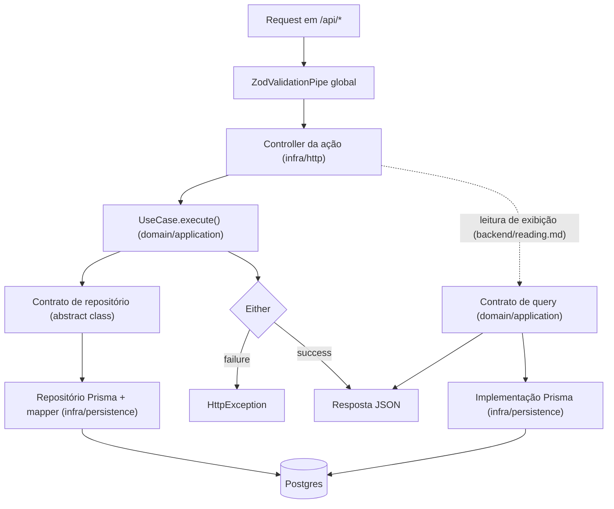

# Camadas do backend

## As camadas do backend (layer-first)

Um app backend tem duas camadas de primeiro nível, e módulo é pasta dentro de cada camada:

```txt
src/
├── domain/
│   ├── enterprise/              # entidades e value objects: TypeScript puro
│   └── application/
│       ├── use-cases/<módulo>/  # casos de uso
│       ├── queries/<módulo>/    # contratos e DTOs de leitura de exibição
│       ├── repositories/        # contratos de repositório (abstract class)
│       ├── queues/              # contratos de fila (abstract class)
│       └── services/<capacidade>/  # contratos de service (abstract class)
├── infra/
│   ├── http/                    # controllers por ação, DTOs Zod, presenters
│   ├── persistence/             # Prisma: repositórios, mappers, implementações de query
│   ├── services/<capacidade>/   # implementações de integração externa (e-mail, storage, ...)
│   ├── health/                  # endpoints de infra externa (probe, monitor)
│   └── common/                  # env, constantes e fronteiras transversais de request
└── main.ts
```

`domain/` e `infra/` são as únicas pastas na raiz de `src/`; o resto é `main.ts` e `app.module.ts`. Módulo é pasta dentro de cada camada (`use-cases/<módulo>/`, `controllers/<módulo>/`, `dtos/<módulo>/`): um módulo novo não cria pasta própria na raiz de `src/` com camadas dentro, só ganha a sua pasta nas camadas que usa. As fronteiras que importam são as de camada (`backend/boundaries.md`); a pasta por módulo existe para navegação, não para enforcement. Nome de módulo é conceito do negócio, nunca subdivisão técnica (`backend/modules.md`).

Layer-first, e não module-first, porque a fronteira que o projeto quer proteger é a de camada: domínio que não conhece infraestrutura. Com as camadas no primeiro nível, essa fronteira é visível na árvore de pastas e verificável por um `grep` de caminho (o check `boundaries`, `backend/boundaries.md`); com módulos no primeiro nível, ela vira convenção interna repetida em cada módulo.

O que cada camada pode conhecer, em resumo (regras completas de import e exceções em `backend/boundaries.md`):

- `domain/enterprise`: só `@metri/core`, `@metri/utils` e as bibliotecas de cálculo puro que `backend/boundaries.md` permite (`date-fns`, `@date-fns/tz`). Nada de NestJS, Prisma, Zod ou HTTP.
- `domain/application`: o mesmo, mais o decorator `@Injectable()` de `@nestjs/common`, e nada além dele.
- `infra/`: conhece `domain/` e as bibliotecas de infraestrutura. É o único lugar que toca Prisma e HTTP.

## O que mora em cada camada

Regra de negócio na entidade e no value object (`domain/model.md`); orquestração no caso de uso, com erro esperado como `Either` e injeção por contrato (`backend/application.md`, `backend/errors.md`); leitura de exibição por query (`backend/reading.md`).

## O caminho de uma request



- As rotas ficam sob `/api` (`general/http-surface.md`, "Superfície HTTP"). O pipe global e o módulo dos endpoints de infra externa, entram no grafo de módulos pela regra de `infrastructure/runtime.md`.
- `ZodValidationPipe` global valida body, query e path param na fronteira (`backend/http-api.md`).
- Controller é por ação (`backend/http-api.md`) e traduz `Either.failure` em `HttpException` pela tabela de `backend/errors.md`.
- Use case fala com o banco só pelo contrato; repositório concreto e mapper vivem em `infra/persistence`.
- Endpoint de leitura de exibição substitui use case e repositório de agregado por um contrato de query da aplicação, implementado em infra e injetado no controller (`backend/reading.md`); pipe e formato de erro são os mesmos.

## Onde cada arquivo mora

| Artefato | Caminho | Guia de construção |
| --- | --- | --- |
| Entidade | `src/domain/enterprise/<entidade>.entity.ts` | `domain/model.md` |
| Classes de erro do módulo | `src/domain/enterprise/errors/<módulo>.errors.ts` | `backend/errors.md` |
| Lista rastreada de coleção filha (capacidade condicional) | `src/domain/enterprise/<coleção>-list.ts`, vínculo puro em `<referenciado>-ids.ts` | `domain/watched-list.md` |
| Regra de domínio sem dono natural (Domain Service) | `src/domain/enterprise/domain-services/<regra>.ts` | `domain/domain-services.md` |
| Value object | `src/domain/enterprise/value-objects/<nome>.vo.ts` | `domain/model.md` |
| Enum de domínio | `src/domain/enterprise/enums/<nome>.enum.ts` | `domain/model.md` |
| Domain event | `src/domain/enterprise/events/<evento>.event.ts` | `backend/events.md` |
| Caso de uso | `src/domain/application/use-cases/<módulo>/<ação>.use-case.ts` | `backend/application.md` |
| Contrato de repositório | `src/domain/application/repositories/<agregado>-repository.contract.ts` | `backend/persistence.md` |
| Contrato + service de integração | `src/domain/application/services/<capacidade>/` + `src/infra/services/<capacidade>/` | `infrastructure/services.md` |
| Controller | `src/infra/http/controllers/<módulo>/<ação>.controller.ts` | `backend/http-api.md` |
| DTO | `src/infra/http/dtos/<módulo>/<nome>.dto.ts` | `backend/http-api.md` |
| Presenter | `src/infra/http/presenters/<agregado>.presenter.ts` | `backend/http-api.md` |
| Repositório concreto | `src/infra/persistence/prisma/repositories/<agregado>.prisma-repository.impl.ts` | `backend/persistence.md` |
| Mapper | `src/infra/persistence/prisma/mappers/<agregado>.prisma-mapper.ts` | `backend/persistence.md` |
| Contrato + DTO de query de exibição | `src/domain/application/queries/<módulo>/<ação>.query.ts` | `backend/reading.md` |
| Implementação Prisma de query | `src/infra/persistence/prisma/queries/<módulo>/<ação>.prisma-query.impl.ts` | `backend/reading.md` |
| Subscriber de evento | `src/infra/events/on-<evento>.subscriber.ts` | `backend/events.md` |
| Contrato de fila | `src/domain/application/queues/<fluxo>-queue.contract.ts` | `backend/async-jobs.md` |
| Worker de job | `src/infra/jobs/<job>.worker.ts` | `backend/async-jobs.md` |
| Implementação de fila e client da fila | `src/infra/jobs/` | `backend/async-jobs.md` |
| Env var | `src/infra/common/env/env.validation.ts` | `infrastructure/runtime.md` |
| Factory de teste | `test/factories/make-<agregado>.factory.ts` | `backend/testing.md` |
| Repositório em memória | `test/repositories/<agregado>.in-memory-repository.impl.ts` | `backend/testing.md` |
| Fila em memória | `test/queues/<fluxo>.in-memory-queue.impl.ts` | `backend/async-jobs.md` |
| Primitivo de domínio compartilhado | `packages/core/src/<área>/` | instruções de projeto de `packages/core` |
| Banco de um app: config, schema, migrations e client gerado | `packages/db/src/<conector>/<app>/`, como `packages/db/src/postgres/app/` (`prisma.config.ts`, `models/` com o `schema.prisma`, `migrations/`, `generated/client/`, `index.ts`); outro app ganha uma pasta irmã | `backend/persistence.md` |

Paths de `src/` e `test/` são relativos ao app backend (`apps/app-api/`).

## Verificação rápida

- A regra de negócio nova está em entidade ou value object, com o use case só orquestrando?
- O arquivo novo está no caminho da tabela acima?
- `domain/` continua sem import de infraestrutura (NestJS além de `@Injectable()`, Prisma, Zod)?
- O erro esperado é `Either`, sem `throw`?
