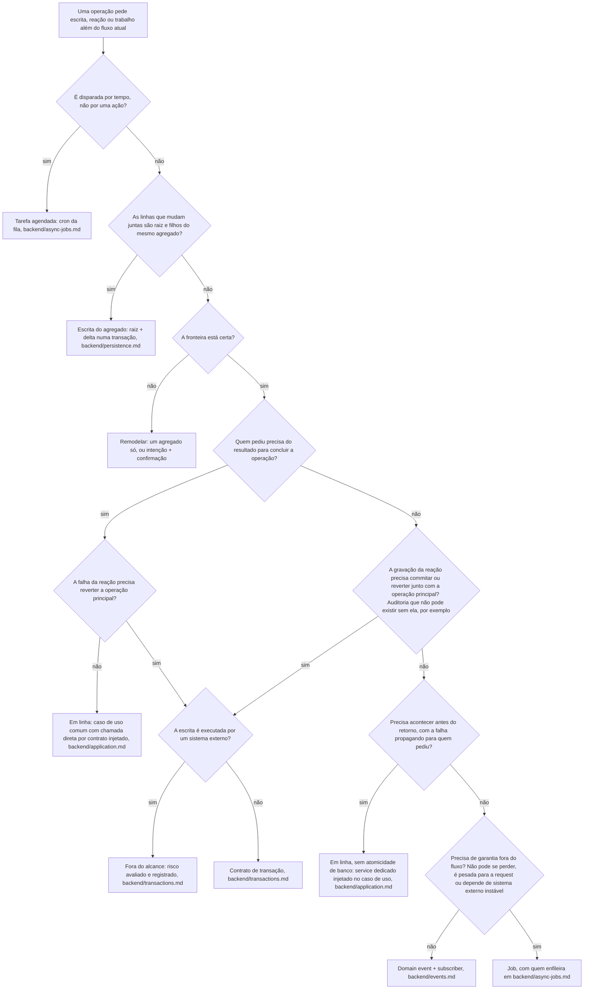

# Roteamento de operação

Uma operação de negócio raramente termina na própria gravação: ela confirma um pedido e emite uma fatura, avisa o cliente, alimenta um relatório. Este documento decide por qual mecanismo cada parte acontece; os documentos de cada mecanismo dizem como ela é construída depois de escolhida. Os exemplos usam o domínio didático de pedidos (`order`, `invoice`, `notification`) de `backend/modules.md`.

## Árvore de decisão

## Regras

### A árvore

**Obrigatório.** Operação que grava em mais de uma tabela, reação a um fato do domínio e operação que precisa acontecer fora do fluxo de quem pediu passam pela árvore antes de escolher o mecanismo.

**Obrigatório.** As perguntas seguem a ordem da árvore.

> **Por quê.** Cada pergunta resolve o problema num nível mais barato que a seguinte: remodelar elimina o problema, a consistência eventual evita a transação, e a transação fica só para o que sobrou.

### Tarefa agendada

Quando a operação é disparada por tempo, não por uma ação: **Obrigatório.** Tarefa agendada, o cron da fila (`backend/async-jobs.md`, "Tarefas agendadas").

### Escrita do mesmo agregado

Quando as linhas que mudam juntas são a raiz e os filhos de um mesmo agregado: **Obrigatório.** Escrita canônica do agregado (`backend/persistence.md`); o resto da árvore não se aplica.

### Fronteira

Quando dois agregados sempre mudam juntos: **Obrigatório.** Revisar a fronteira antes de escolher mecanismo: um agregado só, o invariante num deles com o outro apenas reagindo, ou a operação repensada em duas etapas locais a um agregado (registrar a intenção num passo, confirmar noutro).

> **Por quê.** Remodelar aqui elimina o problema em vez de administrá-lo.

### Em linha: chamada direta

Quando o resultado da reação decide o fluxo de quem pediu e a falha dela não precisa reverter a operação principal: **Obrigatório.** Execução em linha, no caso de uso comum, com chamada direta pelo contrato injetado nele.

**Proibido.** Job para operação cujo resultado decide a resposta de quem pediu.

### Transação

Quando a reação é invariante real do negócio, imediato, que uma gravação de agregado sozinha não fecha, e a falha dela precisa reverter a operação principal: **Obrigatório.** Contrato de transação (`backend/transactions.md`).

Quando a reação não devolve resultado ao fluxo, mas a gravação dela precisa commitar ou reverter junto com a operação principal, como a auditoria que não pode existir sem a operação, nem a operação sem ela: **Obrigatório.** A gravação participa do mesmo contrato de transação.

Quando essa escrita é executada por um sistema externo: **Obrigatório.** Ela sai do contrato de transação e segue `backend/transactions.md`, "Escrita de sistema externo fica fora do alcance".

**Proibido.** Transação para efeito independente da operação principal.

> **Por quê.** Transação para efeito independente cria transações longas, com contenção e acoplamento à disponibilidade do efeito.

### Service dedicado em linha

Quando a reação não devolve resultado ao fluxo e não precisa de atomicidade de banco com a operação principal, mas precisa acontecer antes do retorno, com a falha propagando para quem pediu: **Obrigatório.** Execução em linha: service dedicado injetado no caso de uso e chamado direto por ele (`backend/application.md`).

**Proibido.** Tratar o service dedicado como atomicidade: a chamada em linha propaga a falha, mas não desfaz a escrita que já aconteceu; commit e rollback juntos só existem no contrato de transação (`backend/transactions.md`).

**Proibido.** Reação atômica ou em linha com a operação principal ir para evento ou job.

> **Por quê.** Auditoria é o contraexemplo clássico: parece efeito aditivo, mas perder o registro é inaceitável, e domain event é fire-and-forget, sem garantia transacional.

### Evento

Quando quem pediu não precisa do resultado, a reação não precisa ser atômica nem em linha e o efeito tolera perda com log: **Obrigatório.** Domain event + subscriber (`backend/events.md`).

**Proibido.** Evento para invariante real do negócio.

> **Por quê.** Evento para invariante real cria janelas de inconsistência que aparecem como bug raro e difícil de reproduzir.

**Proibido.** Job para efeito aditivo que tolera perda com log.

### Job

Quando quem pediu não precisa do resultado, a reação não precisa ser atômica nem em linha e a operação precisa acontecer com garantia fora do fluxo — o efeito não pode se perder e precisa sobreviver a restart, crash e falha transitória, com retry; a operação é pesada demais para o ciclo da request; ou ela depende de sistema externo instável cujo retry com espera não pode acontecer no fluxo principal: **Obrigatório.** Job (`backend/async-jobs.md`).

Quem enfileira o job está em `backend/async-jobs.md`, "Quem enfileira".

### Compensação

Quando o efeito secundário de um fluxo eventual falha depois do commit da operação principal: **Obrigatório.** Tratá-lo por uma destas estratégias:

- **Retry**: o efeito é tentado de novo algumas vezes, pelo retry da fila de `backend/async-jobs.md` (o subscriber não retenta: ele engole a falha com log, `backend/events.md`). Para falha transitória (rede, serviço temporariamente fora).
- **Fila de inspeção (dead letter)**: o que falha repetidamente sai do fluxo e espera intervenção humana.
- **Compensação explícita**: a falha do efeito dispara a operação inversa no agregado principal, como um evento de falha que reverte o status.

**Obrigatório.** Fluxo novo com efeito pós-commit cabe numa destas formas, sem compensação improvisada: a operação cabe numa transação; o efeito é adiável e a falha dele é tolerável e visível; ou o fluxo segue `backend/async-jobs.md` por inteiro como primeira implementação da fila, pela regra de transição de `authoring.md`.

## Aplicação

- Efeito aditivo é o caso típico de evento: e-mail de confirmação, invalidação de cache, analytics, webhook para sistema externo. Adicionar ou remover um subscriber não muda o resultado da operação; a reação pode acontecer depois sem prejuízo de correção, e muitas vezes cruza módulos que devem continuar desacoplados.
- No ramo de evento, o agregado principal commita, o evento é despachado e cada subscriber roda por conta própria, na própria transação; a falha dele não reverte nada. Engolir com log é o destino da falha nesse ramo (`backend/events.md`, "Falha no handler").
- Efeito importante demais para se perder num log, como e-mail crítico ou integração externa, sai do ramo de evento e cai no de job: o subscriber enfileira, o worker processa com retry e dead letter.
- Validar limite de crédito e cobrar pagamento são chamadas diretas: o resultado decide o fluxo.
- Auditoria entra por um de dois ramos: no contrato de transação, quando o registro precisa ser persistido atomicamente com a operação; no service dedicado em linha, quando basta executar antes do retorno e propagar a falha.
- Sentir falta de um contrato de repositório próprio para o filho de um agregado é sintoma de que ele é candidato a agregado (`backend/persistence.md`, "Mapper"); aí a operação entra de fato na árvore, a partir da pergunta de fronteira.
- Job é comando, no imperativo; evento é fato, no particípio (`backend/events.md`, "Evento não é comando"). O mecanismo escolhido aqui não muda essa nomeação.
- O formato do subscriber e a regra de que falha de handler não escapa estão em `backend/events.md`; retry, fila e dead letter seguem o desenho de `backend/async-jobs.md`.

## Verificação

- A operação passou pela árvore, na ordem dela: tempo, mesmo agregado, fronteira, resultado, reversão ou atomicidade, sistema externo, execução em linha, garantia?
- Gravação que precisa commitar ou reverter junto com a operação está no contrato de transação, e nenhum service dedicado em linha é tratado como atômico?
- O fato que virou evento não é caso de chamada direta, transação ou service em linha (a auditoria, por exemplo)?
- A operação que virou job não é caso de execução em linha, subscriber simples ou transação?
- Nenhuma transação envolve efeito independente, e nenhum evento carrega invariante real?
- Efeito pós-commit que pode falhar tem retry, dead letter ou compensação explícita, sem compensação improvisada?

## Referências

- `backend/transactions.md`: contrato de transação, concorrência e locking, escrita de sistema externo.
- `backend/events.md`: evento, despacho, subscriber e falha no handler.
- `backend/async-jobs.md`: contrato de fila, worker, quem enfileira, tarefas agendadas, idempotência, retry e dead letter.
- `backend/persistence.md`: escrita canônica do agregado.
- `backend/application.md`: contrato injetado e caso de uso.
- `authoring.md`: regra de transição.
