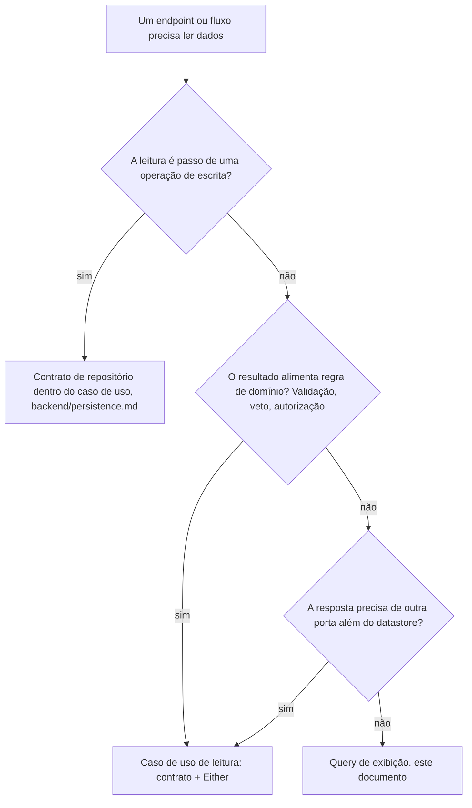

# Leitura

Como o backend monta respostas de consulta: quando uma leitura pertence ao caminho de domínio (contrato, entidade, caso de uso) e quando ela vira uma query de exibição com contrato na aplicação e execução direta no banco pela infraestrutura, onde cada artefato mora, paginação, não-encontrado e agregação.

Os exemplos usam o domínio didático de pedidos (`order`, `customer`) de `skills/writing-for-agents/RULE-FORMAT.md`, "Domínio didático".

## As duas naturezas de uma leitura

O caminho de domínio existe para proteger invariantes: entidade aplica regra, caso de uso orquestra e declara falha por `Either`, contrato isola a persistência para o spec unitário provar a decisão com dublês. Tudo isso paga quando há uma decisão a proteger.

Leitura de exibição não decide nada. Ela monta uma resposta: uma listagem com filtro, um detalhe com dados de dois agregados, um contador de dashboard. Não há invariante, não há transição de estado, não há falha de negócio além de "não existe". Forçar esse caminho pela entidade cobra o custo inteiro do lado de escrita sem proteger coisa nenhuma.

Por isso a leitura tem dois caminhos, e a escolha não é livre:

- **Leitura que alimenta decisão** fica no caminho de domínio: contrato de repositório devolvendo entidade, caso de uso com `Either`, regra na entidade, no value object ou num domain service (`domain/domain-services.md`) quando nenhuma entidade é dona natural da decisão. O resultado pode ser um tipo de negócio próprio, não precisa ser entidade.
- **Leitura de exibição** vai por uma query quando a resposta sai de um datastore só: contrato da ação em `domain/application`, implementação em infra que fala com o banco direto e devolve um DTO plano. O controller consome o contrato sem caso de uso de repasse no meio. Se um campo da resposta precisa de outra porta, a montagem é de caso de uso mesmo sem regra nenhuma (seção "A árvore de decisão").

Na escrita, a propriedade de agregados e as fronteiras de consistência são rígidas (`domain/model.md`, `backend/transactions.md`). Na leitura de exibição, uma projeção pode atravessar agregados do mesmo bounded context e do mesmo datastore: ela acopla schema e significado dos campos, mas não usa esses dados para modificar estado nem contorna invariantes. Fronteira de bounded context (`domain/bounded-contexts.md`) continua rígida também na leitura; composição entre contextos usa contrato publicado, API ou read model alimentado pelo contexto dono, nunca join direto nas tabelas internas do outro contexto.

Os sinais de que uma leitura de exibição entrou no caminho errado, qualquer um deles:

- Um "value object" em `enterprise/` com o formato de uma tela: agrupa entidade mais campos de outros agregados, contadores, ou estado relativo a quem está vendo, sem invariante nenhum dentro.
- Contrato de repositório acumulando variações `find*` que nenhuma regra de negócio consome, uma por tela.
- Dublê em memória reimplementando join ou agregação em TypeScript só para o spec unitário compilar.
- Caso de uso com `Either<never, ...>` que só repassa dado: sem falha possível e sem decisão, é query disfarçada. O tipo sozinho não condena: caso de uso que decide (mapeia os fatos consultados numa união de estados, como o próximo passo de um fluxo) usa `Either<never, ...>` legitimamente quando nenhuma das saídas é falha de negócio.
- Implementação de query injetando contrato de serviço da aplicação além do `PrismaService` e do contrato de cache do próprio fluxo (`infrastructure/cache.md`): é o sinal simétrico do anterior, um caso de uso disfarçado de query (seção "A árvore de decisão", terceira pergunta).

## A árvore de decisão



O critério é a natureza da leitura, nunca o tamanho dela. Uma listagem que junta quatro tabelas continua query; um preview de convite que valida token e expiração antes de mostrar qualquer coisa continua caso de uso, mesmo devolvendo três campos.

A terceira pergunta é sobre composição, não sobre regra. Query é projeção de um datastore: a implementação fala com o banco e devolve o DTO. Quando um campo da resposta só existe combinando o banco com outra porta da aplicação, como a URL pública derivada da chave de um objeto guardado no storage, quem monta é caso de uso, que é quem orquestra contratos neste desenho (seção "Leitura no caminho de domínio"). O custo da composição não muda a resposta; derivar um valor sem I/O nenhum continua sendo uma segunda porta.

O que a pergunta evita é a implementação de query virar orquestradora por baixo. Ela mora em `infra/persistence/prisma/`, então injetar contrato de serviço ali obriga o módulo de persistência a importar o de serviços, e a mesma feature termina com a escrita compondo no caso de uso e a leitura compondo na persistência. Leitura e escrita do mesmo agregado que precisam das mesmas peças têm a mesma forma.

Esse caso de uso não é query disfarçada, mesmo sem veto nenhum: ele declara a falha que tem, a classe de não-encontrado do módulo quando o recurso não existe, e devolve um DTO plano.

Quando uma biblioteca externa já expõe um endpoint de leitura que devolve exatamente o que a tela precisa, ele é usado como está, sem query nossa duplicando. Query nossa nasce quando a resposta precisa de formato, filtro ou agregação que o endpoint pronto não oferece.

## Leitura no caminho de domínio

Nada deste documento muda o que `domain/model.md`, `backend/application.md`, `backend/persistence.md` e `backend/errors.md` já definem para esse caminho; esta seção só marca a fronteira.

- Leitura como passo de escrita usa o contrato do agregado e devolve entidade; leitura de N relacionados é em lote com `Map` (`backend/persistence.md`, "Leitura em lote").
- Caso de uso é o serviço de aplicação deste desenho: orquestra contratos e regras sem conter detalhe de HTTP ou banco. Caso de uso de leitura existe quando o resultado passa por regra antes de sair, como validar um token, mascarar recurso de outro dono com a classe de não-encontrado (`backend/errors.md`, "Erros sensíveis") ou decidir o próximo passo de um fluxo, e também quando não há regra nenhuma mas a resposta precisa de mais de uma porta (seção "A árvore de decisão", terceira pergunta). Ele declara as falhas possíveis no `Either` como qualquer outro.
- Processo ou transformação de negócio sem entidade ou value object naturalmente responsável pode ser domain service (`domain/domain-services.md`). O caso de uso carrega os fatos, invoca a regra e devolve um tipo de resultado nomeado; ausência de entidade correspondente não transforma a operação em leitura de exibição.
- Caso de uso nunca devolve projeção de query nem consulta uma query: se o dado que ele precisa não justifica método de contrato, a decisão provavelmente não existe e a leitura inteira é uma query.

## A query de exibição

Uma query por ação de leitura, espelhando o um-controller-por-ação, dividida em duas peças:

- Contrato `<Ação>Query`, input e DTO de saída em `src/domain/application/queries/<módulo>/<ação>.query.ts`. O contrato é `abstract class` com um único método `execute()`, no mesmo mecanismo de injeção dos outros contratos de aplicação.
- Implementação `<Ação>PrismaQueryImpl` em `src/infra/persistence/prisma/queries/<módulo>/<ação>.prisma-query.impl.ts`. Só esta peça conhece Prisma e o schema do banco.

O `<módulo>` das duas pastas é o mesmo módulo do controller que consome a query, nunca as tabelas que ela lê. Uma listagem que junta `order` e `customer` continua em `queries/order/`, porque o endpoint é `/orders`; a pergunta "essa query cabe em qual módulo?" já foi respondida quando o controller entrou em `controllers/<módulo>/`, e as duas peças copiam a resposta. Tipos compartilhados de leitura, como paginação, vivem em `domain/application/queries/`.

```ts
// domain/application/queries/order/fetch-orders.query.ts
import type { PaginatedResult } from '../pagination';

export interface FetchOrdersQueryInput {
  customerId: string;
  status?: string;
  page: number;
  pageSize: number;
}

export interface OrderListItem {
  id: string;
  number: string;
  customerName: string;
  status: string;
  totalInCents: number;
  createdAt: Date;
}

export abstract class FetchOrdersQuery {
  abstract execute(
    input: FetchOrdersQueryInput,
  ): Promise<PaginatedResult<OrderListItem>>;
}
```

Exemplo completo: reading.examples.md#fetchordersprismaqueryimpl

Pontos-chave:

- O contrato é a capacidade exposta pela aplicação. Não importa NestJS, Prisma, `@metri/db`, entidade ou value object; seu DTO é o modelo de leitura que o consumidor recebe.
- A implementação injeta `PrismaService` e nada mais; a leitura cacheada injeta também o contrato de cache do próprio fluxo (`infrastructure/cache.md`, "Cache de leitura"). Por morar dentro de `infra/persistence/prisma/`, também pode tipar contra os tipos gerados de `@metri/db` quando precisar.
- Leitura de dado protegido segue o escopo do dono de `backend/access-scope.md`: escopo no input, filtro no `where`.
- `include`/`select` pode atravessar agregados do mesmo bounded context e datastore, com `select` estreito dos campos usados.
- O DTO da query é o corpo HTTP quando essa é a única porta, sob a chave que o nomeia (`{ order: ... }`) ou dentro do envelope de paginação, que já é tipado (`{ items: [...], total, page, pageSize }`). Nomear não é transformar: não existe presenter ou mapper por cerimônia na leitura, e mapper de agregado pertence à escrita (`backend/persistence.md`). Se outra porta exigir representação diferente, cada adapter transforma o DTO ou ganha uma query própria conforme a intenção.
- O DTO é plano e serializável: primitivos, `Date`, arrays e objetos deles. O `Date` sai no HTTP como string ISO, pelo codec do DTO de resposta (`backend/http-api.md`, "Contrato de API: o backend é a fonte").

## DTO, projeção, read model e CQRS

O contrato `<Ação>Query` é o query service da aplicação. Ele nomeia uma capacidade de leitura e devolve um DTO; não é domain service nem repositório. Projeção é a seleção e transformação que a implementação faz para produzir esse DTO, seja por `select`, SQL, view ou outra fonte. Read model é o modelo conceitual otimizado para leitura: pode ser o próprio DTO montado a cada execução ou uma estrutura persistida e desnormalizada.

Separar essa query do caminho de escrita já é segregação entre comando e consulta, mas não exige banco separado, eventos ou consistência eventual. Read store próprio entra quando escala, custo da consulta, autonomia de bounded context ou disponibilidade justificarem sincronização e operação adicionais. Sem essa justificativa, contrato de aplicação com implementação sobre o mesmo Postgres preserva a separação sem adotar o custo inteiro de CQRS.

## O não-encontrado do detalhe

Query de detalhe devolve `<DTO> | null`. `Either` não entra: `Either` é o vocabulário de falha esperada de caso de uso, e a única falha esperada de uma query é a ausência.

```ts
async execute(input: GetOrderDetailsQueryInput): Promise<OrderDetails | null> {
  const row = await this.prisma.client.order.findFirst({
    where: { id: input.orderId, customerId: input.customerId },
    include: {
      customer: { select: { id: true, name: true, email: true } },
      items: true,
    },
  });

  if (!row) {
    return null;
  }

  // ...flat DTO, as in the listing...
}
```

O controller traduz `null` com a classe de não-encontrado do módulo e o `toHttpException` de `backend/errors.md`, para o corpo de erro da API continuar único. O escopo do dono chega resolvido pela fronteira de request (`backend/access-scope.md`, "De onde o dono chega"):

```ts
// controller excerpt, with the scope already resolved by the boundary
const details = await this.getOrderDetailsQuery.execute({
  customerId: scope.customerId,
  orderId: params.orderId,
});

if (!details) {
  throw toHttpException(new OrderNotFoundError(params.orderId));
}

return { order: details };
```

Como o `where` da query filtra o dono, pedido de outro dono e pedido inexistente produzem o mesmo `null` e a mesma resposta, indistinguíveis por construção (`backend/errors.md`, "Erros sensíveis").

## Paginação

Toda listagem que pode crescer com o tamanho do banco é paginada. O contrato de resposta é um só, em `domain/application/queries/pagination.ts`:

```ts
export interface PaginatedResult<T> {
  items: T[];
  total: number;
  page: number;
  pageSize: number;
}
```

`items` é a única chave genérica da API. Ela se sustenta porque o tipo em volta
dá o contexto: `PaginatedResult<OrderListItem>` já diz que são os itens daquela
página, e de quê.

Defaults e teto pertencem à fronteira HTTP, no schema Zod do endpoint; a query recebe `page` e `pageSize` obrigatórios e já resolvidos:

```ts
export const FetchOrdersQueryStringSchema = z.object({
  status: z.string().max(50).optional(),
  page: z.coerce.number().int().min(1).default(1),
  pageSize: z.coerce.number().int().min(1).max(100).default(20),
});
```

Um lugar só resolve default: se a query também aplicasse `?? 20`, os dois valores divergiriam em silêncio na primeira mudança.

## Agregação: dashboard e relatório

Tela que não pertence a nenhum agregado (dashboard, relatório) é módulo de tela: mesmo critério de "A query de exibição", com o módulo do controller sendo o conceito da tela (`dashboard`, `reports`) em vez de um agregado. Ganha a própria pasta em `domain/application/queries/<módulo>/`, `infra/persistence/prisma/queries/<módulo>/` e `controllers/<módulo>/`, sem entidade, repositório de agregado ou caso de uso.

Agregação usa a API do Prisma enquanto ela expressa a consulta (`count`, `aggregate`, `groupBy`). Quando o SQL preciso é mais claro ou mais eficiente (window function, `DATE_TRUNC`, join com agregação), `$queryRaw` com template tag é bem-vindo:

```ts
// infra/persistence/prisma/queries/reports/revenue-by-period.prisma-query.impl.ts
async execute(input: RevenueByPeriodQueryInput): Promise<RevenuePeriod[]> {
  const rows = await this.prisma.client.$queryRaw<
    Array<{ period: Date; totalInCents: bigint; orderCount: bigint }>
  >`
    SELECT
      DATE_TRUNC(${input.groupBy}, o.created_at) AS period,
      SUM(o.total_in_cents)::bigint              AS "totalInCents",
      COUNT(*)                                   AS "orderCount"
    FROM orders o
    WHERE o.customer_id = ${input.customerId}
      AND o.created_at >= ${input.startDate}
      AND o.created_at < ${input.endDate}
    GROUP BY period
    ORDER BY period
  `;

  const items = rows.map((row) => ({
    period: row.period,
    totalInCents: Number(row.totalInCents),
    orderCount: Number(row.orderCount),
  }));
  return items;
}
```

Pontos-chave:

- Interpolação e identificador variável (a unidade do `DATE_TRUNC`) seguem a política de SQL cru de `backend/persistence.md`: template tag parametrizada, identificador como união fechada validada na fronteira.
- O join e o group by acontecem no banco; a query devolve linhas prontas. Agregar em memória o que o SQL agregaria é a versão de leitura do N+1.
- Agregado numérico não volta como `number`: `COUNT` devolve `bigint`, e `SUM` sobre inteiros devolve `numeric` (`Decimal` no client), por isso o cast `::bigint` no próprio SQL quando o valor é inteiro. A conversão para `number` acontece no `map`, nunca vaza para a projeção.
- O `WHERE` de escopo do dono vale aqui igual (`backend/access-scope.md`), e em SQL cru ele é ainda mais fácil de esquecer.

## Regras absolutas da query

1. Read-only: nunca INSERT, UPDATE ou DELETE. Escrita disfarçada de leitura ("marcar como visto", contador de acesso) é operação de negócio, caminho de domínio.
2. Dado protegido segue o escopo do dono de `backend/access-scope.md`.
3. Devolve DTO plano serializável, nunca entidade, value object ou `UniqueEntityID`.
4. Não toma decisão nem executa comportamento de domínio. Critério de seleção com significado de negócio pode aparecer no `where`; quando a mesma regra tem consumidor em memória, a definição compartilhada vira specification e a implementação aplica seu `toWhere()` (`domain/specification.md`).
5. O controller injeta o contrato da query em `domain/application`, sem caso de uso de repasse no meio nem dependência da implementação Prisma.
6. Não emite domain event e não tem efeito colateral: nada de log de auditoria, contador ou invalidação de cache dentro dela. Gravar no cache o resultado que ela mesma montou, na leitura cacheada, é parte da leitura (`infrastructure/cache.md`).
7. Listagem que cresce tem paginação, com defaults e teto no schema Zod.
8. SQL cru segue a política de `backend/persistence.md`.
9. Join direto só atravessa agregados do mesmo bounded context e datastore. Outro bounded context expõe contrato publicado ou alimenta read model próprio do consumidor.

## Registro no Nest

Contrato e implementação entram em `persistence.module.ts` com `{ provide: <Ação>Query, useClass: <Ação>PrismaQueryImpl }`; o módulo exporta o contrato, nunca a implementação. O controller de leitura entra em `http.module.ts` como qualquer ação. Nenhum módulo Nest novo.

```ts
{
  provide: FetchOrdersQuery,
  useClass: FetchOrdersPrismaQueryImpl,
}
```

## A execução é direta, o contrato não

A implementação de leitura fala com o Postgres primário sem repositório genérico, mapper de agregado ou camada de repasse. A única indireção é a fronteira real entre a operação exposta pela aplicação e o mecanismo que a executa.

A evolução sob custo real (SQL cru, índice ou view materializada, cache de `infrastructure/cache.md`, read replica, até um read model desnormalizado alimentado por eventos de `backend/events.md`) troca a implementação ou a infraestrutura abaixo dela sem mudar o controller. DTO e contrato mudam somente quando a operação exposta pela aplicação muda. A fronteira não antecipa nenhum desses mecanismos, só impede que a porta HTTP pertença ao Prisma.

## Testes

Contrato e implementação de query não têm spec unitário nem dublê em memória. O contrato não contém comportamento; o que quebra na implementação é o `where` errado, o `include` faltando, a projeção com campo trocado, e só o banco real exercita isso: a prova é o e2e do controller (`test/setup-e2e.ts`, banco isolado por arquivo), com a tag de regra no título quando a listagem implementa regra de spec. Specification compartilhada continua com spec unitário próprio (`domain/specification.md`).

O que o e2e de leitura cobre, além do caminho feliz: o filtro aplicado, a paginação (um `total` maior que a página devolvida), o 404 do detalhe, e o escopo do dono, pela prova de dois donos de `backend/access-scope.md`.

Os dois lados do corte ficam mais baratos ao mesmo tempo: o dublê em memória não implementa nada de exibição, e o spec unitário de caso de uso não muda, porque caso de uso continua falando só contrato.

## Verificação rápida

- A leitura passou pela árvore de decisão (passo de escrita, decisão, composição, exibição)?
- O contrato está em `domain/application/queries/<módulo>/<ação>.query.ts` e a implementação em `infra/persistence/prisma/queries/<módulo>/<ação>.prisma-query.impl.ts`, uma dupla por ação e sem dublê?
- O DTO é plano e serializável, sem entidade, value object ou `UniqueEntityID`?
- A query não toma decisão de domínio, critério compartilhado usa specification, e não existe caso de uso de repasse sobre ela?
- O controller injeta o contrato, só a implementação conhece Prisma, e ela não injeta nada além do `PrismaService` e, quando cacheada, do contrato de cache do fluxo?
- O detalhe devolve `null` e o controller traduz com a classe de não-encontrado do módulo + `toHttpException`?
- A listagem é paginada com `PaginatedResult`, defaults e teto no Zod, query recebendo valores resolvidos?
- Agregação com template tag parametrizada, identificador variável como união fechada, conversão numérica no `map`?
- O contrato de repositório continua sem método que só uma tela consome?
- Join direto ficou dentro do bounded context e datastore?
- O e2e cobre filtro, paginação, escopo do dono e o 404?
