# Builder

A construção passo a passo: os casos comuns que o padrão promete resolver já têm casa em outros desenhos, e esta é a referência de onde cada um mora e dos gatilhos raros em que um builder de verdade entraria.

Os exemplos são didáticos e não existem no produto.

## O problema que ele promete resolver

Builder promete montar um objeto complexo por passos encadeados (`withCustomer().withItems().build()`): muitos campos opcionais, montagem condicional, ordem controlada. O padrão nasceu em linguagens sem parâmetro nomeado nem literal de objeto. Em TypeScript, e neste projeto em particular, cada caso que ele promete resolver já tem uma casa mais simples; este documento diz onde cada caso mora e registra os gatilhos raros em que um builder de verdade entraria.

## A árvore de decisão

```mermaid
flowchart TD
    start[Objeto complexo para construir] --> q1{É entidade ou value object de domínio?}
    q1 -- sim --> create[create com objeto de props e Either, domain/model.md]
    q1 -- não --> q2{É dado de teste?}
    q2 -- sim --> factory[Factory make com override, backend/testing.md]
    q2 -- não --> q3{É config de biblioteca externa?}
    q3 -- sim --> config[Classe de config com build, infrastructure/logging.md]
    q3 -- não --> q4{Montagem combinatória, mais de uma representação da mesma montagem, ou ordem que o tipo deve forçar?}
    q4 -- não --> literal[Objeto literal, spread condicional]
    q4 -- sim --> builder[Builder: parar e decidir, ver gatilhos abaixo]
```



## Cada caso já tem casa

- Entidade ou value object: `create()` com objeto de props e `Either` (`domain/model.md`). O literal de props é o parâmetro nomeado que o builder simula em Java, com uma vantagem que o padrão clássico não tem: campo obrigatório faltante é erro de compilação. O `build()` clássico que lança para campo faltando rebaixa essa checagem para runtime, e `throw` para falha esperada viola `backend/errors.md`.
- Dado de teste: `make<Agregado>(override)` com defaults e spread (`backend/testing.md`) já é o test data builder da casa, sem chain. Builder de cenário de e2e (montar um pedido com itens e faturas numa expressão fluente) não entra: o Arrange dos e2e é deliberadamente inline (`backend/testing.md`).
- Config de biblioteca externa: classe de config com método `build()`, montada dentro da composição de infra que consome a biblioteca (`infrastructure/logging.md`, "Log de biblioteca externa"). O nome coincide, o padrão não: é composição de configuração numa chamada única, sem passo encadeado nem estado acumulado. Não "completar o padrão" adicionando `withX()` a essas classes.
- Objeto interno com campos opcionais: literal com spread condicional (`...(input.status ? { status: input.status } : {})`), como o `where` de `backend/reading.md`.

## Os gatilhos que fariam o padrão entrar

Três, nenhum com instância no produto:

- Montagem incremental de documento com partes opcionais combinatórias: uma fatura em PDF com cabeçalho com ou sem marca, N linhas, blocos opcionais, rodapé por país. Um objeto de props com quinze opcionais vira sopa; acumular passos é a forma natural desse problema.
- O mesmo processo de montagem produzindo mais de uma representação: a mesma fatura saindo como PDF e como HTML pelos mesmos passos. Reuso de processo de construção entre formatos de saída é a única promessa do padrão que nenhuma casa existente cobre.
- Pipeline em que a ordem dos passos precisa ser garantida pelo compilador: cada passo devolve um tipo que só expõe o próximo passo legal (type-state), coisa que objeto de props não expressa.

## A forma, quando o gatilho chegar

O exemplo fixa a forma no primeiro gatilho, a fatura de partes combinatórias. O produto do builder é uma estrutura serializável que um renderizador consome, nunca uma entidade de domínio: entidade continua nascendo só por `create()` (`domain/model.md`).

Exemplo completo: builder.examples.md#invoicedocumentbuilder

O consumidor chama só os passos que o caso pede, inclusive condicionalmente, que é o que o literal de props não expressa bem quando a montagem atravessa vários pontos do código:

```ts
const builder = new InvoiceDocumentBuilder().addLine({
  description: 'Assinatura mensal',
  quantity: 1,
  unitPriceInCents: 9900,
});

if (customerBrand) {
  builder.withBrand(customerBrand.name);
}

const documentOrError = builder.build();

if (documentOrError.isFailure()) {
  return failure(documentOrError.value);
}
```

Pontos-chave:

- `build()` é o único ponto de saída: valida a invariante da montagem (`Either`, nunca `throw`) e é onde o derivado nasce (`totalInCents`), como derivado nasce dentro do `create()` em `domain/model.md`.
- Passo opcional ausente vira `null` explícito na estrutura, e quem renderiza decide o que fazer com a ausência; o builder não inventa default de apresentação.
- Quando a ordem dos passos importar (terceiro gatilho), a forma evolui: cada passo devolve um tipo que só expõe o próximo passo legal (type-state), em vez de `this`. A forma acumuladora acima basta enquanto a ordem for livre.
- A casa exata do arquivo e a separação entre receita e passos (o papel do Director no padrão clássico) se decidem com o caso real, seguindo a regra de escape do AGENTS.md; a montagem de documento tende a morar em infra, ao lado do serviço que renderiza (`infrastructure/mail.md`, "O contrato por fluxo"). A decisão vira edição desta seção.

## Verificação rápida

- A construção passou pela árvore antes de considerar builder (props + `create()`, factory de teste, classe de config, literal com spread)?
- O builder monta estrutura serializável, nunca entidade (`create()` continua o único nascimento)?
- Nenhum `build()` lançando para campo faltante; falha esperada é `Either`, com derivado nascendo no `build()`?
- Nenhum builder de cenário de teste (Arrange inline, `backend/testing.md`)?
- Classe de config com `build()` continua composição única, sem `withX()` encadeado?
- Gatilho real (documento combinatório, mais de uma representação, ordem por tipo): parou e decidiu antes de implementar, com a decisão virando edição da seção?

**Pontos em aberto:** A forma acumuladora já está fixada; ficam em aberto, para o primeiro gatilho real, a casa do arquivo, a separação entre receita e passos (Director) e a variante type-state quando a ordem dos passos importar. Quando fecharem, viram edição das seções deste documento e saem desta lista.
