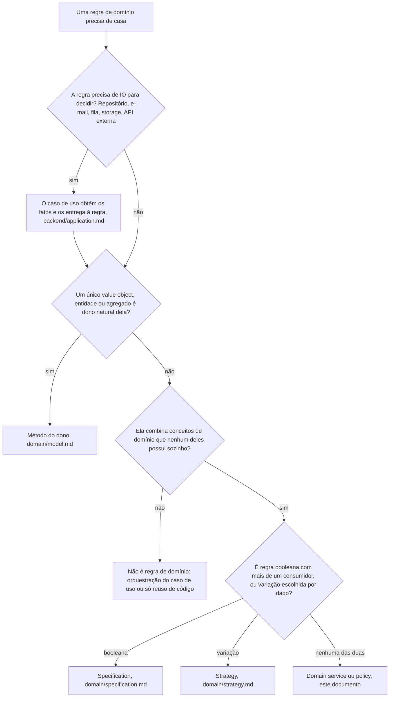

# Domain Service e Policy

Domain service é capacidade condicional: a maioria das regras tem dono natural no modelo, e um projeto pode nunca precisar de um. Quando a regra sem dono aparece, a forma dela já está decidida aqui. Domain service e domain policy são o mesmo artefato neste desenho, uma regra de domínio sem estado e sem IO; o nome acompanha a forma. Os exemplos usam o domínio didático de pedidos (`order`, `customer`).

## Árvore de decisão



## Regras

### A casa padrão é o modelo

**Padrão.** Comportamento de domínio mora no value object, na entidade ou na raiz do agregado dono dele (`domain/model.md`).

Quando a regra é do domínio, combina conceitos ou objetos de domínio e não pertence naturalmente a um único value object, entidade ou agregado: **Permitido.** Ela virar domain service ou policy.

**Proibido.** Domain service ou policy para coordenação de infraestrutura, orquestração de aplicação ou só reuso de código.

**Proibido.** Criar domain service porque o método ficou grande, porque há código duplicado, porque a regra precisa de repositório, e-mail, API externa, transação, relógio ou gerador de id, ou porque "service" parece uma organização conveniente.

> **Por quê.** Service criado por conveniência tira a regra de quem tem o estado, e a entidade vira dado manipulado de fora.

Quando os conceitos combinados pertencem a bounded contexts diferentes: **Proibido.** Domain service entre eles: a interação passa pelo contrato entre os contextos (`domain/bounded-contexts.md`).

### A regra não coordena IO

**Obrigatório.** Domain service ou policy recebe por argumento os fatos de domínio já carregados e devolve uma decisão ou um resultado de domínio.

**Proibido.** Domain service ou policy conhecer repositório, contrato de aplicação, HTTP, fila, e-mail, storage, logger, Prisma ou framework.

**Obrigatório.** O instante e o identificador de que a regra depende chegam por argumento, de quem chama.

> **Por quê.** É o que mantém a regra pura e testável sem dublê.

Quando decidir exige um fato que só IO obtém: **Obrigatório.** O caso de uso obtém o fato e o entrega à regra (`backend/application.md`), e a regra continua sem a dependência.

### Forma mínima

**Obrigatório.** A forma é a mínima que representa a regra:

- função pura exportada, quando a regra é uma operação só;
- policy object, uma classe com o contexto da avaliação no construtor e o método de decisão, quando parâmetro ou contexto precisa ser fixado uma vez para mais de uma avaliação;
- service de domínio sem estado, uma classe com mais de uma operação da mesma regra, quando elas só fazem sentido juntas.

**Proibido.** `abstract class`, token de injeção ou registro no container para domain service ou policy: quem precisa chama a função ou instancia a classe.

> **Por quê.** Injeção existe para trocar dependência; uma regra pura não tem nenhuma, e o token só esconderia isso.

**Obrigatório.** A regra mora em `src/domain/enterprise/policies/<regra>.policy.ts`, um arquivo por regra, qualquer que seja a forma, nomeada pela regra no vocabulário do negócio.

> **Por quê.** `services/` já nomeia os contratos de integração de `domain/application/services/` (`infrastructure/services.md`); uma segunda pasta com o mesmo nome e outro sentido deixaria o nome ambíguo.

### Spec

**Obrigatório.** Domain service ou policy nasce com spec unitário colocado (`<regra>.policy.spec.ts`), sem dublê e sem módulo de teste, com os fatos montados pelas factories de `backend/testing.md`.

## Aplicação

A regra de desconto por fidelidade combina o nível do cliente e o total do pedido:

Exemplo completo: domain-services.examples.md#calculateloyaltydiscount

O caso de uso carrega os fatos, chama a regra e grava:

```ts
// domain/application/use-cases/order/apply-loyalty-discount.use-case.ts (trecho)
const order = await this.orderRepository.findById(orderId);
if (!order) {
  return failure(new OrderNotFoundError(orderId));
}

const customer = await this.customerRepository.findById(order.customerId.toValue());
if (!customer) {
  return failure(new CustomerNotFoundError(order.customerId.toValue()));
}

const discountInCents = calculateLoyaltyDiscount(order, customer);

const applied = order.applyDiscount(discountInCents);
if (applied.isFailure()) {
  return failure(applied.value);
}

await this.orderRepository.save(order);
```

- Nenhum dos dois agregados é dono da regra sozinho, e o `Order` não guarda o `Customer` nas props (`domain/model.md`, "Referência entre agregados").
- A regra só calcula; `applyDiscount()` aplica a invariante do pedido, como qualquer mudança de estado (`domain/model.md`). Regra que muda estado o faz pelos métodos de intenção das entidades envolvidas, e persistir, com o mecanismo da escrita, continua com o caso de uso (`backend/operation-routing.md`).
- Regra que pode recusar devolve `Either` com a classe de erro do módulo, como entidade e value object (`backend/errors.md`).
- A tabela por nível é dado, não variação de comportamento: cálculo que mudasse de forma por nível passaria pela árvore de `domain/strategy.md`.
- Método grande se divide em métodos privados do próprio dono; duplicação entre dois donos vira value object ou método do conceito comum, antes de virar domain service.

| | Domain service ou policy | Caso de uso |
| --- | --- | --- |
| Expressa | Uma decisão ou cálculo do domínio | O fluxo da operação |
| Recebe | Fatos de domínio já carregados | O input da porta |
| Fala com | Value objects, entidades, enums e outras regras de domínio | Contratos de repositório, service, fila e transação |
| Faz IO | Nunca | Pelos contratos |
| Mora em | `domain/enterprise/policies/` | `domain/application/use-cases/` |

## Verificação

- A regra passou pela árvore: sem IO, sem dono natural no modelo, combinando conceitos de domínio, e não é specification nem strategy?
- Ela depende só de conceitos de domínio, e continuaria fazendo sentido sem framework nem persistência?
- Os fatos, o instante e o identificador chegam por argumento, sem repositório, contrato ou framework dentro?
- A mudança de estado passou pelos métodos das entidades, com a persistência no caso de uso?
- A forma é a mínima, sem `abstract class`, token ou registro no container, em `enterprise/policies/<regra>.policy.ts`?
- O spec unitário colocado prova a regra sem dublê?

## Referências

- `domain/model.md`: a casa padrão da regra e a mudança de estado por método de intenção.
- `backend/application.md`: o caso de uso que carrega os fatos e coordena o IO.
- `domain/strategy.md`: variação de comportamento escolhida por dado.
- `domain/specification.md`: regra booleana de domínio com mais de um consumidor.
- `domain/bounded-contexts.md`: regra entre contextos.
- `backend/errors.md`: `Either` e classe de erro do módulo.
- `backend/operation-routing.md`: o mecanismo da escrita que o caso de uso escolhe.
- `backend/testing.md`: factories dos fatos no spec.
- `infrastructure/services.md`: o sentido de `services/` na aplicação.
- `docs/architecture/INDEX.md`: a regra concreta como decisão de projeto.
