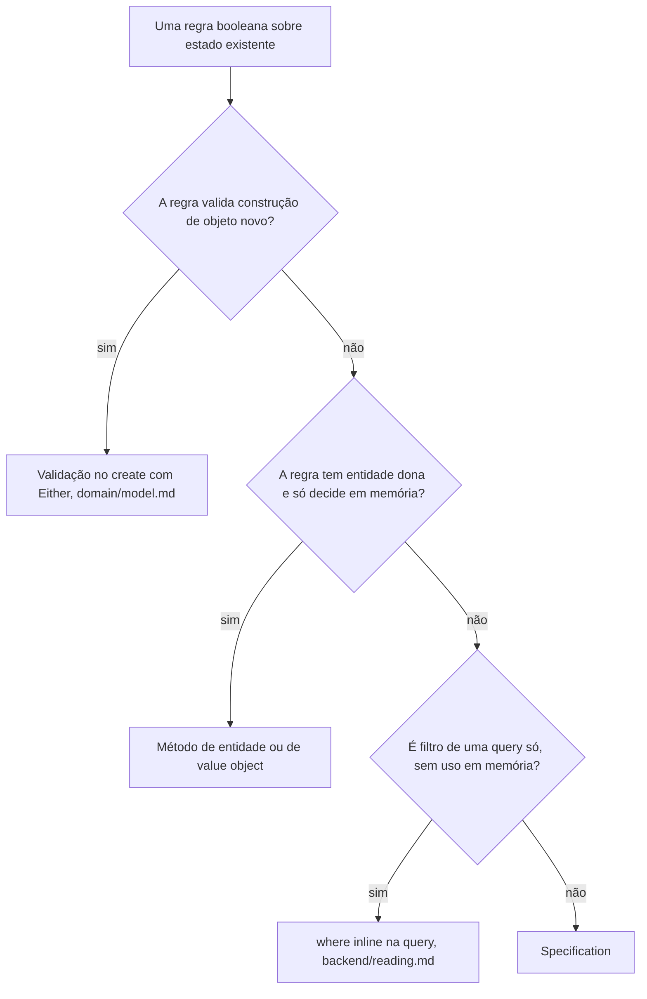

# Specification

A regra booleana com mais de um consumidor: uma classe de domínio que sabe responder pela mesma regra em memória e como filtro de query.

Os exemplos usam o domínio didático de pedidos de `methodology/authoring.md`, "Domínio didático".

## O problema

Uma regra booleana sobre estado existente ("este pedido é reembolsável?") começa com um consumidor e ganha outros: o caso de uso decide em memória, o backoffice quer a listagem de quem satisfaz a regra, um segundo módulo quer a mesma resposta. Sem desenho, cada consumidor reescreve a regra no próprio vocabulário (um `if` no caso de uso, um `where` na query), e as cópias divergem em silêncio na primeira mudança: a janela de reembolso muda de 7 para 14 dias, alguém atualiza um lado só, e nenhum erro acusa.

Specification dá casa única à regra: uma classe de domínio que sabe responder pela regra em cada contexto que a consome.

## A árvore de decisão

O padrão é o último recurso da árvore, não o primeiro. O default da casa continua sendo o método de entidade.



Os critérios por trás da árvore:

- Validação de nascimento nunca vira specification: objeto inválido não chega a existir (`create()` com `Either`, modelo sempre-válido de `domain/model.md`). Specification só responde sobre objeto que já existe.
- Regra com entidade dona, consumida só em memória, mora na entidade (`order.confirm()` decide a própria transição). Extrair para uma classe separada fragmentaria a lógica para fora de quem tem o estado.
- Filtro que só existe numa listagem é `where` inline da query (`backend/reading.md`); specification não nasce para um consumidor só, mesma lógica da segunda variação real de `domain/strategy.md`.
- Os dois gatilhos que sobram para o padrão: a mesma regra decidindo em memória e filtrando query (dois vocabulários, uma regra), ou regra que cruza agregados sem ter entidade dona, reutilizada em mais de um contexto.

## A forma

A specification é uma classe de domínio em `enterprise/specifications/<regra>.specification.ts`, nunca `.spec.ts`, que é o glob dos arquivos de teste. O construtor carrega o contexto da avaliação (o instante, os parâmetros); `isSatisfiedBy()` responde em memória; `toWhere()` existe só quando há o lado de query.

Exemplo completo: specification.examples.md#refundableorderspecification

O caso de uso decide em memória:

```ts
const refundableOrderSpecification = new RefundableOrderSpecification(
  new Date(),
);

if (!refundableOrderSpecification.isSatisfiedBy(order)) {
  return failure(new OrderNotRefundableError(orderId));
}
```

A query de exibição filtra pela mesma regra:

```ts
// infra/persistence/prisma/queries/order/list-refundable-orders.prisma-query.impl.ts
const refundableOrderSpecification = new RefundableOrderSpecification(
  new Date(),
);

const rows = await this.prisma.client.order.findMany({
  where: {
    customerId: input.customerId,
    ...refundableOrderSpecification.toWhere(),
  },
});
```

Pontos-chave:

- A classe é a casa única da regra: a janela mudar de 7 para 14 dias é uma edição num arquivo, e os dois consumidores acompanham. `isSatisfiedBy()` e `toWhere()` são duas expressões da mesma regra; não existe tradução automática entre elas, e o que as mantém juntas é morarem no mesmo arquivo, cobertas pelo mesmo spec unitário e pelo e2e da listagem.
- `toWhere()` devolve objeto puro, sem nenhum import de Prisma no domínio (`backend/boundaries.md`). O tipo fecha no `where` da query, que é quem pode falar Prisma (`backend/reading.md`): shape divergente do schema vira erro de compilação no ponto de consumo. É também o que mantém a query dentro da regra "Não toma decisão nem executa comportamento de domínio" de `backend/reading.md`: ela aplica o filtro pronto, nunca reimplementa a regra.
- O construtor carrega o instante para os dois lados avaliarem o mesmo momento.
- A specification nunca carrega dado: não injeta repositório, não consulta nada. Para regra multi-agregado sem entidade dona, `isSatisfiedBy(order, customer)` recebe os agregados que o caso de uso já carregou.
- Entidade dona que já tinha o método delega para a specification quando o segundo consumidor aparecer, nunca duplica.
- O escopo de acesso não entra na specification: organização, usuário ou outro vínculo continua obrigação do `where` da query (`backend/access-scope.md`), fora do `toWhere()` da regra.
- Composição (`and`/`or`/`not` como objetos) fica fora: duas regras combinadas num consumidor são `&&` no código. Infraestrutura de composição só se composição dinâmica virar requisito real (ver "Pontos em aberto").

## Verificação rápida

- A regra passou pela árvore de decisão (não é validação de construção, não basta método de entidade, não é filtro de uma query só)?
- O arquivo é `enterprise/specifications/<regra>.specification.ts`, nunca `.spec.ts`?
- O construtor carrega o contexto da avaliação, e os dois lados usam o mesmo instante?
- `toWhere()` só existe quando há lado de query, devolve objeto puro sem import de Prisma, e o tipo fecha no `where` da query?
- A specification não injeta repositório nem carrega dado; recebe agregados já carregados?
- Método de entidade preexistente delega, nunca duplica?
- O escopo de acesso continua no `where` da query, fora do `toWhere()`?
- Nenhuma infraestrutura de composição sem requisito real de composição dinâmica?

## Em aberto

- **Composição de specifications.** Composição de specifications (`and`/`or`/`not` como objetos combináveis) fica fora do desenho até composição dinâmica de regra ser requisito real do produto (segmentação montada pelo usuário, por exemplo).
