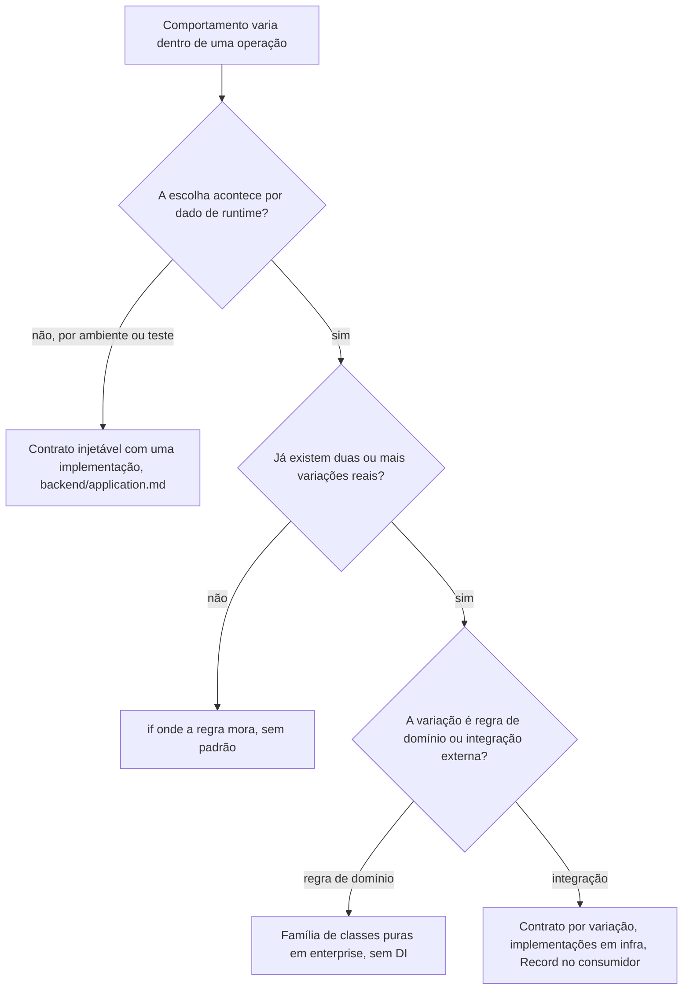

# Strategy

A variação de comportamento selecionada por dado: cada variação é uma classe própria sob o mesmo contrato, e a escolha é uma consulta a um `Record` tipado.

Os exemplos usam o domínio didático de pedidos de `skills/writing-for-agents/RULE-FORMAT.md`, "Domínio didático".

## O problema

Uma operação precisa executar de um jeito diferente conforme um dado do fluxo: a notificação sai por e-mail ou SMS conforme a preferência do cliente, o frete depende da modalidade de entrega escolhida no pedido. Sem desenho, cada variação nova é mais um ramo de `if`/`switch` dentro do caso de uso: a escolha da variação se mistura com a execução dela, toda variação nova edita um arquivo que já funcionava, e nenhum erro acusa a variação que ficou sem tratamento.

Strategy separa os dois papéis. Cada variação vira uma classe própria sob o mesmo contrato, e a escolha vira uma consulta a um `Record` tipado, indexado por uma chave de união fechada. Variação nova passa a ser extensão (uma classe nova), não modificação de quem já funciona, e o compilador garante que toda variação tem tratamento.

## O princípio: aberto para extensão, fechado para modificação

O padrão existe para servir esse princípio, e o mapeamento é um para um. O contrato é a interface estável em volta do ponto de variação. As variações são a parte aberta: regra nova é classe nova. O consumidor é a parte fechada: quando a família cresce, ele não é editado, e as variações existentes também não. A direção de dependência é a mesma de `backend/boundaries.md`: a variação depende do contrato, nunca o contrário. É isso que mantém o núcleo fechado enquanto a borda cresce.

O princípio só paga em ponto de variação comprovado: daí o gatilho da árvore, a segunda variação real, nunca "para quando precisar".

## A árvore de decisão



Os critérios por trás da árvore:

- Duas ou mais variações reais, vivas ao mesmo tempo. Contrato de variação "para quando precisar" é especulação, mesma regra do método especulativo de contrato em `backend/application.md`: o padrão nasce quando a segunda variação chega, junto com o enum e o `Record`.
- Um ou dois ramos simples e estáveis não pedem padrão: `if` onde a regra mora. O sinal de conversão é o mesmo ramo se repetindo em mais de um lugar, ou a lista de variações crescendo.
- Contrato injetável não é Strategy. Contrato com uma implementação trocada por ambiente ou teste continua o contrato de `backend/application.md`, "Contratos são `abstract class`"; Strategy é o mesmo contrato com N implementações vivas na mesma build, escolhidas por dado.
- A chave é união fechada (enum de domínio ou union de literais), nunca string livre. Chave que chega de request valida na fronteira Zod como união fechada, mesma regra do identificador variável de `backend/persistence.md`.
- O `Record` é total e não tem ramo default: variação nova entra como entrada explícita. Um "resto" silencioso esconderia variação sem tratamento, o mesmo motivo da rejeição do `switch` em `backend/errors.md`.
- Strategy decide como, nunca se: a decisão de negócio de executar ou não (notificar? cobrar?) fica na entidade ou no caso de uso; a estratégia só executa a variação escolhida.

## Variação de regra de domínio: família de classes puras

O cenário: o frete do pedido nasce com duas modalidades, retirada e entrega padrão. Três meses depois o negócio lança a expressa; no trimestre seguinte, a agendada. Regra de precificação é assim, chega em fila; o desenho existe para que cada chegada seja uma classe nova, nunca uma edição no cálculo que já funciona em produção.

A família inteira mora num arquivo da regra em `enterprise/strategies/<regra>.strategy.ts`: o contrato, as variações e a tabela. Nada de DI, nada de infra; são classes puras de domínio.

```ts
// domain/enterprise/enums/delivery-method.enum.ts
export enum DeliveryMethod {
  Pickup = 'pickup',
  Standard = 'standard',
  Express = 'express',
}
```

Exemplo completo: strategy.examples.md#shippingcostcalculator

Quem consome (método de entidade ou caso de uso) seleciona pela tabela e conhece só o contrato:

```ts
const calculator = SHIPPING_COST_CALCULATORS[order.deliveryMethod];
const shippingCostInCents = calculator.calculate({
  distanceInKm,
  totalWeightInGrams,
});
```

Pontos-chave:

- A modalidade agendada chegar significa: uma classe `ScheduledShippingCost` nova, um valor novo no enum, uma entrada nova na tabela. Nenhuma classe existente muda, nenhum consumidor muda, e o `Record` total sobre o enum quebra a compilação até a entrada existir.
- Só o contrato e a tabela são exportados; as variações são classes internas do arquivo. Consumidor que não enxerga `ExpressShippingCost` não tem como acoplar nela.
- Classes stateless, instanciadas uma vez na própria tabela. O spec unitário do arquivo testa cada variação direto, sem dublê e sem módulo de teste.
- Dependência externa não entra aqui: no primeiro `EnvService`, repositório ou client que uma variação precisar, a família muda de casa para a forma de integração da seção seguinte.

## Variação de integração: um token de DI por variação

Quando a variação fala com o mundo externo (canal de envio, gateway por método de pagamento), as implementações moram em infra e entram pela DI. Nesse caso, cada variação precisa de um token próprio, porque uma `abstract class` aponta para uma única implementação no wiring. O contrato declara a base e um contrato vazio por variação:

```ts
// domain/application/services/notification/order-notifier.contract.ts
export interface OrderNotification {
  orderId: string;
  customerName: string;
  customerEmail: string;
  totalInCents: number;
}

export abstract class OrderNotifier {
  abstract send(notification: OrderNotification): Promise<void>;
}

export abstract class EmailOrderNotifier extends OrderNotifier {}

export abstract class SmsOrderNotifier extends OrderNotifier {}
```

As implementações vivem em `infra/services/<capacidade>/<nome>.impl.ts` (`notification/email-order-notifier.impl.ts`, por exemplo) e entram em `services.module.ts` provendo o contrato da própria variação, construção igual à de qualquer service de `infrastructure/services.md`: `{ provide: EmailOrderNotifier, useClass: EmailOrderNotifierImpl }`, `{ provide: SmsOrderNotifier, useClass: SmsOrderNotifierImpl }`. Cada implementação chega ao canal pelo contrato da capacidade dele, nunca pela classe de vendor de outra capacidade (`infrastructure/services.md`). A de e-mail delega ao `OrderConfirmationSender`, e a composição do e-mail é dele (`infrastructure/mail.md`):

```ts
// infra/services/notification/email-order-notifier.impl.ts
@Injectable()
export class EmailOrderNotifierImpl extends EmailOrderNotifier {
  constructor(private readonly orderConfirmationSender: OrderConfirmationSender) {
    super();
  }

  async send(notification: OrderNotification): Promise<void> {
    await this.orderConfirmationSender.send({
      orderId: notification.orderId,
      customerEmail: notification.customerEmail,
      customerName: notification.customerName,
    });
  }
}
```

O consumidor injeta os contratos das variações, nunca implementação, e monta a tabela de despacho no construtor:

Exemplo completo: strategy.examples.md#notifyorderconfirmationusecase

Pontos-chave:

- O contrato vazio por variação (`EmailOrderNotifier`) existe para ser o token daquela variação; a base (`OrderNotifier`) é o tipo comum que o `Record` carrega. O caso de uso continua sem importar nada de `infra/` (`backend/boundaries.md`).
- `Record<NotificationChannel, OrderNotifier>` no construtor é o que faz canal novo no enum sem entrada correspondente virar erro de compilação, não um canal silenciosamente sem notificação.
- Variação nova é extensão, não modificação: uma classe nova em `infra/services/<capacidade>/`, um contrato vazio novo, a entrada no enum. Nenhum comportamento existente é editado; o compilador aponta os dois pontos de registro que faltam (o provider no módulo e a entrada no `Record`).
- No exemplo o canal chega no input já validado; num produto real ele vem da preferência persistida do cliente ou da fronteira Zod como união fechada.
- Spec unitário entrega um dublê por contrato de variação e afirma qual estratégia foi chamada com o quê; nada muda em relação a testar qualquer service.

## Lógica comum entre variações: Template Method

Quando duas ou mais variações duplicam a mesma preparação (validar o payload, registrar o resultado), a base não é só contrato: o método público concreto orquestra o passo comum e delega às variações apenas o passo que de fato varia, `protected` e abstrato. Vale para as duas casas, a família pura de `enterprise/` e o contrato de integração; o exemplo abaixo evolui o segundo.

```ts
// domain/application/services/notification/order-notifier.contract.ts
export abstract class OrderNotifier {
  async send(notification: OrderNotification): Promise<void> {
    // common step: a payload outside the contract is a programming bug, not a business result
    if (notification.totalInCents < 0) {
      throw new Error(`Notificação do pedido ${notification.orderId} com total negativo`);
    }

    await this.deliver(notification);
  }

  protected abstract deliver(notification: OrderNotification): Promise<void>;
}
```

Pontos-chave:

- Nada muda para o consumidor: o `Record` e a chamada `send()` continuam idênticos. A refatoração é interna à família de estratégias.
- `protected` no passo variável impede um caller de pular a preparação comum chamando `deliver()` direto.
- A composição da mensagem não sobe para a base: no e-mail ela é do sender (`infrastructure/mail.md`), e a variação entrega a ele só dado de domínio.
- Template Method entra quando a duplicação já existe entre variações, nunca antes: uma base com orquestração especulativa engessa a família no primeiro caso que não seguir o roteiro. Contrato sem lógica comum permanece só abstrato, como na seção anterior.

## Verificação rápida

- A variação passou pela árvore de decisão (dado de runtime, duas ou mais variações reais)?
- A chave é união fechada, validada na fronteira Zod quando vem de request, nunca string livre?
- O despacho é um `Record` total tipado pela união, sem ramo default e sem `switch`?
- Variação nova entrou como classe nova mais entrada de tabela, sem editar variação existente nem consumidor?
- Regra de domínio: família num arquivo `enterprise/strategies/<regra>.strategy.ts` (contrato + variações não exportadas + tabela), sem DI e sem dependência externa?
- Integração: contrato base + contrato vazio por variação em `application/services/<capacidade>/`, implementações `<nome>.impl.ts` em `infra/services/<capacidade>/`, `Record` montado no construtor do consumidor?
- O domínio segue sem importar implementação concreta (`backend/boundaries.md`)?
- A decisão de negócio de executar ou não ficou fora da estratégia?
- Lógica comum entre variações subiu para a base como Template Method só depois de a duplicação existir, com o passo variável `protected`?
