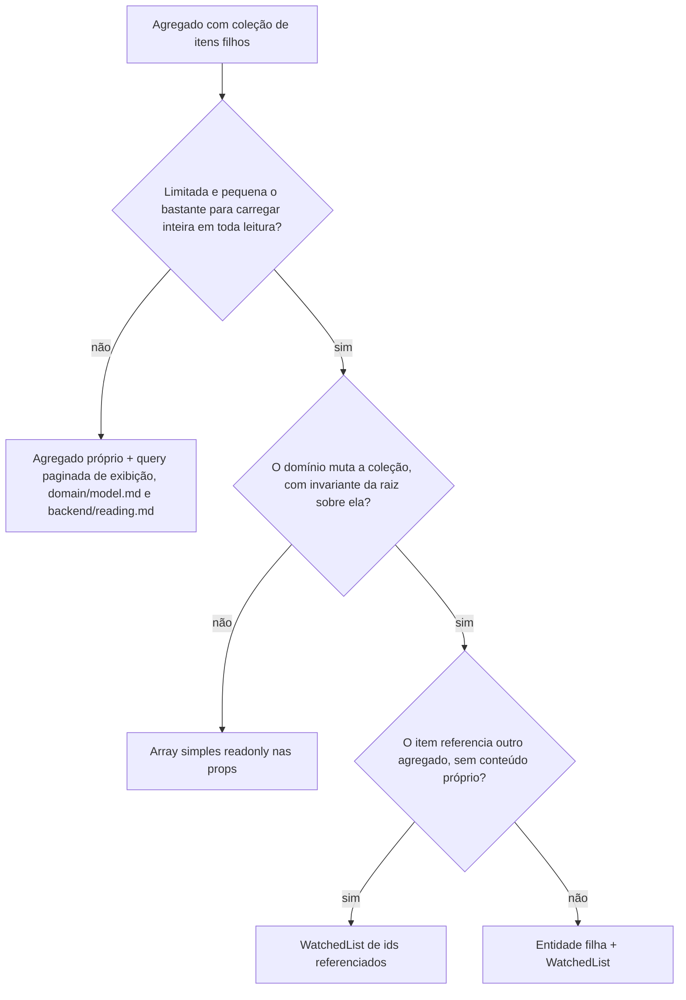

# WatchedList

A coleção filha com delta rastreado: um agregado dono de uma coleção de itens filhos responde "o que mudou nessa coleção" com uma `WatchedList<T>`.

Os exemplos usam o domínio didático de pedidos de `skills/writing-for-agents/RULE-FORMAT.md`, "Domínio didático", estendido aqui com um agregado `Product` e a coleção de fotos dele.

## O problema

Um agregado que é dono de uma coleção de itens filhos (pedido tem itens, produto tem fotos) precisa responder, em dois momentos diferentes, "o que mudou nessa coleção":

- Na escrita do repositório: quais itens inserir e quais deletar, para persistir só o delta em vez de reescrever a coleção inteira a cada gravação.
- No fluxo de substituição completa: o cliente envia o conjunto final desejado (a galeria de fotos reordenada pela UI, por exemplo), e o domínio precisa descobrir o que entrou e o que saiu em relação ao que está no banco.

Implementar esse diff à mão em cada caso é repetitivo, e o erro é silencioso: um item removido que permanece no banco, um duplicado inserido, e nenhum erro de compilação ou de runtime acusa.

`WatchedList<T>` resolve os dois momentos com a mesma estrutura: uma coleção que conhece o próprio estado inicial e rastreia o que foi adicionado e removido desde ele.

## A árvore de decisão



A coleção filha entra no agregado como `WatchedList` quando todas as condições valem:

- O agregado é o dono da coleção e alguma invariante da raiz depende dela (limite de itens, pedido nunca vazio, unicidade interna).
- A coleção é limitada e pequena o bastante para carregar inteira em toda leitura do agregado.
- A coleção muta pelo domínio: itens entram e saem por método de intenção da entidade.

Fora dessas condições, o padrão não se aplica:

- Coleção ilimitada (comentários de um post, registros de acesso) nunca vira prop do agregado: carregar tudo para qualquer operação não escala. O filho é candidato a agregado próprio (`backend/persistence.md`, "Mapper": quando um filho parece precisar de contrato de repositório), a listagem é query de exibição paginada (`backend/reading.md`), e invariante que dependa da coleção (um limite, uma contagem) usa método de contrato que consulta o banco, nunca a coleção carregada.
- Coleção que o domínio só lê, sem mutação em memória, é um array simples nas props (`readonly T[]`); uma lista rastreada sem nada para rastrear é ruído.

## A classe base

`WatchedList<T>` vive em `@metri/core/entities`, pronta; nenhum app reimplementa. A superfície:

| Membro | Papel |
| --- | --- |
| `constructor(initialItems?)` | Estado inicial, tipicamente a coleção vinda do banco na reconstituição |
| `compareItems(a, b)` | Abstrato; identidade entre dois itens, implementado pela subclasse |
| `add(item)` / `remove(item)` | Mutação item a item; readicionar um item removido cancela a remoção, e vice-versa |
| `update(items)` | Substituição completa: recebe o conjunto final e recalcula o delta contra o estado corrente |
| `getItems()` | A coleção corrente |
| `getNewItems()` / `getRemovedItems()` | O delta que o repositório persiste |
| `exists(item)` | Pertencimento pelo mesmo `compareItems` |

As restrições de uso que a assinatura não mostra:

- `update()` recebe o conjunto final completo, nunca só os acréscimos: item corrente ausente do argumento vira remoção. Chamar `update([itemNovo])` para "acrescentar" marca todo o resto da coleção para deleção em silêncio; acrescentar um item é `add()`.
- `update()` sobrescreve o delta inteiro a cada chamada: o diff é contra o estado corrente, e uma segunda chamada na mesma operação, ou misturar `update()` com `add()`/`remove()`, descarta o delta anterior sem erro. Uma operação de negócio usa mutação item a item ou uma única substituição completa, nunca os dois.
- Nada zera o delta depois da escrita: `getNewItems()`/`getRemovedItems()` continuam preenchidos. A instância do agregado vive uma operação (carregar, mutar, salvar, descartar); salvar a mesma instância duas vezes reaplicaria o delta.

## Especialização e entidade

Cada coleção tem a própria subclasse em arquivo próprio na raiz de `enterprise/`, ao lado da entidade dona, implementando só `compareItems`. Para item com conteúdo próprio, a identidade é o `equals` da entidade filha, mesmo formato da `OrderItemList` de `domain/model.md`; coleção de vínculo puro nem tem entidade filha, a lista guarda os próprios ids referenciados (seção "Coleção de vínculo"). A entidade guarda a subclasse nas props, o getter expõe a lista porque o repositório lê o delta dela, e mutação de fora sempre passa por método de domínio, nunca por `product.photos.add()` direto (`domain/model.md`, "Agregado e mutação interna").

O que `domain/model.md` ainda não mostra é o método de substituição completa. Ele aplica a invariante antes de tocar a lista e delega o diff ao `update()`:

Exemplo completo: watched-list.examples.md#productphotolist

Exemplo completo: watched-list.examples.md#product

O mapper monta a lista na reconstituição (`new ProductPhotoList(photos)` dentro do `toDomain()`), exatamente como o `OrderPrismaMapper` de `backend/persistence.md` faz com `OrderItemList`.

Quando o filho não tem identidade para o cliente, que envia só o conjunto final (os intervalos de um horário, as faixas de uma tabela de frete): **Obrigatório.** O `compareItems` compara pela identidade estrutural, um `sameValueAs()` da entidade filha sobre os campos de negócio, e o input não traz id de filho.

> **Por quê.** A substituição recria cada item do input; comparado pelo id, o `update()` marcaria o conjunto inteiro como removido e reinserido a cada gravação, mesmo sem mudança.

## O caso de uso de substituição completa

O ponto que decide se o padrão funciona: a substituição precisa preservar a identidade que `compareItems` usa. Numa coleção de itens com conteúdo próprio, essa identidade é o id da linha, então item mantido entra na substituição como a instância corrente, localizada por id na própria coleção, nunca recriado. No filho de identidade estrutural ("Especialização e entidade"), o caso de uso recria os itens do input, e o `sameValueAs()` reconhece os mantidos. Recriar todos os itens do input com ids novos faria `compareItems` não reconhecer nada, e o delta degeneraria em deletar e reinserir a coleção inteira a cada edição; com arquivo físico, em novo upload de tudo.

O input distingue os dois casos: item mantido referencia o id, item novo traz os dados de criação. Item novo traz o id do registro de upload, nunca a chave, que não é aceita de cliente (`infrastructure/storage.md`, "Regras absolutas do storage"); o caso de uso resolve a chave pelo registro, no fluxo de `infrastructure/storage.md`, "O upload direto e o registro pendente".

Exemplo completo: watched-list.examples.md#replaceproductphotosusecase

Pontos-chave:

- Referência a item mantido que não existe na coleção é falha declarada no `Either`, não item ignorado em silêncio: o cliente enviou um estado que não corresponde ao que o servidor conhece.
- A invariante do limite mora em `replacePhotos()`, na entidade; o caso de uso só propaga a falha, como qualquer método de domínio de `domain/model.md`.
- Mutação item a item (um `addPhoto()` chamado por outro fluxo) segue o formato do `addItem()` de `domain/model.md` e não se mistura com substituição na mesma operação (restrição do `update()` acima).
- O input de substituição chega sem duplicatas, rejeitadas ou dedupadas no schema Zod da fronteira: `update()` não dedupa o argumento, e o mesmo item duas vezes vira dois inserts no delta, sem nenhum erro antes do banco.
- Duas substituições concorrentes do mesmo agregado são o lost update clássico: a segunda apaga em silêncio o que a primeira acabou de gravar. A avaliação do risco e a proteção quando ela se justificar (coluna `version`, conflito como `failure` de `CONFLICT`) seguem `backend/transactions.md`, "Concorrência e locking".

## Coleção de vínculo: a lista guarda os ids referenciados

Nem todo item filho tem conteúdo próprio. Quando a coleção referencia outro agregado (as tags de um produto, por exemplo), vale a referência por identidade de `domain/model.md`: o agregado guarda o id do referenciado, nunca a entidade dele. Não existe entidade filha a modelar; o item da lista é o próprio id referenciado, e a identidade é a igualdade entre ids.

```ts
// domain/enterprise/product-tag-ids.ts
import { UniqueEntityID, WatchedList } from '@metri/core/entities';

export class ProductTagIds extends WatchedList<UniqueEntityID> {
  compareItems(a: UniqueEntityID, b: UniqueEntityID): boolean {
    return a.equals(b);
  }
}
```

A forma simplifica a substituição completa de ponta a ponta. Id é valor: o input já é a lista final de ids (`tagIds: string[]`), recriar `UniqueEntityID` é inofensivo, e a distinção mantido/novo com o `Map` de resolução desaparece. O que o caso de uso ainda faz é validar em lote que os ids referenciados existem, antes de tocar o domínio:

```ts
const tags = await this.tagRepository.findManyByIds(tagIds);

const foundIds = new Set(tags.map((tag) => tag.id.toValue()));
const missingIds = tagIds.filter((tagId) => !foundIds.has(tagId));

if (missingIds.length > 0) {
  return failure(new TagsNotFoundError(missingIds));
}

const nextTagIds = tagIds.map((tagId) => new UniqueEntityID(tagId));
const replaced = product.replaceTags(nextTagIds);
```

No repositório, o delta vira escrita na tabela de vínculo usando o id da raiz: `createMany` dos pares `(productId, tagId)` para os ids novos, `deleteMany` por `tagId in (...)` para os removidos, na mesma transação, como qualquer coleção filha. O mapper reconstitui a lista a partir dos ids referenciados das linhas de vínculo.

O critério entre as duas formas: item com conteúdo próprio (a foto, o item de pedido) é entidade filha, compara por `a.equals(b)` e exige a instância corrente para item mantido; vínculo puro dispensa entidade e a lista guarda ids. Vínculo que carrega payload próprio (uma quantidade, uma posição de exibição no par) é conteúdo próprio: recriá-lo descartaria o payload, então volta à primeira forma.

## O repositório persiste o delta

A escrita upsert com `createMany` dos novos e `deleteMany` dos removidos na mesma transação da raiz, e o despacho de eventos depois dela, já são o padrão de `backend/persistence.md` ("Escrita canônica do agregado", com o upsert em backend/persistence.examples.md#orderprismarepositoryimpl) e de `backend/events.md` ("A entidade registra, o repositório despacha"); esta seção não muda nada dele, só fixa um limite. O `save()` de `Product` segue aquele desenho com `ProductPhotoPrismaMapper`.

O limite que este documento fixa: o delta rastreia pertencimento, não conteúdo. Um item que permaneceu na coleção mas mudou um campo interno não aparece em `getNewItems()` nem em `getRemovedItems()`, e a escrita canônica do agregado não persiste essa edição. Fluxo que precisa editar item filho no lugar ainda não tem instância nem desenho decidido; quando aparecer, parar e decidir antes de implementar (ver "Pontos em aberto").

## Arquivo físico na coleção

Quando o item da coleção referencia um arquivo em storage (a foto do produto), a ordem das operações em volta da escrita é a de `infrastructure/storage.md`, "Arquivo físico segue o destino do registro": validação do upload dos itens novos antes de mutar o domínio, `replacePhotos()` e `save()`, remoção física dos arquivos dos itens removidos depois do `save()`.

No caso de uso, o exemplo anterior já resolve a chave do item novo pelo registro de upload; só o pós-`save()` muda, e o contrato de storage entra como qualquer dependência de `application/`:

```ts
// after save(): the delta stays in the list, and it is what says what to delete
const removedPhotos = product.photos.getRemovedItems();

await Promise.all(
  removedPhotos.map((photo) => this.productPhotoStorage.remove(photo.key)),
);
```

O desenho do serviço de storage em si (contrato por asset, fluxo de upload direto, registro pendente, validação de tamanho e tipo) é assunto de `infrastructure/storage.md`; daqui vale só a aplicação com `WatchedList`.

## Verificação rápida

- A coleção passou pela árvore de decisão (agregado próprio, array simples, entidade filha ou ids referenciados)?
- Coleção ilimitada ficou fora do agregado (agregado próprio + query paginada + contagem por contrato)?
- A subclasse tem arquivo próprio na raiz de `enterprise/` e a identidade é a certa: `equals` da entidade filha para item com conteúdo próprio, lista de ids para vínculo puro?
- Mutação de fora passa por método de domínio, nunca pela lista direto?
- A operação usa mutação item a item ou uma única substituição completa, nunca os dois?
- `update()` recebeu o conjunto final completo, nunca só os acréscimos?
- Na substituição de itens com conteúdo próprio, item mantido é a instância corrente localizada por id, nunca recriado?
- Em vínculo puro, os ids referenciados foram validados em lote antes de montar a lista?
- O input de substituição chega sem duplicatas (schema Zod da fronteira)?
- A escrita persiste o delta na mesma transação da raiz e despacha eventos depois (`backend/persistence.md`)?
- Nenhuma instância de agregado é salva duas vezes (o delta não zera)?
- Arquivo físico: upload antes da escrita, remoção física depois?

## Em aberto

- **Edição de item filho no lugar.** Edição de item filho no lugar (campo interno de item que permanece na coleção) não tem instância nem desenho na escrita canônica; quando o caso aparecer, a decisão edita a escrita canônica de `backend/persistence.md` e esta coleção.
