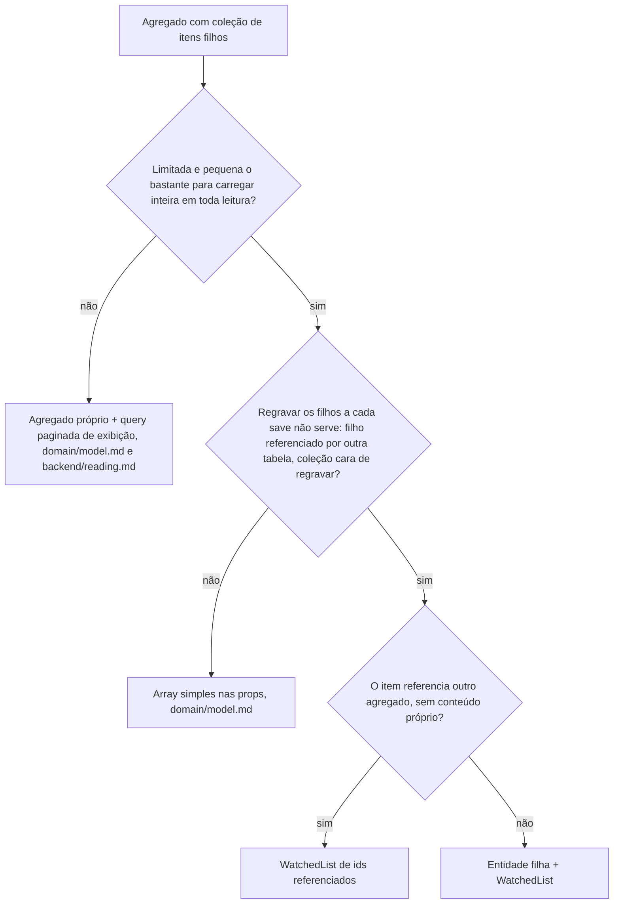

# WatchedList

A coleção filha com delta rastreado: o agregado guarda a coleção numa `WatchedList<T>`, que sabe o que entrou e o que saiu desde a carga, e o repositório grava só esse delta em vez de substituir os filhos. Os exemplos usam o `Order` de `domain/model.md`, com `items` como `OrderItemList`.

## Quando usar



- Coleção ilimitada (comentários de um post, registros de acesso) nunca vira prop do agregado: o filho é candidato a agregado próprio (`backend/persistence.md`, "Mapper"), a listagem é query paginada (`backend/reading.md`), e invariante sobre a coleção (um limite, uma contagem) usa método de contrato que consulta o banco.
- Sem motivo para o delta, a coleção fica array simples, e o repositório substitui os filhos (`backend/persistence.md`).

## A classe base

`WatchedList<T>` vive em `@metri/core/entities`, pronta (watched-list.examples.md#watchedlist), e nenhum módulo reimplementa.

| Membro | Papel |
| --- | --- |
| `constructor(initialItems?)` | Estado inicial, a coleção vinda do banco na reconstituição |
| `compareItems(a, b)` | Abstrato; identidade entre dois itens, implementado pela subclasse |
| `add(item)` / `remove(item)` | Mutação item a item; readicionar um item removido cancela a remoção, e vice-versa |
| `update(items)` | Substituição completa: recebe o conjunto final e recalcula o delta contra o estado corrente |
| `getItems()` | A coleção corrente |
| `getNewItems()` / `getRemovedItems()` | O delta que o repositório grava |
| `exists(item)` | Pertencimento pelo mesmo `compareItems` |

**Obrigatório.** `update()` recebe o conjunto final completo: item corrente ausente do argumento vira remoção, e acrescentar um item é `add()`.

**Obrigatório.** Uma operação de negócio usa mutação item a item ou uma única substituição completa, nunca as duas: cada `update()` sobrescreve o delta inteiro.

**Proibido.** Salvar a mesma instância do agregado duas vezes: nada zera o delta depois da escrita, e a segunda gravação o reaplicaria.

## Especialização e entidade

**Obrigatório.** Cada coleção tem a própria subclasse em arquivo próprio na raiz de `enterprise/`, ao lado da entidade dona, implementando só `compareItems`; a entidade guarda a subclasse nas props, e o mapper a monta no `toDomain()` (`new OrderItemList(items)`).

Exemplo completo: watched-list.examples.md#orderitemlist

**Obrigatório.** A mutação continua por método de domínio da entidade (`addItem()` chama `this.props.items.add(item)`), nunca pela lista de fora (`domain/model.md`, "Agregado e mutação interna").

Quando o filho tem id para o cliente: **Obrigatório.** `compareItems` usa o `equals` da entidade filha, e a substituição completa recebe o item mantido como a instância corrente, localizada por id na coleção; referência a id que não existe na coleção é `failure`.

> **Por quê.** Item recriado com id novo não é reconhecido, e o delta degenera em apagar e reinserir a coleção inteira.

Quando o filho não tem identidade para o cliente, que envia só o conjunto final (os intervalos de um horário, as faixas de uma tabela de frete): **Obrigatório.** `compareItems` compara pela identidade estrutural, um `sameValueAs()` da entidade filha sobre os campos de negócio, e o input não traz id de filho.

**Obrigatório.** O input de substituição chega sem duplicatas, rejeitadas ou dedupadas no schema Zod da porta: `update()` não dedupa, e o item repetido vira dois inserts.

### Coleção de vínculo

Quando o item só referencia outro agregado (as tags de um produto): **Obrigatório.** A lista guarda os ids referenciados, sem entidade filha, e o caso de uso valida em lote que eles existem antes de montá-la.

```ts
// domain/enterprise/product-tag-ids.ts
import { UniqueEntityID, WatchedList } from '@metri/core/entities';

export class ProductTagIds extends WatchedList<UniqueEntityID> {
  compareItems(a: UniqueEntityID, b: UniqueEntityID): boolean {
    return a.equals(b);
  }
}
```

Vínculo que carrega payload próprio (uma quantidade, uma posição) é conteúdo próprio: entidade filha.

## O repositório grava o delta

**Obrigatório.** O `save()` grava a raiz e o delta na mesma `$transaction` (`backend/persistence.md`): `createMany` de `getNewItems()`, `deleteMany` de `getRemovedItems()`, pelo mapper do filho.

Exemplo completo: watched-list.examples.md#orderprismarepositoryimpl

O delta rastreia pertencimento, não conteúdo: filho que continua na coleção e mudou um campo não aparece nele.

Quando um filho que continua na coleção muda de conteúdo (a quantidade de um item): **Obrigatório.** A raiz marca os filhos alterados, e o `save()` grava cada um por `update`, na mesma `$transaction`.

## Verificação rápida

- A coleção passou pela árvore (agregado próprio, array simples, entidade filha ou ids referenciados)?
- A subclasse tem arquivo próprio ao lado da entidade, com a identidade certa (`equals`, `sameValueAs()` ou ids)?
- Mutação de fora passa por método de domínio, nunca pela lista direto?
- A operação usa item a item ou uma única substituição completa, com `update()` recebendo o conjunto final?
- Na substituição de itens com id, item mantido é a instância corrente, e o input chega sem duplicatas?
- Em vínculo puro, os ids foram validados em lote antes de montar a lista?
- O `save()` grava raiz, delta e filhos alterados na mesma `$transaction`, e nenhuma instância é salva duas vezes?
