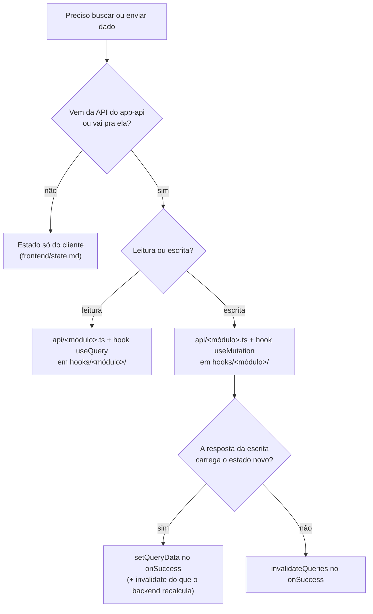

# Busca de dados no frontend

Como o `app-web` busca e envia dado pro app-api: o cliente HTTP, as funções de `api/`, os hooks de React Query (query e mutation), a key factory, a sincronização de cache e o caminho de erro.

Os exemplos usam o domínio didático de pedidos (`order`, `customer`) de `skills/writing-for-agents/RULE-FORMAT.md`, "Domínio didático".

## A árvore de decisão

Antes de escrever qualquer fetch, o roteamento: nem todo dado passa por React Query, e nem toda escrita sincroniza o cache do mesmo jeito.



- **Estado servidor lido e escrito pelas rotas REST do app-api é do React Query**, pela divisão de `frontend/state.md` ("A divisão fundamental: servidor ou cliente").
- **Estado só do cliente** (modal aberto, passo de wizard, filtro na URL) fica fora daqui, em `frontend/state.md`.

## O cliente HTTP

Um cliente só, `httpClient` em `lib/http/client.ts`, sobre o `fetch`. É o mutator que as funções geradas de `api/` chamam, e facade de dependência externa (`frontend/structure.md`, casa `lib/`): não conhece domínio. Ele trabalha sempre na origem da página: os paths do OpenAPI já trazem o `/api`.

Exemplo completo: data-fetching.examples.md#httpclient.

Como a chamada sai na própria origem, o browser envia o cookie sem configuração cross-origin, e não existe env de URL da API no frontend — trocar de ambiente não troca nada no bundle.

Em desenvolvimento, o Vite encaminha `/api` para o app-api. O proxy aponta para a porta do app-api (data-fetching.examples.md#viteconfig). Em produção, o edge mantém o mesmo contrato de path e de preservação do host; essa configuração pertence ao IaC, não ao bundle do frontend.

A mensagem que a interface mostra sai do erro por `lib/http/to-user-facing-message.ts`, e quem monta a notificação a consome (adiante). O nome segue a convenção `to<Alvo>`/`from<Origem>`, um por arquivo. O formato de resposta de erro é o do backend (`backend/errors.md`, "O formato de resposta de erro").

```ts
// lib/http/to-user-facing-message.ts
import { ApiError } from './client';

/**
 * The message the notification shows, from the request failure. It comes from the
 * backend envelope (`backend/errors.md`, "O formato de resposta de erro"); a failure with no
 * response, such as the network being down, has no message to show.
 */
export function toUserFacingMessage(error: unknown): string {
  if (error instanceof ApiError && error.body?.message) {
    return error.body.message;
  }

  return 'Tente novamente em instantes.';
}
```

Só a mensagem sai daqui. O título da notificação é a ação que falhou, e quem sabe qual é ela é a tela, não o servidor: o mesmo código de erro chega igual venha de onde vier. Tela que precisa ramificar por código lê `error.body?.code` no próprio ponto de uso, sem tabela intermediária.

## Funções de API

As funções de `api/` são geradas pelo Orval a partir do `openapi.json` do app-api (`backend/http-api.md`, "Contrato de API: o backend é a fonte"): uma função por endpoint em `api/<módulo>.ts`, e os schemas Zod e os tipos em `api/model.zod.ts`. Elas chamam o `httpClient`, não têm lógica de UI e não conhecem React Query, e não validam a resposta em runtime: quem garante a forma é o `@ZodResponse` do servidor. A pasta inteira é do gerador: muda por `pnpm api:generate`.

Exemplo completo: data-fetching.examples.md#orvalconfig.

O tipo da resposta, do filtro e do payload é o gerado, importado de `@/api/model.zod`, nunca redeclarado à mão (`frontend/helpers.md`, "Tipos compartilhados"). A função gerada devolve o corpo como o backend o nomeia (`{ order }`, `backend/http-api.md`, "Presenter e corpo de resposta"): quem desembrulha é a `queryFn` do hook. O hook a chama dentro de uma arrow (`() => fetchOrder(id)`): passada por referência, ela receberia o contexto do React Query no lugar do `init` do fetch.

Parâmetro de conjunto fechado segue `backend/http-api.md`, "União fechada".

## A key factory

Cada módulo tem uma key factory em `hooks/<módulo>/keys.ts`: um objeto hierárquico que constrói cada nível a partir do anterior. É a única fonte das query keys do módulo, consumida pelos hooks e pela invalidação.

```ts
// hooks/order/keys.ts
import type { FetchOrdersParams } from '@/api/model.zod';

export const orderKeys = {
  all: ['orders'] as const,
  lists: () => [...orderKeys.all, 'list'] as const,
  list: (filters?: FetchOrdersParams) =>
    [...orderKeys.lists(), filters ?? {}] as const,
  details: () => [...orderKeys.all, 'detail'] as const,
  detail: (id: string) => [...orderKeys.details(), id] as const,
};
```

A hierarquia é o que dá invalidação granular: `orderKeys.all` invalida tudo do módulo, `orderKeys.lists()` só as listagens, `orderKeys.detail(id)` um pedido só. Declarar a key à mão em cada hook é o que essa factory evita, porque uma key digitada errado não quebra com erro, só deixa o cache dessincronizado em silêncio. O `keys.ts` é o único arquivo não-hook dentro de `hooks/<módulo>/`: é companion dos hooks do módulo.

## Hooks de query

Componente nunca chama `useQuery` direto: sempre um custom hook em `hooks/<módulo>/`, um por arquivo (`frontend/structure.md`, "Estrutura de pastas"). O hook liga a key factory à função de `api/`. Leitura de item único é `useOrder`, de lista é `useOrders`.

```ts
// hooks/order/use-order.ts
import { useQuery } from '@tanstack/react-query';
import { fetchOrder } from '@/api/order';
import { orderKeys } from './keys';

export function useOrder(id: string) {
  return useQuery({
    queryKey: orderKeys.detail(id),
    queryFn: () => fetchOrder(id).then(({ order }) => order),
  });
}
```

```ts
// hooks/order/use-orders.ts
import { useQuery } from '@tanstack/react-query';
import type { FetchOrdersParams } from '@/api/model.zod';
import { fetchOrders } from '@/api/order';
import { orderKeys } from './keys';

export function useOrders(filters?: FetchOrdersParams) {
  return useQuery({
    queryKey: orderKeys.list(filters),
    queryFn: () => fetchOrders(filters),
  });
}
```

O hook devolve o objeto do `useQuery` inteiro (`data`, `isPending`, `isError`, ...); a página consome os estados dele e monta o loading/erro com os componentes do `@metri/ui`. Hook que compõe mais de uma fonte não tem objeto pra devolver: entrega o dado com nome de domínio mais `isPending`, `hasLoadError`, `isRetrying` e `refetch`, já derivados, que é o que a tela consome (`frontend/components.md`, "Estados de leitura").

## Freshness: `staleTime` é decisão do hook

**Proibido.** `staleTime` global no `QueryClient`.

> **Por quê.** Um valor global faz todo dado herdar a defasagem em silêncio; o default do TanStack nasce stale e revalida no foco, no mount e na reconexão.

Quando a query precisa de outra freshness: **Obrigatório.** O próprio hook declara o `staleTime`.

```ts
// hooks/shipping/use-shipping-methods.ts
export function useShippingMethods() {
  return useQuery({
    queryKey: shippingKeys.all,
    queryFn: () => fetchShippingMethods().then(({ shippingMethods }) => shippingMethods),
    // changes on release, not during the session
    staleTime: Number.POSITIVE_INFINITY,
  });
}
```

## Hooks de mutation

Escrita feita por rota REST do app-api é um `useMutation` embrulhado num hook, nomeado pelo verbo da ação (`useCreateOrder`, `useCancelOrder`), sem sufixo `Mutation`: o verbo já diz que muda estado. O recorte é a operação da API, não o controle da tela: rota que atualiza vários campos tem um hook só, e quando a tela dispara esse hook de mais de um lugar, quem identifica a escrita em voo é `variables`, não um hook por controle. No `onSuccess`, o hook sincroniza o cache.

```ts
// hooks/order/use-create-order.ts
import { useMutation, useQueryClient } from '@tanstack/react-query';
import type { CreateOrderDto } from '@/api/model.zod';
import { createOrder } from '@/api/order';
import { orderKeys } from './keys';

export function useCreateOrder() {
  const queryClient = useQueryClient();

  return useMutation({
    mutationFn: (input: CreateOrderDto) => createOrder(input),
    onSuccess: () => {
      queryClient.invalidateQueries({ queryKey: orderKeys.lists() });
    },
  });
}
```

## Atualizar vs. invalidar o cache

Depois de uma mutation, duas formas de manter o cache em dia, e a régua é uma frase: **o que a resposta carrega, atualiza; o que o backend recalcula além dela, invalida.** A régua pressupõe a decisão irmã do backend — endpoint de escrita devolve o recurso escrito pelo presenter, não só um id; sem isso todo caminho colapsa em invalidar, e cada escrita paga uma ida extra ao servidor.

- **`setQueryData` (atualizar)** quando a resposta da escrita já traz o estado novo. O hook escreve no cache o que recebeu — status, `updatedAt`, o agregado que nasceu no mesmo commit — sem refetch nenhum.
- **`invalidateQueries` (invalidar)** quando o backend calcula algo além do que a resposta traz: a listagem que reordena, refiltra e reconta no servidor, várias entidades que mudam sem o front ver todas, ou quando a consistência importa mais que evitar um refetch.

Exemplo completo: data-fetching.examples.md#useconfirmorder

## Erro e sucesso: quem dispara a ação nomeia o resultado

O erro percorre um caminho fixo. O `httpClient` lança `ApiError` em falha de HTTP; a `queryFn`/`mutationFn` propaga; o React Query põe no estado de erro do hook. Não há handler global de notificação no `QueryClient`: quem transforma a falha em algo visível é sempre quem disparou a ação, no ponto em que ela acontece.

**Leitura vira estado de tela, não toast.** Falha de leitura que impede a tela de existir mostra o `LoadErrorState` com a saída de tentar de novo (`frontend/components.md`, "Estados de leitura"); leitura acessória, cuja falha não trava nada, não mostra nada. Nos dois casos o toast seria uma segunda cópia do mesmo fato, ou uma interrupção por algo que não interrompe.

**Escrita vira notificação no handler.** O `catch` do handler chama o `toast.error` da lib `sonner` (`defaults/ui.md`, "Componente novo"), com o título nomeando a ação que falhou e a descrição vindo do `toUserFacingMessage`, que lê o envelope do backend. A exceção é a tela que ramifica por código e mostra estado próprio: ali o erro de escrita vai pra esse estado, não pra notificação.

**Escrita confirmada também notifica.** Toda escrita, confirmada ou recusada, notifica no handler que a disparou, e é essa simetria que mantém a regra copiável. No sucesso o título nomeia o que aconteceu ("Pedido confirmado") e a descrição diz em que estado a pessoa encontra o resultado, nomeando o item quando a tela o tem ("O pedido 1042 já aparece nos confirmados."). Quando a escrita produziu um efeito além do que o título diz, é ele que a descrição conta ("A fatura foi emitida."). Navegar em seguida não substitui a notificação: a tela de destino mostra o estado novo, não diz que a ação acabou de acontecer.

```tsx
const [isConfirming, startConfirmTransition] = useTransition();

function handleConfirm() {
  startConfirmTransition(async () => {
    try {
      await confirmOrder.mutateAsync(order.id);
      toast.success('Pedido confirmado', {
        description: `O pedido ${order.number} já aparece nos confirmados.`,
      });
      navigate('/orders', { replace: true });
    } catch (error) {
      toast.error('Não foi possível confirmar o pedido', {
        description: toUserFacingMessage(error),
      });
    }
  });
}
```

O título é do frontend porque só ele sabe qual ação o usuário disparou; no erro, a descrição é do backend porque só ele sabe o motivo, e no sucesso ela também é do frontend, que sabe onde o resultado aparece. Entre os dois, nenhum repete o outro.

### O estado em voo cobre a ação inteira

O handler usa `mutateAsync` com `try/catch`, não `mutate` com callbacks, porque o que vem depois da escrita — a notificação, o `navigate` — é parte da mesma ação, e o `isPending` da mutation solta o controle antes de tudo isso terminar. Quem representa o em-voo é a primitiva que corresponde à interface:

- **Handler de botão:** `useTransition`, um par por ação (`isConfirming`, `isCanceling`). Ações que disputam o mesmo recurso se combinam num `isBusy` que desabilita o conjunto de controles junto (o nome segue `frontend/components.md`, "O nome separa estado da fonte e estado da página").
- **Submit de formulário:** `formState.isSubmitting` do React Hook Form, que o `await` no `handleFormSubmit` já cobre por inteiro.
- **Linha de lista:** o `variables` da mutation identifica qual item está em voo, sem um hook por linha.

Flag manual de pending (`useState` ligado e desligado à mão) não nasce: as primitivas acima acompanham a função async sem código de sincronização, e a flag manual é a que fica ligada pra sempre no caminho de erro esquecido. `mutation.isPending` continua sendo o estado cru da escrita, útil quando só a requisição importa.

Erro de campo de formulário continua no `FieldError` do campo via react-hook-form, não vira toast: notificação é para falha de requisição, não para validação prevista. Validação de entrada sem campo onde ancorar, como tipo e tamanho de arquivo, é a exceção que notifica.

## Provider e configuração

O `QueryClient` é singleton de módulo em `app/providers/query-client.ts` (casa dos providers globais do app), importado no provider em `app/index.tsx` (a casa de composição). Sem SSR, um singleton de módulo basta; não há request a isolar, então o `useState(() => new QueryClient())` do modelo Next.js não é necessário.

Exemplo completo: data-fetching.examples.md#app.

O `@tanstack/react-query-devtools` entra só em desenvolvimento, montado como irmão do router, quando o primeiro consumo real justificar.

## Verificação rápida

- Toda chamada REST passa pelo `httpClient` sob `/api`, na origem da página, sem URL de API configurada no frontend?
- Em desenvolvimento, o proxy de `/api` preserva o `Host` e não reescreve o domínio do cookie?
- Leitura de estado servidor e escrita REST estão em React Query, sem cópia do dado em `useState`/contexto/store?
- A operação HTTP é a função gerada de `api/<módulo>.ts`, sem edição à mão, sobre o `httpClient`?
- Tipo de resposta, de filtro e de payload vem de `api/model.zod.ts`, não redeclarado no app?
- O componente consome um custom hook de `hooks/<módulo>/`, nunca `useQuery`/`useMutation` direto?
- As query keys saem da factory em `hooks/<módulo>/keys.ts`, não são digitadas à mão no hook?
- A mutation sincroniza o cache pela regra (atualiza o que a resposta carrega, invalida o que o backend recalcula)?
- Falha de leitura vira estado de tela e falha de escrita vira notificação no `catch` do handler, com o título nomeando a ação?
- Escrita confirmada notifica no mesmo handler, com o título nomeando o resultado e a descrição dizendo onde ele aparece ou o efeito além do título?
- O handler usa `mutateAsync` com o em-voo vindo da primitiva da interface (`useTransition`, `isSubmitting`, `variables`), sem flag manual de pending?
- Sem `staleTime` global, e o hook que precisa de outra freshness declara o seu?
- O `QueryClient` é o singleton de `app/providers/query-client.ts`, montado no provider de `app/index.tsx`?
