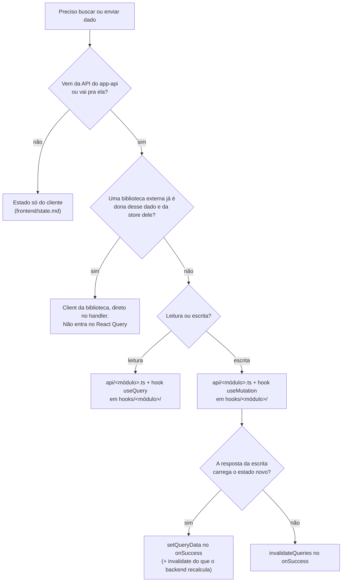

# Busca de dados no frontend

Como o `app-web` busca e envia dado pro app-api: o cliente HTTP, as funções de `api/`, os hooks de React Query (query e mutation), a key factory, a sincronização de cache e o caminho de erro.

Os exemplos usam o domínio didático de pedidos (`order`, `customer`) de `methodology/authoring.md`, "Domínio didático".

## A árvore de decisão

Antes de escrever qualquer fetch, o roteamento: nem todo dado passa por React Query, e nem toda escrita sincroniza o cache do mesmo jeito.



Três fronteiras saem do React Query e são registradas antes do detalhe:

- **Estado servidor lido e escrito pelas rotas REST do app-api é do React Query**, pela divisão de `frontend/state.md` ("A divisão fundamental: servidor ou cliente").
- **Estado só do cliente** (modal aberto, passo de wizard, filtro na URL) fica fora daqui, em `frontend/state.md`.
- **Dado cuja store reativa pertence a uma biblioteca externa fica com ela**, não com o React Query (`frontend/state.md`). Quando essa fronteira existir, valem as regras de "Comando de biblioteca externa fica no handler".

### Comando de biblioteca externa fica no handler

Método imperativo de um client externo é chamado direto no handler da página, com os callbacks do próprio client. O estado local da ação usa a primitiva que corresponde à interface: `formState.isSubmitting` no submit de formulário, `useTransition` numa ação de botão e um id em `useState` quando uma lista precisa identificar a linha em voo (a mesma tabela de "O estado em voo cobre a ação inteira", adiante). Um `useMutation` ou hook próprio não embrulha o método apenas pra reproduzir `isPending`, callbacks ou dar outro nome à chamada.

Hook sobre esse client nasce em dois casos. O primeiro é a mesma orquestração React pertencer a mais de um dono, e isso inclui os efeitos e o estado ao redor da chamada, não apenas o método de transporte: quando cada tela navega, notifica ou representa o estado em voo de forma diferente, cada uma mantém seu próprio handler. O segundo é o comando cujo efeito é sincronizar uma query do React Query: ele é um `useMutation` em `hooks/<módulo>/`, com a key invalidada no `onSuccess`, porque quem conhece a key factory é o módulo do hook, não a tela — a invalidação inline no handler é a que digita a key errada sem nada acusar. Comando sem efeito em cache não ganha hook por simetria.

Para leitura, a fronteira é o ciclo de estado, não a origem do dado: a pergunta é se a biblioteca mantém store reativo daquele dado, e ela se responde pelo que a biblioteca publica, nunca pelo nome dela. A mesma biblioteca costuma expor os dois, e um caso não contradiz o outro.

Método imperativo não é store: não há o que duplicar, então é estado servidor e entra em React Query, com o método como `queryFn`. Store reativo é o oposto: copiá-lo cria duas verdades que desincronizam sozinhas, então o hook da biblioteca é chamado direto no componente, sem hook nosso por volta, e ler um campo do que ele devolveu é inline no ponto de uso.

Duas ressalvas devolvem a leitura pro React Query mesmo havendo store. Store de A que carrega um array de B é store de A: quando o assunto da tela é B, e B tem endpoint próprio com paginação, ordenação ou filtro, B é estado servidor por conta própria. E store que não revalide como estado servidor, sem rebuscar ao reganhar assinante nem invalidar nas escritas, mostraria dado velho ao ser revisitado, que é justamente quando o dado costuma ter mudado.

A recíproca também vale: escrita que muda um dado da store da biblioteca **sem** passar pelo client dela não notifica os assinantes daquela store. Nesse caso quem escreve avisa explicitamente, senão o cliente aponta pro estado anterior pelo resto da sessão do navegador, e o sintoma aparece longe da causa.

Se o comando muda um fato que uma query da tela também lê, o `onSuccess` sincroniza essa query no próprio handler. A tela que permanece montada atualiza, invalida ou reseta a key conforme "Atualizar vs. invalidar o cache"; a que sai do fluxo não sincroniza, porque a query nasce stale e revalida quando voltar a montar.

## O cliente HTTP

Um cliente só, em `lib/http/client.ts`, uma instância `createFetch` do `@better-fetch/fetch`. É facade de dependência externa (`frontend/structure.md`, casa `lib/`): não conhece domínio. Ele trabalha sempre na origem da página, sob `/api`.

```ts
// lib/http/client.ts
import { createFetch } from '@better-fetch/fetch';

export const httpClient = createFetch({
  // A origem é lida no momento da chamada, nunca de uma env: o frontend é
  // servido pela mesma origem que atende /api (general/http-surface.md, "Superfície HTTP").
  baseURL: `${window.location.origin}/api`,
  // erro de HTTP vira exceção, não valor de retorno: o React Query só
  // popula o estado de erro se a queryFn/mutationFn lançar.
  throw: true,
});
```

O prefixo `/api` pertence ao facade, não às funções de `api/`: elas continuam recebendo `/orders`, `/orders/:id` e demais paths de recurso. Como a chamada sai na própria origem, o browser envia o cookie sem configuração cross-origin, e não existe env de URL da API no frontend — trocar de ambiente não troca nada no bundle.

Em desenvolvimento, o Vite encaminha `/api` para o app-api. O proxy usa a forma objeto, aponta para `http://127.0.0.1:3000`, mantém `changeOrigin: false` e não reescreve domínio de cookie. Assim o backend recebe o `Host` da página, não o host interno do target. Em produção, o edge mantém o mesmo contrato de path e de preservação do host; essa configuração pertence ao futuro IaC, não ao bundle do frontend.

```ts
// vite.config.ts
server: {
  proxy: {
    '/api': {
      target: 'http://127.0.0.1:3000',
      changeOrigin: false,
      cookieDomainRewrite: false,
    },
  },
},
```

Por que better-fetch e não `fetch` cru: valida a resposta contra um schema Zod pelo `output`, e carrega o corpo de erro parseado no `BetterFetchError`. A escolha é reversível sem tocar `api/`, porque tudo passa por este facade; se um dia outro mecanismo bastar, só o `client.ts` muda.

A mensagem que a interface mostra sai do erro por `lib/http/to-user-facing-message.ts`, e quem monta a notificação a consome (adiante). O nome segue a convenção `to<Alvo>`/`from<Origem>`, um por arquivo. O formato de resposta de erro é o do backend (`backend/errors.md`, "O formato de resposta de erro"); este arquivo não redefine o formato, lê ele.

```ts
// lib/http/to-user-facing-message.ts
import { BetterFetchError } from '@better-fetch/fetch';

/**
 * A mensagem que a notificação mostra, a partir da falha da requisição. Vem do
 * envelope do backend (`backend/errors.md`, "O formato de resposta de erro"); falha sem
 * resposta, como rede indisponível, não tem mensagem nenhuma para exibir.
 */
export function toUserFacingMessage(error: unknown): string {
  if (error instanceof BetterFetchError && error.error?.message) {
    return error.error.message;
  }

  return 'Tente novamente em instantes.';
}
```

Só a mensagem sai daqui. O título da notificação é a ação que falhou, e quem sabe qual é ela é a tela, não o servidor: o mesmo código de erro chega igual venha de onde vier. Tela que precisa ramificar por código lê `error.error.code` no próprio ponto de uso, sem tabela intermediária.

## Funções de API

Cada operação REST do app-api é uma função em `api/<módulo>.ts` (`frontend/structure.md`, casa `api/`): usa o `httpClient`, não tem lógica de UI e não conhece React Query. Leitura valida a resposta com o schema do contrato canônico, importado do pacote dono do conceito (`backend/http-api.md`, "Contrato de API compartilhado"), passado como `output`, garantindo em runtime que o backend devolveu o formato esperado. Escrita recebe o input já tipado. Nos exemplos, `@metri/<pacote-dono>` é esse pacote, cuja escolha segue a colocação de `general/code-placement.md`.

Exemplo completo: data-fetching.examples.md#apiorderts

O tipo da resposta é o que o contrato canônico exporta, derivado do schema por `z.infer` e nomeado lá, e é importado do pacote, nunca redeclarado à mão nem escrito como `z.infer<typeof schema>` na própria assinatura (`frontend/helpers.md`, "Tipos compartilhados" e "Zod schema vs. type plain"). Escrita também tem corpo (`backend/http-api.md`, "Presenter e corpo de resposta") e passa `output` do mesmo jeito. O corpo nomeia o que carrega (`{ order }`): a função de `api/` desembrulha o envelope e devolve o recurso; quando o corpo carrega mais de um (`{ order, invoice }`), devolve o corpo como vem.

O input segue a mesma regra: o tipo do filtro de listagem e o do payload de escrita vêm do contrato canônico, não declarados em `api/<módulo>.ts`. A key factory consome o tipo do filtro, e com ele declarado em `api/` a fronteira inverte — `hooks/` passa a importar de `api/` um tipo que não é da chamada HTTP. O retorno de cada função é anotado explicitamente (`Promise<OrderList>`): a assinatura é o contrato que o hook lê, não uma inferência que muda quando o corpo muda.

Parâmetro de conjunto fechado e o nome do query param na URL do app seguem `backend/http-api.md`, "União fechada e limite do contrato".

## A key factory

Cada módulo tem uma key factory em `hooks/<módulo>/keys.ts`: um objeto hierárquico que constrói cada nível a partir do anterior. É a única fonte das query keys do módulo, consumida pelos hooks e pela invalidação.

```ts
// hooks/order/keys.ts
import type { FetchOrdersFilters } from '@metri/<pacote-dono>';

export const orderKeys = {
  all: ['orders'] as const,
  lists: () => [...orderKeys.all, 'list'] as const,
  list: (filters?: FetchOrdersFilters) =>
    [...orderKeys.lists(), filters ?? {}] as const,
  details: () => [...orderKeys.all, 'detail'] as const,
  detail: (id: string) => [...orderKeys.details(), id] as const,
};
```

A hierarquia é o que dá invalidação granular: `orderKeys.all` invalida tudo do módulo, `orderKeys.lists()` só as listagens, `orderKeys.detail(id)` um pedido só. Declarar a key à mão em cada hook é o que essa factory evita, porque uma key digitada errado não quebra com erro, só deixa o cache dessincronizado em silêncio. O `keys.ts` é o único arquivo não-hook dentro de `hooks/<módulo>/`; ele é companion dos hooks do módulo, mesma lógica do `<módulo>.helpers.ts` companion dos arquivos do módulo (`frontend/helpers.md`, "Nível 2: helper do módulo").

## Hooks de query

Componente nunca chama `useQuery` direto: sempre um custom hook em `hooks/<módulo>/`, um por arquivo (`frontend/structure.md`, "Estrutura de pastas"). O hook liga a key factory à função de `api/`. Leitura de item único é `useOrder`, de lista é `useOrders`.

```ts
// hooks/order/use-order.ts
import { useQuery } from '@tanstack/react-query';
import { fetchOrder } from '@/api/order';
import { orderKeys } from './keys';

export function useOrder(id: string) {
  return useQuery({
    queryKey: orderKeys.detail(id),
    queryFn: () => fetchOrder(id),
  });
}
```

```ts
// hooks/order/use-orders.ts
import { useQuery } from '@tanstack/react-query';
import type { FetchOrdersFilters } from '@metri/<pacote-dono>';
import { fetchOrders } from '@/api/order';
import { orderKeys } from './keys';

export function useOrders(filters?: FetchOrdersFilters) {
  return useQuery({
    queryKey: orderKeys.list(filters),
    queryFn: () => fetchOrders(filters),
  });
}
```

O hook devolve o objeto do `useQuery` inteiro (`data`, `isPending`, `isError`, ...); a página consome os estados dele e monta o loading/erro com os componentes do `@metri/ui`. Hook que compõe mais de uma fonte não tem objeto pra devolver: entrega o dado com nome de domínio mais `isPending`, `hasLoadError`, `isRetrying` e `refetch`, já derivados, que é o que a tela consome (`frontend/components.md`, "Estados de leitura"). A `queryFn` fica fina: a chamada e o parse moram em `api/`, o hook só amarra key e função.

## Freshness: `staleTime` é decisão do hook

Não há `staleTime` global neste app. Cravar um valor canônico faria todo dado herdar aquela defasagem em silêncio, e o dado que precisa acompanhar o backend de perto (status de um job, saldo, disponibilidade) ficaria velho sem ninguém decidir por isso. O default de fábrica do TanStack já erra pro lado seguro: o dado nasce stale e revalida no foco, no mount e na reconexão. A freshness de cada query é escolha do hook, visível ali, não num default do provider.

A escolha é pela volatilidade do dado, em quatro tiers:

- **Padrão:** muda com uso normal (um pedido, uma lista). Fica no default de fábrica, sem declarar `staleTime`. Revalida no foco/mount/reconexão.
- **Estável:** quase não muda na sessão (opções de um select, dado de referência, valores iniciais de formulário). Declara `staleTime` alto, até `Infinity`, pra cortar refetch inútil.
- **Realtime:** precisa acompanhar o backend de perto (job em andamento). `staleTime: 0` e `refetchInterval` com condição de parada (ver "Polling" em Padrões de referência), não um `staleTime` baixo torcendo pra bastar.
- **Verificação pontual:** consulta disparada por uma ação do usuário pra decidir algo na hora (disponibilidade de um slug, de um e-mail, de um código), sem necessidade de manter atualizado depois. `staleTime: 0` e `gcTime` baixo (ou `0`), sem `refetchInterval`: livre agora pode não estar disponível segundos depois, então reusar um resultado do cache é sempre errado aqui, não só impreciso — diferente do tier realtime, não é um job em andamento que justifique polling, é uma pergunta pontual, tipicamente ao lado de um debounce da entrada do usuário.

O tier padrão é a maioria e não escreve nada. Os demais declaram a config no próprio hook:

```ts
// hooks/shipping/use-shipping-methods.ts (tier estável)
import { useQuery } from '@tanstack/react-query';
import { fetchShippingMethods } from '@/api/shipping';
import { shippingKeys } from './keys';

export function useShippingMethods() {
  return useQuery({
    queryKey: shippingKeys.all,
    queryFn: fetchShippingMethods,
    // muda em release, não na sessão: staleTime alto corta refetch inútil
    staleTime: Number.POSITIVE_INFINITY,
  });
}
```

Quando a mesma config se repete entre hooks de um módulo, ela é extraída com `queryOptions` (helper do TanStack Query v5) e reusada, pra não copiar `staleTime` e tier em cada arquivo.

Uma consequência de não ter `staleTime` global: query do tier padrão nasce stale, então `refetchOnWindowFocus` revalida a cada foco. Numa tela onde isso é chatty demais, o próprio hook sobe o `staleTime`, que é a mesma decisão por hook. O default nunca esconde o requisito de freshness, ele só escolhe o lado seguro.

## Hooks de mutation

Escrita feita por rota REST do app-api é um `useMutation` embrulhado num hook, nomeado pelo verbo da ação (`useCreateOrder`, `useCancelOrder`), sem sufixo `Mutation`: o verbo já diz que muda estado. O recorte é a operação da API, não o controle da tela: rota que atualiza vários campos tem um hook só, e quando a tela dispara esse hook de mais de um lugar, quem identifica a escrita em voo é `variables`, não um hook por controle. No `onSuccess`, o hook sincroniza o cache. Comando de client externo segue "Comando de biblioteca externa fica no handler".

```ts
// hooks/order/use-create-order.ts
import { useMutation, useQueryClient } from '@tanstack/react-query';
import { createOrder } from '@/api/order';
import { orderKeys } from './keys';

export function useCreateOrder() {
  const queryClient = useQueryClient();

  return useMutation({
    mutationFn: createOrder,
    onSuccess: () => {
      queryClient.invalidateQueries({ queryKey: orderKeys.lists() });
    },
  });
}
```

## Atualizar vs. invalidar o cache

Depois de uma mutation, duas formas de manter o cache em dia, e a régua é uma frase: **o que a resposta carrega, atualiza; o que o backend recalcula além dela, invalida.** A régua pressupõe a decisão irmã do backend — endpoint de escrita devolve o recurso escrito pelo presenter, não só um id; sem isso todo caminho colapsa em invalidar, e cada escrita paga uma ida extra ao servidor.

- **`setQueryData` (atualizar)** quando a resposta da escrita já traz o estado novo. O hook escreve no cache o que recebeu — status, `updatedAt`, o agregado que nasceu no mesmo commit — sem refetch nenhum.
- **`invalidateQueries` (invalidar)** quando o backend calcula algo além do que a resposta traz: a listagem que reordena, refiltra e reconta no servidor, várias entidades que mudam sem o front ver todas, ou quando a consistência importa mais que evitar um refetch.
- **`resetQueries` (descartar)** quando um valor obsoleto no cache decide navegação, e não só o que a tela mostra.

O terceiro caso é estreito e vale explicar. Invalidar marca a query como stale mas **mantém o dado**, então `isPending` continua `false` e quem lê recebe o valor antigo por um render. Numa tabela isso é um flash; num guard de rota, é um redirecionamento para o lugar errado, que só se corrige quando o refetch chega. Remover apaga o dado, mas deixa observers já montados órfãos, sem refetch nenhum: a tela trava. `resetQueries` é a que faz as duas coisas — limpa o dado e rebusca em quem está observando —, então serve tanto pra quem continua na tela quanto pra quem navega pra uma rota onde o consumidor ainda vai montar.

Regra prática: mutação que muda um fato lido por um guard usa `resetQueries` na key desse fato. As demais seguem em `invalidateQueries`.

Exemplo completo: data-fetching.examples.md#useconfirmorder

## Paginação: a página anterior fica na tela, a próxima já chega

Lista paginada declara `placeholderData: (previous) => previous`: durante o refetch da página nova, a anterior continua visível e a tela não volta pro skeleton a cada clique. O hook também faz prefetch da página seguinte quando ela existe, pra navegação instantânea.

O prefetch mora num `useEffect` com **dependências primitivas**, nunca com o objeto de filtros: o objeto muda de referência a cada render e dispararia o prefetch em todo commit. O hook desmonta o objeto nas primitivas e remonta o filtro da página seguinte dentro do efeito.

Exemplo completo: data-fetching.examples.md#useorders

A página e os filtros moram na URL, não em `useState`, e chegam como parâmetro do hook: mudar a URL troca a key e o React Query refetcha (`frontend/state.md`, "URL state" e "O hook de params da tela").

## Erro e sucesso: quem dispara a ação nomeia o resultado

O erro percorre um caminho fixo. O `httpClient` lança em falha de HTTP (`throw: true`); a `queryFn`/`mutationFn` propaga; o React Query põe no estado de erro do hook. Não há handler global de notificação no `QueryClient`: quem transforma a falha em algo visível é sempre quem disparou a ação, no ponto em que ela acontece.

**Leitura vira estado de tela, não toast.** Falha de leitura que impede a tela de existir mostra o `LoadErrorState` com a saída de tentar de novo (`frontend/components.md`, "Estados de leitura"); leitura acessória, cuja falha não trava nada, não mostra nada. Nos dois casos o toast seria uma segunda cópia do mesmo fato, ou uma interrupção por algo que não interrompe.

**Escrita vira notificação no handler.** O `catch` do handler chama o `Sonner.toast.error` (`@metri/ui/components/ui/sonner`), com o título nomeando a ação que falhou e a descrição vindo do `toUserFacingMessage`, que lê o envelope do backend. Escrita por comando de client externo segue a mesma forma, com a mensagem do próprio pacote. A exceção é a tela que ramifica por código e mostra estado próprio: ali o erro de escrita vai pra esse estado, não pra notificação.

**Escrita confirmada também notifica.** Toda escrita, confirmada ou recusada, notifica no handler que a disparou, e é essa simetria que mantém a regra copiável. No sucesso o título nomeia o que aconteceu ("Pedido confirmado") e a descrição diz em que estado a pessoa encontra o resultado, nomeando o item quando a tela o tem ("O pedido 1042 já aparece nos confirmados."). Quando a escrita produziu um efeito além do que o título diz, é ele que a descrição conta ("A fatura foi emitida."). Navegar em seguida não substitui a notificação: a tela de destino mostra o estado novo, não diz que a ação acabou de acontecer. A exceção é a edição campo a campo, em que a linha volta ao estado de leitura já com o valor novo e é ela própria a confirmação: ali só a falha notifica, e é ela quem desfaz, devolvendo o valor da fonte com `resetField`.

```tsx
const [isConfirming, startConfirmTransition] = useTransition();

function handleConfirm() {
  startConfirmTransition(async () => {
    try {
      await confirmOrder.mutateAsync(order.id);
      Sonner.toast.success('Pedido confirmado', {
        description: `O pedido ${order.number} já aparece nos confirmados.`,
      });
      navigate('/orders', { replace: true });
    } catch (error) {
      Sonner.toast.error('Não foi possível confirmar o pedido', {
        description: toUserFacingMessage(error),
      });
    }
  });
}
```

O título é do frontend porque só ele sabe qual ação o usuário disparou; no erro, a descrição é do backend porque só ele sabe o motivo, e no sucesso ela também é do frontend, que sabe onde o resultado aparece. Entre os dois, nenhum repete o outro.

### O estado em voo cobre a ação inteira

O handler usa `mutateAsync` com `try/catch`, não `mutate` com callbacks, porque o que vem depois da escrita — a notificação, o `navigate` — é parte da mesma ação, e o `isPending` da mutation solta o controle antes de tudo isso terminar. Quem representa o em-voo é a primitiva que corresponde à interface:

- **Handler de botão:** `useTransition`, um par por ação (`isConfirming`, `isCanceling`). Ações que disputam o mesmo recurso se combinam num `isBusy` que desabilita o conjunto de controles junto (o nome segue `frontend/components.md`, "O nome separa estado da fonte e estado da página").
- **Submit de formulário:** `formState.isSubmitting` do React Hook Form, que o `await` no `handleFormSubmit` já cobre por inteiro.
- **Linha de lista:** o `variables` da mutation identifica qual item está em voo, sem um hook por linha.
- **Linha de lista em comando de client externo, sem mutation:** um id em `useState` identifica a linha em voo e é limpo no `finally`. É a exceção declarada à flag manual do parágrafo abaixo: sem mutation não há `variables`, e o `finally` desliga o id também no caminho de erro.

Flag manual de pending (`useState` ligado e desligado à mão) não nasce: as primitivas acima acompanham a função async sem código de sincronização, e a flag manual é a que fica ligada pra sempre no caminho de erro esquecido. `mutation.isPending` continua sendo o estado cru da escrita, útil quando só a requisição importa.

Erro de campo de formulário continua no `Field.Error` do campo via react-hook-form, não vira toast: notificação é para falha de requisição, não para validação prevista. Validação de entrada sem campo onde ancorar, como tipo e tamanho de arquivo, é a exceção que notifica.

## Provider e configuração

O `QueryClient` é singleton de módulo em `app/providers/query-client.ts` (casa dos providers globais do app), importado no provider em `app/index.tsx` (a casa de composição). Sem SSR, um singleton de módulo basta; não há request a isolar, então o `useState(() => new QueryClient())` do modelo Next.js não é necessário.

Exemplo completo: data-fetching.examples.md#app

A troca de dono segue `frontend/state.md`, "Troca de dono: o estado que depende do dono é limpo": no cache, é o `queryClient.clear()` na instância do `QueryClientProvider`, e nenhum `persistQueryClient` é montado.

O `@tanstack/react-query-devtools` entra só em desenvolvimento, montado como irmão do router, quando o primeiro consumo real justificar.

## Padrões de referência

Sem instância no produto ainda; a primeira de cada segue este documento, pela regra de transição de `methodology/authoring.md`. Ficam aqui pra que a primeira implementação não reinvente o padrão.

### Optimistic update

Atualiza o cache antes da resposta e reverte no erro, pra feedback imediato. Só quando a latência percebida importa e a reversão é barata.

Exemplo completo: data-fetching.examples.md#usecancelorder

O `onError` do hook trata a reversão do cache; a notificação continua sendo do handler que disparou a ação, no `catch` dele.

### Polling

Dado que precisa de refresh automático usa `refetchInterval` com condição de parada, pra não pollar pra sempre.

```ts
export function useOrderProcessing(id: string) {
  return useQuery({
    queryKey: orderKeys.detail(id),
    queryFn: () => fetchOrder(id),
    refetchInterval: (query) => {
      const status = query.state.data?.status;
      if (status === 'CONFIRMED' || status === 'CANCELLED') {
        return false;
      }
      return 3000;
    },
  });
}
```

## Verificação rápida

- Comando de client externo está no handler da página, sem `useMutation` ou hook que apenas o embrulhe?
- Toda chamada REST passa pelo `httpClient` sob `/api`, na origem da página, sem URL de API configurada no frontend?
- Em desenvolvimento, o proxy de `/api` preserva o `Host` e não reescreve o domínio do cookie?
- Leitura de estado servidor e escrita REST estão em React Query, sem cópia do dado em `useState`/contexto/store?
- A operação HTTP é uma função em `api/<módulo>.ts`, usando o `httpClient`, sem lógica de UI, com o retorno anotado explicitamente?
- Leitura valida a resposta com o schema do contrato canônico (`output`), sem cópia local?
- Tipo de resposta, de filtro e de payload vem do contrato canônico, não declarado em `api/` nem redeclarado no app?
- O componente consome um custom hook de `hooks/<módulo>/`, nunca `useQuery`/`useMutation` direto?
- As query keys saem da factory em `hooks/<módulo>/keys.ts`, não são digitadas à mão no hook?
- A mutation sincroniza o cache pela regra (atualiza mudança simples, invalida mudança calculada pelo backend, descarta o que um guard lê pra decidir rota)?
- Escrita que muda um dado da store de uma biblioteca externa sem passar pelo client dela avisa os assinantes daquela store?
- Falha de leitura vira estado de tela e falha de escrita vira notificação no `catch` do handler, com o título nomeando a ação?
- Escrita confirmada notifica no mesmo handler, com o título nomeando o resultado e a descrição dizendo onde ele aparece ou o efeito além do título?
- O handler usa `mutateAsync` com o em-voo vindo da primitiva da interface (`useTransition`, `isSubmitting`, `variables`), sem flag manual de pending?
- Lista paginada declara `placeholderData` e faz prefetch da próxima página com deps primitivas no efeito?
- A freshness de cada query é decisão do hook pela volatilidade (padrão/estável/realtime/verificação pontual), sem `staleTime` global?
- O `QueryClient` é o singleton de `app/providers/query-client.ts`, montado no provider de `app/index.tsx`?
- Todo evento que troca o dono do dado chama `queryClient.clear()`, e nada do cache é persistido em storage?

**Pontos em aberto:**

- Em aberto: `refetchOnWindowFocus` no backoffice (ADR-0011)
