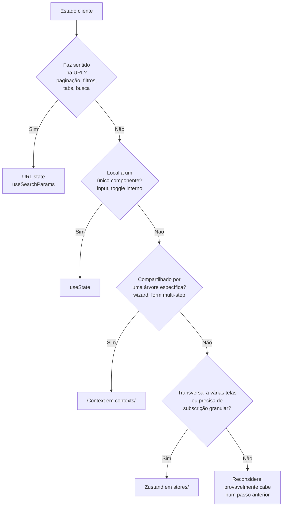

# Estado cliente no frontend

Como o `app-web` guarda estado que vive só no navegador: a divisão entre estado servidor e estado cliente, e a árvore que roteia cada dado pra URL, `useState`, Context ou Zustand.

Os exemplos usam o domínio didático de pedidos (`order`, `customer`).

## A divisão fundamental: servidor ou cliente

A primeira pergunta antes de escolher onde um dado mora é a origem dele.

**Estado servidor** é o dado que vem de uma API, vai pra uma API, ou os dois. Mora em React Query e em nenhum outro lugar. Nunca é copiado pra `useState`, Context ou Zustand: uma cópia manual desincroniza da fonte em silêncio no primeiro refetch. A regra prática: se o dado tem dono no backend, ele não vira estado cliente.

**Estado cliente** é o dado que existe só no frontend, sem persistência no backend: estado de UI (modal aberto, tab ativa, item selecionado), estado de fluxo (passo atual de um wizard), preferência de sessão. É desse estado que o resto do documento trata.

## A árvore de decisão

Todo estado cliente passa por esta sequência antes de escolher ferramenta. A primeira resposta "sim" decide.



Estado que poderia viver na URL ou num `useState` mas foi parar num store global é a forma mais comum de complexidade desnecessária.

## URL state: paginação, filtros, tabs, busca, ordenação

Estado que faz sentido num link compartilhável deve estar na URL. O ganho é concreto: o link carrega o estado, o refresh não perde nada, e voltar/avançar do navegador funciona sem código extra.

Casos:

- Paginação: `?page=3`.
- Filtros: `?status=ACTIVE&category=premium`.
- Tabs: `?tab=details`.
- Busca: `?q=customer+name`.
- Ordenação: `?sortBy=date&sortDirection=desc`.

No react-router isso não precisa de wrapper próprio: `useSearchParams` devolve o par leitura/escrita, e o updater funcional cobre merge e remoção de chave.

Exemplo completo: state.examples.md#orderdetailstabs

Filtro e paginação seguem o mesmo mecanismo, e o valor lido da URL vira parâmetro do hook de React Query. Trocar filtro reescreve a URL, a chave da query muda, e o React Query refetcha com a chave nova (`frontend/data-fetching.md`, "A key factory"). A URL é a fonte única do filtro; o componente não guarda uma segunda cópia em `useState`.

O `useSearchParams` do react-router entrega tudo como `string`: a conversão pra número, boolean ou enum fica no ponto de leitura.

## useState: estado de um único componente

Estado que só um componente lê e escreve fica em `useState`. Modal de confirmação, toggle interno, valor de hover: nada disso precisa sair do componente.

```tsx
function OrderActions() {
  const [isConfirmOpen, setIsConfirmOpen] = useState(false);

  return (
    <>
      <Button onClick={() => setIsConfirmOpen(true)}>Cancelar pedido</Button>
      <ConfirmModal open={isConfirmOpen} onClose={() => setIsConfirmOpen(false)} />
    </>
  );
}
```

Envolver isso num Context ou num store global é o anti-padrão inverso: adiciona uma casa de estado compartilhado pra um dado que ninguém compartilha.

## Context: estado de uma árvore de componentes

Use Context quando o estado é lido por vários componentes de uma árvore específica, mas não sai dela: um wizard onde os passos compartilham o mesmo fluxo, um form complexo com seções coordenadas, um compound component com estado interno.

O arquivo do context mora na casa `shared/contexts/`, por módulo, como as outras casas do `app-web` (`frontend/structure.md`, "Estrutura de pastas"). O nome segue `frontend/structure.md`, "Nomeação de arquivo" (`contexts/<módulo>.tsx`). A casa não vira depósito de estado global: cada context é local a uma árvore, e a separação por módulo é o que evita um Context único inchado.

Exemplo completo: state.examples.md#orderwizardprovider

O Provider é montado local à árvore que o usa, não em `app/`: a página que renderiza o wizard (uma tela de `pages/order/`, por exemplo) envolve só a subárvore do fluxo. Quando essa árvore desmonta, o estado do wizard morre com ela. `app/` fica reservado aos providers globais da aplicação, ver a seção de Zustand e tema abaixo.

Um cuidado com Context: quando o valor do Provider muda, todo componente que chama `useContext` re-renderiza. Numa árvore pequena isso é aceitável. Quando a árvore cresce e o re-render pesa, o caminho é dividir em contexts menores ou, se o estado já não é mais local a uma árvore, subir pra Zustand.

## Zustand: estado transversal a várias telas

Use Zustand quando o estado é compartilhado entre telas diferentes (um carrinho que aparece no header e na página de checkout, um filtro global aplicado em várias listas) ou quando o custo de re-render do Context seria alto e você precisa de subscrição granular. Zustand é a biblioteca de estado global cliente desta Source.

O store mora na casa `shared/stores/`, por módulo (`shared/stores/cart.ts`), com `create<T>()` tipado. Não há Provider: o store é um hook global, e é essa a diferença prática pro Context. Estado e ações moram no mesmo `create`.

A ausência de Provider também decide casos que a árvore acima empurraria pro Context. Um estado cujo gatilho mora num componente de `shared/components/` fica em store mesmo quando só uma árvore o lê: com Provider, aquele componente passa a quebrar em qualquer tela montada fora dela, e `shared/components/` existe justamente pra ser usada de qualquer área. Vale pra abertura de um menu de busca disparada tanto pelo layout quanto pelo cabeçalho de cada tela.

Exemplo completo: state.examples.md#usecartstore

**Selector sempre, nunca o store inteiro.** Um componente subscreve a fatia que usa, não o objeto todo; consumir `useCartStore()` sem selector re-renderiza o componente a cada mudança de qualquer campo. Pra selecionar um valor único, passe o selector direto. Pra selecionar um objeto ou lista derivada, use `useShallow`, senão o novo objeto a cada render dispara re-render por identidade.

```tsx
import { useShallow } from 'zustand/react/shallow';
import { useCartStore } from '@/shared/stores/cart';

export function CartBadge() {
  // primitive slice: re-renders only when the size changes
  const count = useCartStore((state) => state.items.length);
  return <Badge count={count}>Carrinho</Badge>;
}

export function CartActions() {
  // selecting several slices: useShallow avoids re-renders caused by object identity
  const { addItem, clear } = useCartStore(
    useShallow((state) => ({ addItem: state.addItem, clear: state.clear })),
  );
  // ...
}
```

**Persistência é decisão por store, não default.** Um store que precisa sobreviver a refresh (um carrinho, por exemplo) usa o middleware `persist` sobre `localStorage`. Store que não precisa não persiste.

Um store nasce coeso num arquivo. Quando ele cresce a ponto de misturar fatias sem relação, o padrão de slices do Zustand (compor vários slice creators num `create`) divide sem quebrar o hook; isso é resposta a um store grande demais, não estrutura antecipada.

## Tema não é estado de store

Preferência de tema é do provider de tema de `frontend/theming.md`, fora da árvore acima.

## Persistência: o que sobrevive a refresh

Persistência é ortogonal à árvore de decisão, não um tier novo: é o `useState` local ou o store global que ganham durabilidade, cada um pelo caminho da própria camada.

- Estado global que sobrevive a refresh: Zustand com `persist` (ver acima).
- Preferência de tema: o provider de tema (ver acima).
- Preferência local a um componente que sobrevive a refresh (banner dispensado, "não mostrar de novo", seção recolhida lembrada localmente): `localStorage` direto, lido no inicializador do `useState` e escrito junto com o setter.
- Dado servidor nunca vai pra `localStorage`.
- **Contexto de navegação nunca é guardado.** Onde o usuário está (o recurso aberto, a seção) sai da URL, e de mais nada: sem `localStorage`, sem "último item acessado". Guardar isso faz a mesma URL produzir telas diferentes conforme o que o navegador lembra, e o link deixa de descrever o que abre. A distinção contra o item acima é o que o dado é: preferência local é como a tela se apresenta, contexto é onde o usuário está.

## Anti-padrões

- **Mais de uma fonte de verdade.** Não duplicar o mesmo estado entre URL e `useState`, nem entre Context e Zustand. Uma fonte por dado.
- **Persistir o mesmo dado por dois caminhos.** Um store com `persist` e um `localStorage` manual na mesma chave criam duas fontes de verdade. Dado persistido tem um caminho só.

## Verificação rápida

- O dado vem ou vai pra API? Se sim, está em React Query, e não copiado pra estado cliente?
- O dado faz sentido num link compartilhável (paginação, filtro, tab, busca)? Se sim, está na URL via `useSearchParams`, sem segunda cópia em `useState`?
- O dado é local a um componente? Se sim, está em `useState`?
- O dado é compartilhado por uma árvore específica? Se sim, está num Context de `contexts/`, com o Provider montado local à árvore?
- O dado atravessa telas ou precisa de subscrição granular? Se sim, está num store de `stores/`, consumido por selector (`useShallow` pra objeto/lista)?
- Não há duplicação entre fontes (URL + local, Context + Zustand)?

