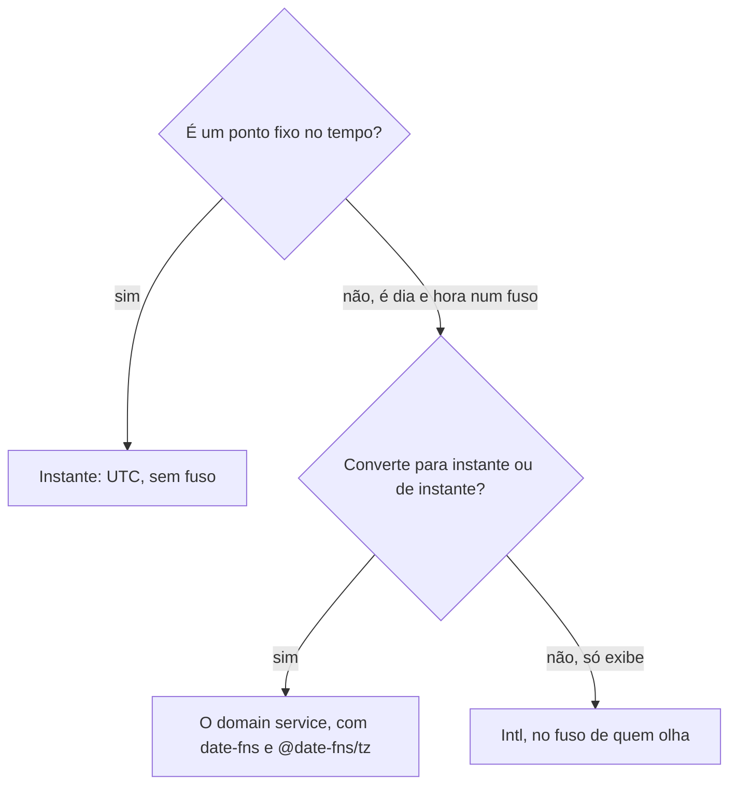

# Data e fuso

Todo valor de data ou hora é um de dois conceitos, nunca uma mistura: o instante, um ponto fixo no tempo, e o momento de parede, um dia e uma hora que só valem num fuso. Nos exemplos, o `confirmedAt` de um `Order` é instante, e o horário de corte do envio no mesmo dia de um `DeliveryMethod` ("pedido confirmado até 14:00 sai hoje") é momento de parede.

## Instante

**Obrigatório.** Instante é guardado, comparado e passado entre camadas em UTC: `Date`, epoch em milissegundos, string ISO com `Z` ou offset, coluna `timestamptz`.

> **Por quê.** O instante não pertence a fuso nenhum; trocar o fuso de quem lê muda só a hora que ele vê.

## Momento de parede

**Obrigatório.** Momento de parede (a data, ou o dia da semana, e a hora `HH:mm`) anda junto do fuso IANA em que vale (`America/New_York`), guardado ao lado dele.

**Proibido.** Montar ou ler um momento de parede no fuso do processo (`new Date(ano, mês, dia, hora)`, `getHours()`, `setDate()`) quando ele entra numa conta de negócio.

> **Por quê.** O fuso do processo muda do laptop para o servidor e para a CI: a mesma conta dá outro resultado em cada lugar, e o teste que passa de dia quebra à noite.

## A conversão

**Obrigatório.** A conversão entre momento de parede e instante mora num domain service (`domain/domain-services.md`), com `date-fns` e `@date-fns/tz`: o `TZDate` monta e lê a data no fuso que recebe.

> **Por quê.** Horário de verão, fuso de offset não inteiro e mudança histórica de fuso são a classe de bug que a biblioteca resolve; a conta à mão com `Intl` e `Date` erra justo nesses dias.

**Obrigatório.** O domain service devolve o instante como `Date` comum (`new Date(zoned.getTime())`), sem o `TZDate`: quem recebe um instante não leva adiante o fuso de origem.

**Obrigatório.** O spec do domain service prova a ida e a volta em dois fusos, um deles atravessando a troca de horário de verão.

## Exibição

**Obrigatório.** O frontend recebe instante, ou texto já formatado, e o mostra no fuso de quem olha a tela, com `Intl` (`frontend/helpers.md`, "Nível 3: fora do módulo, a casa é o que a função conhece"); a conta que cruza fuso fica no backend, que conhece o fuso do dono.

## Árvore de decisão

## Verificação

- Todo instante gravado ou passado entre camadas é UTC, sem fuso embutido?
- Todo momento de parede de negócio leva a data ou o dia, a hora e o fuso IANA juntos?
- A conversão passa pelo domain service, com o spec de ida e volta em dois fusos e na troca de horário de verão?
- O backend e os pacotes não montam data no fuso do processo (`new Date(ano, mês, dia)`)? (check: date-time)
