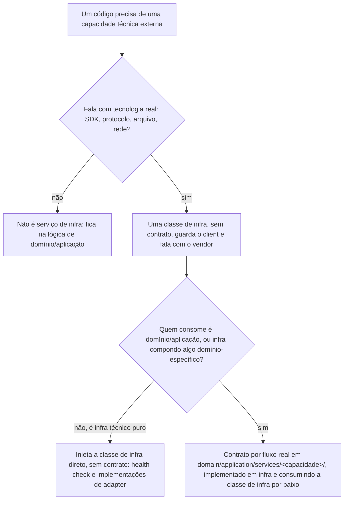

# Infraestrutura

Dono de: a regra transversal dos níveis para um serviço de infraestrutura compartilhado — a classe de infra que guarda o client do vendor, sem contrato; o contrato por fluxo real que domínio e aplicação injetam; o registro no `ServicesModule`; o dublê por contrato.

Consultar antes de: integrar um serviço externo ou um vendor novo ao backend; criar a classe de infra ou o contrato de um serviço de infraestrutura; decidir se um nível a mais de abstração compensa para uma capacidade; registrar um service no `ServicesModule` ou criar o dublê dele.

Não cobre: o desenho de cada capacidade (`infrastructure/mail.md`, `infrastructure/storage.md`, `infrastructure/cache.md`); a fila (`backend/async-jobs.md`); hook de request, guard, interceptor e filter, que não são serviço de integração (`infrastructure/runtime.md`, "Fronteiras de request"); a mecânica do contrato `abstract class` (`backend/application.md`).

Como as capacidades técnicas compartilhadas são organizadas e consumidas pelos módulos: quantos níveis de abstração cada uma tem, onde o contrato mora, onde a implementação concreta mora e o critério pra decidir se um nível a mais compensa.

Os exemplos usam as classes de e-mail de `infrastructure/mail.md` como instância da regra. Quando um caso real não se encaixar nas regras daqui, não force o encaixe nem infira uma variação por conta própria: pare, sinalize e pergunte antes de implementar.

## A regra dos níveis para um serviço de infraestrutura compartilhado

A mecânica do contrato já está fechada em `backend/application.md` ("Contratos são `abstract class`"): `abstract class` em `domain/application/services/`, implementação em `infra/services/`, registrada com `{ provide: <Contrato>, useClass: <Impl> }`. O que muda entre capacidades não é essa mecânica, é quem consome e onde a composição acontece.

Toda capacidade que fala com vendor tem uma classe de infra: guarda o client, sabe a env var, sabe o formato de payload dele. Essa classe nunca tem contrato próprio, mesmo papel de `PrismaService` e `PgBossService`, infra falando com infra, sem indireção. É nela, e só nela, que o nome do vendor aparece.

A classe de infra monta o client pela regra de env e client de `infrastructure/runtime.md`, "Env e montagem de client".



Domínio ou aplicação, seja um caso de uso, seja uma composição de infra que monta uma resposta domínio-específica, nunca injeta a classe de infra. Injeta um contrato específico do que aquele fluxo precisa, um por fluxo real, nunca um contrato genérico da capacidade nem um contrato por módulo agrupando vários fluxos. Um contrato genérico só permite ao spec provar que algo foi chamado; um contrato por fluxo permite provar a intenção, com dado estruturado. É a mesma forma que `backend/async-jobs.md` já fixou pra fila (`<fluxo>-queue.contract.ts`). Infra que faz trabalho puramente técnico, como health check, injeta a classe de infra direto. Implementação de query de `backend/reading.md` também injeta `PrismaService` direto, e nada além dele, mas o controller consome o contrato da ação em `domain/application/queries/`; resposta que precisa de outra capacidade não é query, é caso de uso (terceira pergunta da árvore daquele documento). A implementação de um contrato de service injeta a classe de infra da própria capacidade e, quando o fluxo pede, o contrato de outra: service que completa o próprio resultado com o de outra capacidade compõe pelo contrato dela, nunca pela classe de vendor dela. A capacidade de baixo segue com contrato, dublê e registro próprios, e continua servindo quem a consome direto.

`services/` ganha subpasta por capacidade (`mail/`, e depois `storage/`, `cache/`), porque acumula contratos de tecnologias diferentes; mesmo motivo que levou `enterprise/` a ganhar `value-objects/` e `enums/` (`backend/modules.md`), `strategies/` (`domain/strategy.md`) e `specifications/` (`domain/specification.md`). A subpasta nomeia a capacidade externa e não reusa o nome de um módulo que tem agregado: esse nome já é de `use-cases/` e `queries/`, e a terceira pasta com ele passa a prometer os services daquele módulo. Módulo sem agregado, que existe só por causa da capacidade, empresta o nome sem ambiguidade. É diferente de `queues/` em `backend/async-jobs.md`, que ficou flat: lá todo contrato é a mesma tecnologia, só muda o fluxo, então não tem o que separar por capacidade.

## Registro no Nest

Providers de serviço de infra entram num módulo único, `ServicesModule`, mesmo princípio do `HttpModule` único por ação:

```ts
// infra/services/services.module.ts
@Module({
  providers: [
    ResendMailService,
    {
      provide: OrderConfirmationSender,
      useClass: OrderConfirmationSenderImpl,
    },
  ],
  exports: [OrderConfirmationSender],
})
export class ServicesModule {}
```

A classe de infra entra em `providers` mas não em `exports`: nada fora das implementações da própria pasta de services deveria precisar dela direto. Contrato novo entra na mesma lista, com `{ provide: <Contrato>, useClass: <Impl> }` em `providers` e o contrato em `exports`.

## Testes

Dublê por contrato, nunca da classe de infra. O dublê vive em `test/services/<capacidade>/fake-<contrato>.impl.ts`, implementa o contrato e acumula os inputs recebidos numa lista pública `items`. Quando o e2e troca o provider do contrato pelo dublê segue `backend/testing.md`. A classe de infra não tem dublê em `test/`: nada fora da própria pasta a injeta. A exceção é a impl que compõe, encadeando outra capacidade ou escolhendo entre vendors: ela tem ramificação própria, ganha spec unitário ao lado do arquivo pelo critério de `backend/testing.md`, e é o único lugar que substitui a classe de infra, por um stub local ao spec. Impl que só delega não tem spec próprio, e o e2e da rota com o dublê do contrato é a prova dela.

## Verificação rápida

- A capacidade nova passou pela regra dos níveis (classe de infra sem contrato, contrato específico pra quem é domínio/aplicação)?
- O nome do vendor aparece só na classe de infra?
- Um contrato por fluxo real, nunca um contrato genérico da capacidade nem por módulo?
- Providers no `ServicesModule`, com a classe de infra fora de `exports`?
- A subpasta de `services/` nomeia a capacidade, sem reusar nome de módulo com agregado?
- Impl que precisa de outra capacidade injeta o contrato dela, nunca a classe de vendor dela?
- Dublê por contrato acumulando em `items`, e a classe de infra substituída só no spec da impl que compõe?
