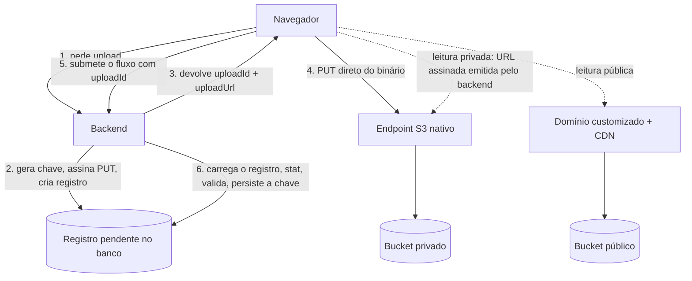

# Storage

O storage de objetos: dois buckets, um público, servido por domínio customizado atrás de CDN, e um privado, acessado só por URL assinada (na implementação de referência, contra o endpoint S3 nativo). O backend é o único trust boundary do storage: gera as chaves, assina as URLs e é quem decide o que cada chamador pode alcançar. Quem escolhe por onde o binário de usuário sobe é tamanho e volume: arquivo pequeno e de baixa frequência passa pelo backend, que recebe o corpo e grava ele mesmo; arquivo grande ou de alto volume sobe direto pro storage por URL assinada de escrita, e o backend só emite a permissão (seção "Quando o binário do usuário passa pelo backend").

Os exemplos usam o Cloudflare R2 como implementação de referência, não como vendor obrigatório: a decisão dos dois buckets nasce de uma restrição real dele, e argumentar isso no abstrato esconderia o motivo. O que é padrão aqui é a forma — dois buckets por visibilidade, chave canônica, contrato por asset, registro pendente —, não o nome do vendor: as regras deste documento independem do vendor, salvo onde o texto marca um detalhe como da implementação de referência. O resto dos exemplos segue o domínio didático de pedidos de `methodology/authoring.md`, "Domínio didático", com o agregado `Product` e a coleção de fotos dele de `domain/watched-list.md`.

## Por que dois buckets

Restrição da implementação de referência primeiro: URL assinada do R2 só funciona contra o endpoint S3 nativo, nunca atrás de domínio customizado; domínio customizado, CDN e WAF só existem pra bucket público. São dois mecanismos de acesso fisicamente distintos; não existe um bucket que às vezes é público e às vezes assinado atrás do mesmo domínio.

Postura de segurança segundo, e esse argumento valeria mesmo sem a restrição: a exposição pública do R2 é do bucket inteiro. Objeto privado salvo por engano num bucket público é vazamento imediato, cacheado na CDN; com dois buckets, o mesmo engano de roteamento vira 404. A separação física transforma a classe de falha mais provável (erro de roteamento de chave na aplicação) de incidente de vazamento em bug funcional.

A classificação é allowlist: todo asset é privado por default, e público é exceção declarada no contrato do asset. Nunca existe "privado por exceção".

## O namespace de um asset

Os dois buckets são compartilhados por todos os assets do sistema, e o que separa um do outro é o prefixo da chave, não um bucket por dono. Um bucket por entidade introduziria custo operacional de provisionamento sem ganho de segurança correspondente, e o isolamento lógico por prefixo é o mesmo modelo que o banco já adota.

O que o prefixo é e o que não é:

- No bucket público, o prefixo não é controle de acesso: o bucket é público, qualquer URL válida resolve. O prefixo é organização e higiene operacional (auditoria, limpeza); a defesa daquele lado é a chave não adivinhável (componente UUID, seção "A chave").
- No bucket privado, o prefixo também não é o mecanismo de segurança: a segurança é o escopo do dono, aplicado na assinatura (`backend/access-scope.md`, "Storage").

Quando um asset pertence a uma entidade que também é fronteira de acesso, ela abre a chave, com a coleção e o identificador dela antes do tipo de asset: uma entidade acumula mais de um asset, e é por ela que a limpeza lista o que apagar. Enquanto essa fronteira não existir, a chave começa direto no tipo de asset (`{assetType}/{uuid}.{ext}`); introduzir um nível de namespace "por precaução" cria um prefixo que ninguém consulta e uma migração de chave quando o nível real aparecer.

## A chave

```txt
{entidade}/{entityId}/{assetType}/{uuid}.{ext}
```

- A chave é gerada pelo backend, nunca derivada do nome de arquivo do usuário: nome de usuário na chave é vetor de path traversal, colisão e dado pessoal vazando pra URL.
- O componente UUID é obrigatório e é a defesa contra enumeração no bucket público.
- O banco armazena a chave, nunca a URL. URL pública é derivada da chave na hora de exibir; URL assinada é efêmera e nasce a cada leitura.

## A classe de infra

Na implementação de referência, `R2StorageService` guarda o client S3 do R2 (privado, ninguém fora da classe o toca) e expõe os dois nomes de bucket e as operações genéricas. Diferente do client do Resend (`infrastructure/mail.md`), o `S3Client` cru não é uma interface confortável: toda operação exige montar um `Command`, e essa montagem se repetiria idêntica em cada asset. Por isso aqui a classe de infra tem métodos, todos genéricos, sem nenhuma convenção de asset dentro:

Exemplo completo: storage.examples.md#r2storageservice

Pontos-chave:

- O TTL de URL assinada é constante interna da classe, nunca parâmetro de contrato: um lugar só decide, e asset que legitimamente precisar de outro valor fixa isso na implementação dele. Gerar a assinatura é computação local com a credencial, sem chamada de rede, então assinar em listagem não custa I/O.
- `Content-Type` sempre entra na assinatura de upload: upload com tipo divergente falha na porta do R2, na implementação de referência. Sem essa trava, uma URL de escrita vira vetor pra hospedar HTML malicioso sob o domínio do produto.
- A credencial é um token escopado exatamente aos dois buckets, nunca token de conta. O escopo é o teto de dano de qualquer URL vazada, e revogar o token invalida toda assinatura já emitida por ele.
- `stat` devolve `null` só quando o vendor confirma a ausência (`NotFound`, na implementação de referência); qualquer outra falha propaga como exceção. `null` é vocabulário de ausência, nunca de erro técnico, mesma linha do não-encontrado de `backend/reading.md`. Sem essa distinção, um soluço de rede na confirmação viraria "objeto inválido" e o fluxo removeria um objeto válido que o usuário acabou de subir.

## Contrato por asset: dois eixos

O contrato de cada asset segue a regra dos níveis de `infrastructure/services.md` (um contrato por asset real, em `domain/application/services/storage/`), e os métodos dele são determinados por dois eixos independentes: quem origina o binário e quem pode ler.

| | Leitura pública | Leitura privada |
| --- | --- | --- |
| Binário do usuário | `requestUpload` + `stat` + `remove` + `publicUrl` | `requestUpload` + `stat` + `remove` + `getSignedUrl` |
| Binário do usuário, pequeno e de baixo volume | `save` + `remove` + `publicUrl` | `save` + `remove` + `getSignedUrl` |
| Binário do backend | `save` + `remove` + `publicUrl` | `save` + `remove` + `getSignedUrl` |

- Binário do usuário grande ou de alto volume sobe por URL assinada de escrita, direto pro storage (`requestUpload` emite a permissão; o backend nunca vê os bytes). Binário que o próprio backend gera (um relatório, um export) entra por `save`: o backend é a origem dos bytes, não proxy de ninguém, e já tem a credencial. A linha do meio é a da seção "Quando o binário do usuário passa pelo backend": mesma origem da primeira, mesmos métodos da terceira.
- Leitura pública é derivação da chave (`publicUrl`, sem I/O); leitura privada é uma URL nova e efêmera a cada exibição (`getSignedUrl`). `getSignedUrl` não existe em contrato de asset público: assinar o que já é público não é operação, e mantê-lo fora preserva a assinatura como ato de autorização.
- Quem traduz chave em URL é o contrato do asset, e quem o chama é o caso de uso que monta a resposta: o de escrita devolve a URL ao lado do agregado, e a leitura que precisa dela é caso de uso, não query de exibição (`backend/reading.md`, "A árvore de decisão", terceira pergunta). Query de exibição nunca injeta o contrato do asset. O presenter é estático e não injeta nada, e controller que injetasse o contrato do asset faria a porta decidir o que a aplicação já sabe.
- O método exportado segue a necessidade real do asset, nunca a simetria da tabela.

Os dois formatos, no domínio didático:

```ts
// domain/application/services/storage/product-photo-storage.contract.ts
// Foto de produto: binário do usuário, leitura pública.
export const PRODUCT_PHOTO_MIME_TYPES = [
  'image/jpeg',
  'image/png',
  'image/webp',
] as const;

export type ProductPhotoMimeType = (typeof PRODUCT_PHOTO_MIME_TYPES)[number];

export type RequestProductPhotoUploadInput = {
  mimeType: ProductPhotoMimeType;
};

export type RequestProductPhotoUploadOutput = {
  key: string;
  uploadUrl: string;
};

export abstract class ProductPhotoStorage {
  abstract requestUpload(
    input: RequestProductPhotoUploadInput,
  ): Promise<RequestProductPhotoUploadOutput>;

  abstract stat(key: string): Promise<{ sizeInBytes: number; contentType: string } | null>;

  abstract remove(key: string): Promise<void>;

  abstract publicUrl(key: string): string;
}
```

```ts
// domain/application/services/storage/order-report-storage.contract.ts
// Relatório de pedidos: binário do backend, leitura privada.
export type SaveOrderReportInput = {
  orderId: string;
  content: Buffer;
};

export abstract class OrderReportStorage {
  abstract save(input: SaveOrderReportInput): Promise<{ key: string }>;

  abstract remove(key: string): Promise<void>;

  abstract getSignedUrl(key: string): Promise<string>;
}
```

A implementação de cada contrato concentra o que é daquele asset: a convenção de chave, a escolha do bucket e os limites de tamanho/tipo. Cada método vira uma ou duas linhas sobre a classe de infra (`R2StorageService`, na implementação de referência):

Exemplo completo: storage.examples.md#productphotostorageimpl

A allowlist de tipos do asset é a união fechada do contrato: a fronteira Zod valida o mime com `z.enum(PRODUCT_PHOTO_MIME_TYPES)` (mesma regra do identificador variável de `backend/persistence.md`), e a extensão sai de um `Record` total sobre essa união, nunca de manipulação de string livre. O motivo de segurança está na regra 10 das "Regras absolutas do storage".

## O upload direto e o registro pendente

Upload direto muda quem segura a chave entre a assinatura e o uso: o navegador. Chave vinda de cliente é input não confiável, e este desenho elimina o problema por construção em vez de validar por disciplina: no momento de assinar, o backend cria um registro pendente no banco apontando pra chave que ele mesmo gerou, e o cliente só carrega o id desse registro. A chave nunca é aceita de volta; o caso de uso que consome o upload recarrega o registro dentro do mesmo escopo que emitiu a permissão, como qualquer leitura protegida (`backend/access-scope.md`).



O registro pendente é o agregado `Upload`, módulo próprio nos moldes de `backend/modules.md`: chave, tipo de asset (`product-photo`, por exemplo), content type declarado, status (pendente, consumido) e criação, com repositório, factory e dublê como qualquer agregado, e o repositório registrado em `persistence.module.ts`. O tipo de asset amarra o upload ao fluxo que o pediu: sem ele, um `uploadId` emitido pra foto de produto poderia ser submetido no consumo de outro asset e persistir uma chave cujo caminho mente sobre o que ela é. O fluxo de consumo, no caso de uso que recebe o `uploadId`:

```ts
// domain/application/use-cases/product/edit-product-photos.use-case.ts (trecho)
const upload = await this.uploadRepository.findById(input.uploadId);
if (!upload || upload.consumed || upload.assetType !== 'product-photo') {
  return failure(new UploadNotFoundError());
}

const stat = await this.productPhotoStorage.stat(upload.key);
if (!stat) {
  return failure(new InvalidUploadError());
}
if (stat.sizeInBytes > MAX_PRODUCT_PHOTO_SIZE_IN_BYTES) {
  await this.productPhotoStorage.remove(upload.key);
  return failure(new InvalidUploadError());
}
```

A verificação com `stat` na confirmação não é opcional, porque a assinatura de PUT não impõe tamanho máximo: qualquer um com a URL de escrita válida pode subir o que couber no teto do vendor dentro do TTL. O limite real de tamanho é checado aqui, contra o objeto que de fato chegou, e objeto inválido é removido na hora (o `null` do `stat` já significa ausência confirmada, então o `remove` só roda sobre objeto que existe e é inválido).

O consumo é uma transição de estado, e a ordem em volta da escrita do agregado dono importa pelo mesmo raciocínio de "Arquivo físico segue o destino do registro", adiante: o upload é marcado consumido antes da persistência que referencia a chave, ou junto dela na mesma transação, pelo desenho de `backend/transactions.md`, quando o fluxo justificar. Se a marcação acontecer e a escrita falhar, o custo é um novo upload; a ordem inversa deixaria a chave referenciada com o registro ainda pendente, e a limpeza agendada apagaria um objeto em uso. Dois consumos concorrentes do mesmo `uploadId` passando juntos pela revalidação são a corrida da escada de locking de `backend/transactions.md`, avaliada pelo projeto e, se aceita, registrada como decisão de projeto na forma de "Concorrência e locking".

Upload órfão é estado normal de operação, não falha rara: URL emitida e nunca usada, binário subido e fluxo abandonado. A limpeza é uma tarefa agendada de `backend/async-jobs.md`, computando por estado: registros pendentes mais velhos que o TTL com folga, removendo objeto primeiro e registro depois. Se a remoção do objeto falhar, o registro sobrevive e a próxima rodada reprocessa; na ordem inversa, a falha deixaria um objeto sem ponteiro nenhum, invisível pra sempre e, no bucket público, ainda acessível por URL.

## Arquivo físico segue o destino do registro

Quando um registro referencia um arquivo em storage (a foto de um produto), o arquivo acompanha o registro, e a ordem das operações em volta da escrita é fixa:

1. Validação do upload dos itens novos antes de mutar o domínio. No upload direto, o binário já subiu pro storage antes de o caso de uso começar, feito pelo navegador; o que o caso de uso faz é resolver a referência pelo registro pendente e validar o que chegou.
2. A mutação do domínio e a escrita (`replacePhotos()` e `save()`, no exemplo de `domain/watched-list.md`).
3. Remoção física dos arquivos dos itens removidos depois da escrita.

A ordem existe pelo modo de falha de cada passo. Se a validação falha, nada foi persistido e nenhuma referência quebrada existe no banco; o resíduo possível é um arquivo órfão no storage, invisível para o produto e coberto pela limpeza agendada da seção anterior. Se a remoção física falha depois da escrita, a operação continua concluída: o registro é a fonte de verdade, e a falha não desfaz a escrita. O binário que sobra fica órfão, e a limpeza agendada não o alcança, porque ela só varre registros pendentes: na arquitetura atual, esse órfão é risco operacional aceito, que uma reconciliação pode eliminar, na forma de `infrastructure/observability.md`, "Reconciliação"; o job concreto é delegação de projeto (`docs/architecture/INDEX.md`). A ordem inversa produziria o dano real: remover o arquivo antes da escrita que falha deixa um registro apontando para um arquivo que não existe.

## Quando o binário do usuário passa pelo backend

O que decide é tamanho e volume. Asset pequeno e de baixa frequência, como o avatar de um cliente, passa pelo backend: o corpo cabe no limite do servidor e o custo de banda e de memória é desprezível. Três peças deixam de existir junto: o registro pendente, o `stat` da confirmação e a limpeza agendada. Asset grande ou de alto volume, um vídeo ou uma importação recorrente, sobe direto por URL assinada, porque aí o corpo inteiro atravessando o processo é custo real e essas três peças se pagam.

O peso da conta não é a validação, é a limpeza: o upload direto obriga a uma tarefa agendada varrendo órfãos, e num app sem fila isso é criar uma capacidade inteira de agendamento para subir um avatar.

O passthrough é também o único formato em que a verdade dos bytes é alcançável: o upload direto entrega tamanho e `Content-Type` declarado, e nada mais, porque `stat` responde sobre o objeto que o storage recebeu, não sobre o que os bytes são. É benefício de quem já está deste lado pelo tamanho, não critério de escolha.

A forma é a do binário do backend, com a origem do binário do usuário:

- o cliente manda o binário no corpo, como data URL base64, e a fronteira Zod limita o tamanho da string;
- um value object decodifica, confere a assinatura dos bytes contra a allowlist e recusa o que não corresponde ao tipo declarado;
- o caso de uso chama `save`, recebe a chave e persiste a chave.

A ordem dentro do caso de uso é regra, não estilo: toda decisão que pode recusar a operação acontece antes do `save` do storage, inclusive as que não têm nada a ver com o binário. Objeto que sobe e só depois esbarra num `failure` fica órfão no bucket, porque a chave dele nunca chega a ser persistida e nenhuma limpeza o alcança. É o mesmo motivo pelo qual a remoção do objeto anterior vem depois da persistência da chave nova, e não antes.

O que não se aplica a esse formato, e por quê:

- registro pendente (`Upload`) e limpeza de órfãos: os dois existem por causa da janela entre assinar e usar, em que o navegador segura a chave. Aqui não existe janela, a chave nasce e é persistida na mesma operação, e a única falha possível deixa um objeto sem referência, não uma referência sem objeto;
- `stat` na confirmação: o tamanho é verificado sobre o binário decodificado, antes de subir.

O custo é real e precisa ser aceito na decisão: o corpo inteiro passa pelo processo antes de qualquer validação, e o limite de corpo do servidor HTTP passa a ter que acomodar o maior asset dessa classe, com a folga do base64, que infla cerca de um terço. Esse limite é do servidor, não da rota, então vale para todas as outras, e é por isso que o teto de tamanho do asset é o que segura o desenho: subi-lo é subir o corpo aceito em toda a API.

## Regras absolutas do storage

1. O dono de um asset, a assinatura e a recarga de registro seguem o escopo validado de `backend/access-scope.md`.
2. Chave nunca é aceita de cliente. No upload direto, a referência circula como id do registro pendente; no passthrough, a chave nasce dentro da mesma operação que a persiste. Nos dois, a chave sai do nosso banco.
3. Chave é gerada pelo backend, com componente UUID, sem nome de arquivo do usuário dentro. É esta regra que mantém a chave segura pra concatenar em URL sem encoding; conteúdo de usuário na chave quebraria também o `publicUrl`.
4. O banco armazena a chave, nunca a URL.
5. TTL de URL assinada é interno da classe de infra, nunca parâmetro de contrato.
6. No upload direto, toda assinatura trava o `Content-Type`, o limite real de tamanho é verificado com `stat` na confirmação, e objeto inválido é removido. No passthrough não há assinatura nem `stat`: o tipo e o tamanho são conferidos sobre o binário decodificado, antes de gravar.
7. Classificação de asset é allowlist: privado por default, público é exceção declarada no contrato.
8. A credencial da classe de infra é token escopado exatamente aos dois buckets, nunca de conta. Todo endpoint público que o vendor ofereça por default fica desabilitado, senão o conteúdo continua acessível por fora do domínio customizado, sem cache e sem WAF.
9. URL assinada é reutilizável até expirar; semântica de uso único, se algum fluxo exigir, é controle da aplicação, não da assinatura.
10. Todo asset de upload declara a allowlist de tipos como união fechada, consumida pelo contrato, e SVG nunca entra no bucket público: é imagem que executa script, e servida sob o domínio do produto vira XSS armazenado. No upload direto, o `Content-Type` travado na assinatura garante o header enviado, não a verdade dos bytes: a allowlist decide o que pode existir e o `stat` decide o tamanho. A verdade dos bytes só é alcançável quando o binário passa pelo backend.

## O que a decisão não é

- Proxy de leitura privada no edge (domínio customizado + autorização fora do backend): o trust boundary já é o backend, e um proxy seria um segundo runtime com lógica de autorização própria, fora do monorepo, que ainda precisaria validar o chamador de qualquer forma. Gatilho pra reabrir: asset privado de alta frequência de leitura, onde o cache passa a pagar o custo; o contrato do asset não muda, só a implementação de `getSignedUrl`.
- Bucket por entidade dona (silo): custo operacional de provisionamento sem ganho de segurança correspondente. Gatilho: exigência contratual de isolamento físico ou residência de dados.
- Bucket único com prefixos público/privado: incompatível com a restrição técnica da implementação de referência e frágil por postura. Sem gatilho; não volta.
- Enforcement do escopo dentro da própria camada de storage (credencial temporária presa ao prefixo antes de assinar): risco aceito, os controles existentes cobrem. Gatilho: exigência de compliance ou incidente; a mudança fica contida na classe de infra, sem tocar contrato.

## Testes

Dublê por contrato de asset, em `test/services/storage/fake-<asset>-storage.impl.ts`: `requestUpload` devolve chave e URL falsas determinísticas, `save` e `remove` acumulam em listas públicas, `stat` responde de um mapa configurável pelo teste (pra simular objeto ausente ou maior que o limite). O repositório em memória de `Upload` segue o padrão de qualquer agregado. A classe de infra não tem dublê, pela regra de `infrastructure/services.md`. O e2e não sobe storage real: substitui o contrato do asset pelo dublê com `overrideProvider` e afirma sobre as listas dele, junto do que foi persistido.

O e2e de asset que passa pelo backend monta o adapter HTTP com o mesmo limite de corpo da aplicação. Com o default do servidor, um binário dentro do limite do asset seria recusado como corpo grande, e o teste que prova o limite passaria pelo motivo errado. O primeiro asset que pertence a uma entidade também prova a barreira A/B de `backend/access-scope.md`.

## Verificação rápida

- O contrato do asset declara os métodos dos dois eixos dele (origem do binário, visibilidade de leitura), e nada além?
- A allowlist de tipos é união fechada, com extensão por `Record` total, sem SVG em bucket público?
- A chave segue o formato canônico, com componente UUID, e o banco guarda chave em vez de URL?
- O caminho do binário saiu de tamanho e volume, e não do que é conveniente validar?
- Sendo upload direto, ele passa pelo registro pendente, com `stat` validando o tamanho na confirmação? Sendo passthrough, o limite de corpo do servidor acomoda o asset em base64?
- A URL do asset é composta pelo caso de uso que monta a resposta, pelo contrato do asset, e nunca pela query de exibição nem pelo presenter?
- Nenhum TTL, bucket ou convenção de chave vazou pra contrato ou caso de uso?
- Dublê por contrato de asset, com `stat` configurável, sem dublê da classe de infra?

**Pontos em aberto:**

- Em aberto: Cron de limpeza de uploads órfãos (ADR-0018)
- Em aberto: Limite de taxa de `requestUpload` (ADR-0019)
