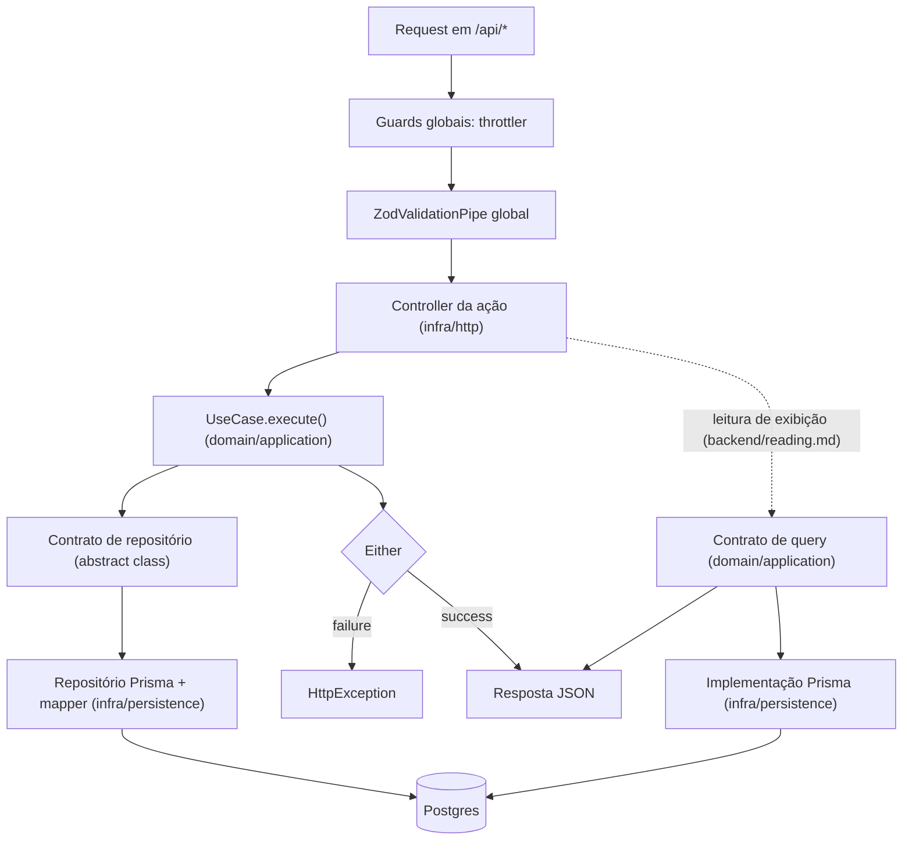

# Visão geral

Dono de: a stack e o idioma do código; a superfície HTTP same-origin sob `/api`; o monorepo e a colocação de código entre app e pacote pelo ownership; as camadas do backend (layer-first), os princípios não negociáveis e o caminho de uma request.

Consultar antes de: decidir em que app ou pacote um código novo mora e em qual camada do backend uma regra entra; promover código de um app para um pacote compartilhado; expor o backend fora de `/api` ou num host próprio; seguir o que um endpoint novo atravessa até chegar ao banco.

O sistema numa página: o que existe no monorepo, as camadas do backend e o caminho que uma request percorre.

O como construir cada artefato vive no documento correspondente (tabela no fim); o que não é decisão da Source segue `authoring.md`, "Decisões específicas de projeto". Fronteiras de import vivem em `backend/boundaries.md`; estrutura de módulo e comunicação entre módulos, em `backend/modules.md`. Quando um caso real não se encaixar nas regras daqui, não force o encaixe nem infira uma variação por conta própria: pare, sinalize a situação e pergunte antes de implementar.

## Stack

- Monorepo pnpm workspaces + Turborepo; pacotes com escopo `@metri/*`.
- Backend: NestJS sobre Fastify, Prisma/Postgres via `@metri/db`.
- Frontend (`app-web`): React + Vite, roteamento com react-router, React Query, formulários com React Hook Form + Zod; consome `@metri/ui` (kit de componentes, tokens e tema).
- Validação de formato HTTP: Zod via `nestjs-zod` (`createZodDto`), pipe global.
- Lint/format: Biome (aspas simples). Testes: Vitest + supertest.
- Idioma: código em inglês; documentação, comentários e mensagens de erro em português.

## Superfície HTTP

A aplicação é same-origin de ponta a ponta: SPA em `/` e a API em `/api/*`. `main.ts` aplica `setGlobalPrefix('api')`. Em desenvolvimento, o Vite encaminha `/api` para o backend; a configuração equivalente de edge e proxy faz parte do IaC de produção.

Same-origin é decisão, não acaso: sem origem cruzada não há CORS a configurar, cookie é `SameSite` por construção e o frontend nunca carrega uma URL de API em variável de ambiente. Endpoint novo entra sob `/api`; qualquer proposta de expor o backend num host próprio para o browser passa por decisão explícita antes.

## Monorepo: apps e pacotes

`apps/` contém aplicações executáveis; `packages/` contém código compartilhado. A lista de apps e pacotes, com o papel de cada um, é decisão de projeto (`activation.md`, "Matriz de delegações").

### Código pode nascer no pacote dono quando nada nele é do app

O critério de colocação é ownership — o que o código conhece e de quem ele é —, não quantos apps o consomem hoje: quem conhece um módulo mora com o módulo, e quem conhece este app (uma regra, um formato, uma tela dele) mora nas casas do app.

Quando o ownership compartilhado do artefato não é inequívoco: **Padrão.** Ele permanece no app que é dono dele.

Quando o artefato é uma capacidade claramente compartilhada, com ownership próprio e independente do app (função pura agnóstica em `@metri/utils`; helper, hook e componente de UI em `@metri/ui`; vocabulário de erro em `@metri/core/errors`; contrato de API que frontend e backend consomem, `backend/http-api.md`): **Permitido.** Ele nascer no pacote dono do conceito, mesmo com um consumidor atual só.

**Proibido.** Promover porque talvez seja reutilizado no futuro.

**Proibido.** Pacote catch-all que junte domínios diferentes, inclusive `@metri/contracts` como agregador global de contratos.

Quando aparece um segundo consumidor real: **Obrigatório.** Reavaliar a casa pelo critério de ownership. O segundo consumidor é gatilho de reavaliação, não promoção automática; o que sobe leva a decisão registrada junto ao código que sobe.

A reavaliação percorre esta árvore, sempre pelo ownership:

```txt
1. O artefato conhece este app (uma regra, um formato, uma tela) ou um módulo dele?
   ├─ SIM → fica no app
   └─ NÃO → passo 2

2. Os apps que o consomem usam a MESMA coisa?
   (mesma assinatura, mesmo comportamento esperado)
   ├─ NÃO → cada app implementa o seu; não é compartilhado de fato
   └─ SIM → passo 3

3. Existe uma capacidade compartilhada com dono claro, independente do app?
   (contrato entre apps; infraestrutura técnica reutilizável; componente de UI;
   helper puro agnóstico de domínio; config de tooling)
   ├─ SIM → packages/, no pacote dono do conceito
   └─ NÃO → fica no app; parar e perguntar se parece compartilhado
```

## As camadas do backend (layer-first)

Um app backend tem duas camadas de primeiro nível, e módulo é pasta dentro de cada camada:

```txt
src/
├── domain/
│   ├── enterprise/              # entidades e value objects: TypeScript puro
│   └── application/
│       ├── use-cases/<módulo>/  # casos de uso
│       ├── queries/<módulo>/    # contratos e DTOs de leitura de exibição
│       ├── repositories/        # contratos de repositório (abstract class)
│       └── services/<capacidade>/  # contratos de service (abstract class)
├── infra/
│   ├── http/                    # controllers por ação, DTOs Zod, presenters
│   ├── persistence/             # Prisma: repositórios, mappers, implementações de query
│   ├── services/<capacidade>/   # implementações de integração externa (e-mail, storage, ...)
│   ├── health/                  # endpoints de infra, fora do throttler global
│   └── common/                  # env, constantes e fronteiras transversais de request
└── main.ts
```

`domain/` e `infra/` são as únicas pastas na raiz de `src/`; o resto é `main.ts` e `app.module.ts`. Módulo é pasta dentro de cada camada (`use-cases/<módulo>/`, `controllers/<módulo>/`, `dtos/<módulo>/`): um módulo novo não cria pasta própria na raiz de `src/` com camadas dentro, só ganha a sua pasta nas camadas que usa. As fronteiras que importam são as de camada (`backend/boundaries.md`); a pasta por módulo existe para navegação, não para enforcement. Nome de módulo é conceito do negócio, nunca subdivisão técnica (`backend/modules.md`).

Layer-first, e não module-first, porque a fronteira que o projeto quer proteger é a de camada: domínio que não conhece infraestrutura. Com as camadas no primeiro nível, essa fronteira é visível na árvore de pastas e verificável por um `grep` de caminho (`backend/boundaries.md`, "Verificação"); com módulos no primeiro nível, ela vira convenção interna repetida em cada módulo.

O que cada camada pode conhecer, em resumo (regras completas de import e exceções em `backend/boundaries.md`):

- `domain/enterprise`: só `@metri/core` e `@metri/utils`. Nada de NestJS, Prisma, Zod ou HTTP.
- `domain/application`: o mesmo, mais o decorator `@Injectable()` de `@nestjs/common`, e nada além dele.
- `infra/`: conhece `domain/` e as bibliotecas de infraestrutura. É o único lugar que toca Prisma e HTTP.

## Princípios não negociáveis

1. Regra de negócio mora na entidade ou no value object. O use case orquestra; o controller adapta HTTP. Invariante dentro de controller está no lugar errado. Detalhe em `domain/model.md` e `backend/application.md`.
2. Erro esperado é valor de retorno (`Either`), nunca exceção. `throw` fica reservado para bug de programação. Ver `backend/errors.md`.
3. Use case não importa Zod. Schema Zod é fronteira HTTP (`infra/http/dtos/`); o request/response do use case é tipo próprio, local ao arquivo, mesmo quando estruturalmente idêntico ao schema. Detalhe em `backend/application.md`.
4. Quem injeta pede o contrato (`abstract class`), nunca a implementação concreta. Detalhe em `backend/application.md`.
5. Toda escrita passa por use case e entidade de domínio, e leitura que alimenta decisão de negócio também. Leitura de exibição expõe contrato e DTO na aplicação, com implementação direta no banco pela infra; o critério e as regras estão em `backend/reading.md`.
6. Abstração só onde paga o custo. Contrato existe onde há fronteira real: módulo, teste, mais de uma implementação plausível. Para o resto, classe concreta basta.
7. Default silencioso só onde a ausência é caso real: `?? valor`, `|| valor` e parâmetro default só quando a ausência é caso real e esperado, nunca por reflexo defensivo que mascara ausência de dado.

## O caminho de uma request



- As rotas ficam sob `/api` ("Superfície HTTP"). Guards e pipe globais, e o módulo dos endpoints de infra externa, entram no grafo de módulos pela regra de `infrastructure/runtime.md`.
- `ZodValidationPipe` global valida body, query e path param na fronteira (`backend/http-api.md`).
- Controller é por ação (`backend/http-api.md`) e traduz `Either.failure` em `HttpException` pela tabela de `backend/errors.md`.
- Use case fala com o banco só pelo contrato; repositório concreto e mapper vivem em `infra/persistence`.
- Endpoint de leitura de exibição substitui use case e repositório de agregado por um contrato de query da aplicação, implementado em infra e injetado no controller (`backend/reading.md`); guards, pipe e formato de erro são os mesmos.

## Onde cada arquivo mora

| Artefato | Caminho | Guia de construção |
| --- | --- | --- |
| Entidade | `src/domain/enterprise/<entidade>.entity.ts` | `domain/model.md` |
| Classes de erro do módulo | `src/domain/enterprise/errors/<módulo>.errors.ts` | `backend/errors.md` |
| Lista rastreada de coleção filha | `src/domain/enterprise/<coleção>-list.ts`, vínculo puro em `<referenciado>-ids.ts` | `domain/watched-list.md` |
| Família de regra com variação (Strategy) | `src/domain/enterprise/strategies/<regra>.strategy.ts` | `domain/strategy.md` |
| Regra com mais de um consumidor (Specification) | `src/domain/enterprise/specifications/<regra>.specification.ts` | `domain/specification.md` |
| Regra de domínio sem dono natural (Domain Service / Policy) | `src/domain/enterprise/policies/<regra>.policy.ts` | `domain/domain-services.md` |
| Value object | `src/domain/enterprise/value-objects/<nome>.vo.ts` | `domain/model.md` |
| Enum de domínio | `src/domain/enterprise/enums/<nome>.enum.ts` | `domain/model.md` |
| Domain event | `src/domain/enterprise/events/<evento>.event.ts` | `backend/events.md` |
| Caso de uso | `src/domain/application/use-cases/<módulo>/<ação>.use-case.ts` | `backend/application.md` |
| Contrato de repositório | `src/domain/application/repositories/<agregado>-repository.contract.ts` | `backend/persistence.md` |
| Contrato + service de integração | `src/domain/application/services/<capacidade>/` + `src/infra/services/<capacidade>/` | `infrastructure/services.md` |
| Controller | `src/infra/http/controllers/<módulo>/<ação>.controller.ts` | `backend/http-api.md` |
| DTO | `src/infra/http/dtos/<módulo>/<nome>.dto.ts` | `backend/http-api.md` |
| Presenter | `src/infra/http/presenters/<agregado>.presenter.ts` | `backend/http-api.md` |
| Repositório concreto | `src/infra/persistence/prisma/repositories/<agregado>.prisma-repository.impl.ts` | `backend/persistence.md` |
| Mapper | `src/infra/persistence/prisma/mappers/<agregado>.prisma-mapper.ts` | `backend/persistence.md` |
| Contrato + DTO de query de exibição | `src/domain/application/queries/<módulo>/<ação>.query.ts` | `backend/reading.md` |
| Implementação Prisma de query | `src/infra/persistence/prisma/queries/<módulo>/<ação>.prisma-query.impl.ts` | `backend/reading.md` |
| Subscriber de evento | `src/infra/events/on-<evento>.subscriber.ts` | `backend/events.md` |
| Contrato de fila | `src/domain/application/queues/<fluxo>-queue.contract.ts` | `backend/async-jobs.md` |
| Worker de job | `src/infra/jobs/<job>.worker.ts` | `backend/async-jobs.md` |
| Implementação de fila e client da fila | `src/infra/jobs/` | `backend/async-jobs.md` |
| Env var | `src/infra/common/env/env.validation.ts` | `infrastructure/runtime.md` |
| Factory de teste | `test/factories/make-<agregado>.factory.ts` | `backend/testing.md` |
| Repositório em memória | `test/repositories/<agregado>.in-memory-repository.impl.ts` | `backend/testing.md` |
| Fila em memória | `test/queues/<fluxo>.in-memory-queue.impl.ts` | `backend/async-jobs.md` |
| Primitivo de domínio compartilhado | `packages/core/src/<área>/` | instruções de projeto de `packages/core` |
| Schema, migrations, client de banco | `packages/db/src/postgres/<banco>/` | instruções de projeto de `packages/db` |

Paths de `src/` e `test/` são relativos ao app backend (`apps/app-api/`).

## Observabilidade

O log estruturado (`nestjs-pino`) tem desenho em `infrastructure/logging.md`, e a captura de erro inesperado (filtro global, corpo padronizado), em `backend/errors.md`. Métrica, alerta e reconciliação são capacidades condicionais, com desenho em `infrastructure/observability.md`; ferramenta e valores concretos são decisão de projeto (`activation.md`).

## Testes

O desenho transversal de testes (pirâmide, factories, repositórios em memória, e2e) está em `backend/testing.md`, para o backend, e em `frontend/testing.md`, para o frontend.

## Verificação rápida

- A regra de negócio nova está em entidade ou value object, com o use case só orquestrando?
- O arquivo novo está no caminho da tabela acima?
- `domain/` continua sem import de infraestrutura (NestJS além de `@Injectable()`, Prisma, Zod)?
- O erro esperado é `Either`, sem `throw`?
- O endpoint novo entrou sob `/api`, com DTO Zod na fronteira e tradução de erro pela tabela de `backend/errors.md`?
