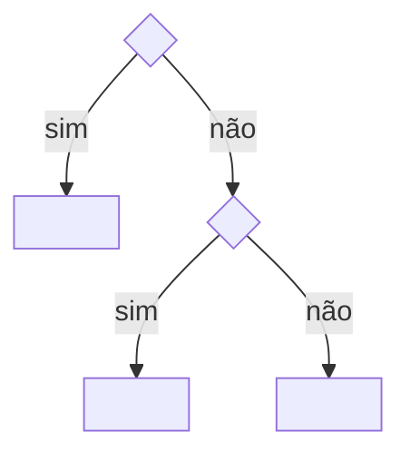

# Slices com Guardrails

**Metodologia de desenvolvimento de software com IA**

> **Versão 1.1.2**, consolidada em 26/09/2026.
> Status: pronta para a fase de **setup**. Depois do setup vem a **fase de validação e melhoria**, com um piloto real (seção 19).

**O que mudou da v1.1 para a v1.1.2**

- Frontmatter das regras com `description`, `use_when` e `not_covered`, no lugar de "Dono de", "Consultar antes de" e "Não cobre" (`methodology/VOCABULARY.md` e seção 7.2).
- ADR com status `proposed`; ponto em aberto vira ADR `proposed` (seção 6.5 e A.8).
- Pastas `general/` e `infrastructure/` no Architecture Source (seção 5.3); stack padrão em `architecture/defaults/stack.md` + ADR global (seção 6.2).
- Release segue `docs/architecture/infrastructure/release.md` (seções 9.3 e 10).
- Regras existentes são refinadas, não reescritas (7.2); sem limite de linhas; sem marca check/manual por regra.
- "Consultar antes de" vai para `use_when` (o gatilho do arquivo), não para `read_first`, que fica opcional; obrigatórias só `id`, `description`, `use_when` e `status`, e chave vazia não é escrita; caminho que depende de decisão de projeto fica em "Caminhos do projeto" no INDEX do projeto; citação que não se sustenta vai para o dono (`methodology/VOCABULARY.md` e seções 6.11, 6.13, 7.2 e A.5).
- O source é montado nos projetos em `.metri/`; os defaults ficam em `architecture/defaults/`, com os mesmos ids; `INDEX.md` de área gerado pelo `rules-index` e `INDEX.md` raiz com parte escrita à mão acima do marcador `<!-- rules-index -->` (seções 5, 6.2, 6.11 e 6.13).

**O que mudou da v1.0 para a v1.1**

- Política de idioma: chaves, ids, skills e código em inglês; documentos humanos em português (seção 4).
- Vocabulário da metodologia com chaves canônicas em inglês, no global (seção 4).
- Estrutura de pastas definida: `docs/` + `.metri/` + `AGENTS.md` na raiz, com lugares reservados (seção 5).
- `CONTEXT.md` separado do `PRODUCT.md`, com a ponte PT ↔ EN (seção 6.7).
- Formato rico e estruturado para os arquivos de regra (seção 7).
- Interface e Design System: `DESIGN.md`, shadcn/ui como default global, triagem de design no `/shape` (seção 8).
- Formato estrito e legível por máquina da Slice Matrix; `RN` passa a ser `BR` (seção 9).
- Portão de conhecimento persistente: o que vira e o que nunca vira conhecimento (seção 15).
- Nova seção de evolução futura, com o que já está preparado (seção 18).

---

## 1. Em uma página

**O que é.** Uma forma de construir software com agentes de IA. O **método** vem do WebProdigios (Perrin): architectural guardrail, look across e Slice Matrix. A **forma das skills** vem do Matt Pocock: skills pequenas, combináveis e escritas para agentes. O modelo de conhecimento é o seu: **Architecture Source global + Project Architecture + ADRs**.

**A ideia central.** A qualidade não depende de o agente lembrar instruções. Ela vem de três coisas:

- **guardrails executáveis:** tipos, lint e checks que "gritam" quando algo sai do padrão;
- **padrões visíveis no código:** o agente copia o que vê;
- **contexto entregue sob demanda:** só o necessário, no momento em que é necessário.

O planejamento olha **transversalmente** (look across) para descobrir capacidades compartilhadas. A entrega acontece em **fatias finas e verificáveis**.

**Fluxo:**

```
Rotear → Moldar → Look across → Construir → Verificar → Aceitar → Release → Aprender
                                     ↺ Diagnosticar (bugs)
```

**Artefatos do projeto (e nada mais):**

| Artefato                | Papel                                                                  |
| ----------------------- | ---------------------------------------------------------------------- |
| `AGENTS.md`             | Procedimentos e ponteiros. É a única coisa sempre carregada            |
| `docs/CONTEXT.md`       | Linguagem compartilhada do domínio (PT ↔ identificador EN)             |
| `docs/PRODUCT.md`       | Intenção e escopo                                                      |
| `docs/DESIGN.md`        | Identidade visual e design system (se houver interface)                |
| `docs/architecture/`    | Estado da ativação (`INDEX.md`) e regras só deste projeto, por área    |
| `docs/adr/`             | Decisões, trade-offs e exceções                                        |
| `docs/plan/MATRIX.md`   | Plano único: features, casos de uso, slices e contratos, tickets e checks |
| `.metri/`               | Regras de padronização globais, somente leitura, só em desenvolvimento |
| Código                  | Padrões, cabeçalhos inline (e o contrato da slice construída), SOT keywords, tokens e checks |

**O humano decide em poucos pontos:** direção, plano, padrões novos e diffs sensíveis, aceite, e passos de release que só ele pode fazer. O resto é trabalho do agente.

---

## 2. Referências e origem de cada peça

A metodologia fica próxima das duas referências. Cada peça tem origem rastreável:

| Peça                                                                                                                                                                                  | Origem                                   |
| ------------------------------------------------------------------------------------------------------------------------------------------------------------------------------------- | ---------------------------------------- |
| Architectural guardrail: confiar em erros, não em contexto; o _block_ por onde toda requisição passa; registry como fonte da verdade; tipos derivados; `server-only` imposto por lint | WebProdigios                             |
| SOT keywords, busca por grep antes de ler, cabeçalho inline (o quê / por quê / onde / como), barrels como mapa                                                                        | WebProdigios                             |
| Documentação mínima para a IA; `AGENTS.md`/`CLAUDE.md` como ponteiro, não como descrição                                                                                              | WebProdigios                             |
| Look across, Vertical Slice Matrix, slice como capacidade compartilhada, contrato da slice, checks por ticket, "nada órfão", planejar para o futuro                                   | WebProdigios                             |
| Coordenador + workers em worktrees; worker fala só com o coordenador; subtarefas                                                                                                      | WebProdigios (Morphite)                  |
| Teste com agente sem contexto; lacuna sinalizada (_gap method_); "assuma que já existe"                                                                                               | WebProdigios                             |
| Tokens de design no lugar de valores fixos; componentes globais com slots                                                                                                             | WebProdigios                             |
| Grilling, linguagem do domínio (`CONTEXT.md`), critério de ADR                                                                                                                        | Matt Pocock                              |
| Tracer bullets, dependências de bloqueio, fronteira, expand–contract, prefactor primeiro                                                                                              | Matt Pocock                              |
| TDD no seam, módulos profundos                                                                                                                                                        | Matt Pocock                              |
| Revisão em dois eixos por subagentes isolados                                                                                                                                         | Matt Pocock                              |
| HITL/AFK, tipo de ticket `task`, contexto limpo por tarefa, filas em vez de loops, protótipo descartável                                                                              | Matt Pocock                              |
| Forma das skills: pequenas, divididas entre invocadas pelo usuário e pelo modelo, ponteiros, critérios de conclusão, palavras-guia                                                    | Matt Pocock (`writing-for-agents`)       |
| Architecture Source global + Project Architecture por áreas + ADRs                                                                                                                    | Seu modelo                               |
| Caso de uso como unidade de definição, ligando planejamento e código                                                                                                                  | DDD                                      |
| `DESIGN.md` como referência de design para agentes                                                                                                                                    | Formato do getdesign.md (spec do Google) |

Referências:

- Matt Pocock, repositório de skills: https://github.com/mattpocock/skills (em especial `to-tickets`, `wayfinder`, `code-review`, `domain-modeling`, `writing-for-agents`).
- WebProdigios, curso _Advanced Claude Code for Web Developers_: https://www.youtube.com/watch?v=GCz83HTg2vI
- WebProdigios, vídeo de construção do Flute com Morphite (Vertical Slice Matrix).
- getdesign.md, coleção de arquivos `DESIGN.md` para agentes: https://getdesign.md/
- shadcn/ui (default global de componentes) e Coss UI (alternativa, design system do Cal.com): https://coss.com/ui/docs

---

## 3. Princípios

1. **Confiar em erros, não em contexto.** Toda regra desce pela _escada de regras_ (seção 6.12) até o degrau mais barato que funcione. O que pode ser verificado no código vira check, não texto.
2. **Uma fonte da verdade por conceito.** Cada informação mora em um único lugar; os outros só apontam para ela. **A fonte migra** quando o conhecimento vira código: um critério planejado mora na matriz até virar teste; um token definido no `DESIGN.md` mora no código depois da slice de design system.
3. **Planejar por capacidade, entregar por fatia fina.** O look across descobre as slices (capacidades compartilhadas). Os tickets dentro delas são tracer bullets: finos, de ponta a ponta, verificáveis.
4. **Construir para o agora, desenhar para o futuro.** O contrato de uma slice acomoda as features previstas; a implementação atende só às features "agora". Todo ticket serve a um caso de uso atual.
5. **Contexto sob demanda.** Pouquíssimo fica sempre carregado. O resto chega por ponteiro, por resolução de regras por caminho ou por grep de SOT keyword. Cada ticket roda num contexto limpo, e a passagem entre etapas é feita por artefato + id, nunca pela conversa.
6. **Conhecimento persistente é exceção.** Só vira conhecimento o que não é derivável nem verificável e afeta o futuro (seção 15). A maioria dos tickets termina sem gerar nenhum.
7. **O humano dirige; o agente executa.** O humano decide direção, plano, padrões e aceite. O agente não inventa arquitetura.
8. **O futuro entra por extensão.** Campos opcionais e pastas reservadas; nada que já existe muda de forma quando uma evolução chega (seção 18).

---

## 4. Idioma e vocabulário

### 4.1 Política de idioma

| O quê                                                                                               | Idioma                            |
| --------------------------------------------------------------------------------------------------- | --------------------------------- |
| Código, identificadores, nomes de arquivos de código                                                | `architecture/defaults/stack.md`, "Stack" |
| Chaves de frontmatter, campos da matriz, ids, status, tipos                                         | Inglês, fixos, validados por lint |
| Skills e `AGENTS.md`                                                                                | Inglês                            |
| `PRODUCT.md`, `CONTEXT.md` (definições), `DESIGN.md` (prosa), regras (prosa), ADRs, prosa da matriz | Português                         |
| Conversa com o agente                                                                               | Português                         |

A regra que evita deriva: **a conversa pode ser em português, mas toda chave, campo, id e identificador tem uma forma canônica em inglês.** Dois agentes nunca traduzem o mesmo conceito de formas diferentes, porque a tradução já está fixada e o lint rejeita qualquer outra.

### 4.2 Dois glossários, duas casas

| Glossário                      | Conteúdo                                   | Onde mora                                               |
| ------------------------------ | ------------------------------------------ | ------------------------------------------------------- |
| **Linguagem do domínio**       | Termos do produto (ex.: Pedido → `Order`)  | `docs/CONTEXT.md`, por projeto (seção 6.7)              |
| **Vocabulário da metodologia** | Termos do processo (ex.: toca → `touches`) | `.metri/methodology/VOCABULARY.md`, global |

### 4.3 Vocabulário da metodologia (chaves canônicas)

Mora em `methodology/VOCABULARY.md`: as chaves canônicas e o frontmatter de regra.

---

## 5. Onde ficam os artefatos

### 5.1 Quatro naturezas de conteúdo

| Natureza                                     | Exemplo                                      | Onde                                             |
| -------------------------------------------- | -------------------------------------------- | ------------------------------------------------ |
| **Consumido** (não é produzido pelo projeto) | Regras globais, templates, skills            | `.metri/` na raiz, somente leitura               |
| **Conhecimento durável**                     | Contexto, produto, design, arquitetura, ADRs | `docs/`                                          |
| **Plano temporário**                         | Matriz, technical design                     | `docs/plan/`                                     |
| **Saída gerada** (reservado)                 | Evidências de teste                          | `.evidence/` (fora do git)                       |

### 5.2 Árvore do projeto

```
AGENTS.md                     procedimentos + ponteiros (CLAUDE.md = uma linha apontando para ele)
.metri/                       global, somente leitura, versão fixada, fora do código entregue
docs/
  CONTEXT.md                  linguagem compartilhada do domínio
  PRODUCT.md                  intenção, escopo, fora de escopo
  DESIGN.md                   identidade visual e design system (se houver interface)
  architecture/
    INDEX.md                  base (source@vX.Y), desvios de stack, caminho linear, capacidades ativas, delegações, caminhos do projeto, exceções, áreas ativas
    <área>/*.md               regras só do projeto          (+ INDEX.md gerado)
  adr/NNNN-*.md
  plan/
    MATRIX.md                 plano vivo
    tech/                     [reservado] technical design de features complexas
.evidence/                    [reservado, fora do git] evidências por ticket
```

- **Os arquivos que agentes já reconhecem pelo nome ficam em maiúsculas:** `AGENTS.md`, `CONTEXT.md` (nome do Matt), `DESIGN.md` (nome do spec). O nome funciona como palavra-guia.
- **`AGENTS.md` fica na raiz**, porque as ferramentas o procuram lá.
- **Arquivos gerados** (`INDEX.md` de área) têm como primeira linha "Gerado por rules-index. Não edite."; no `INDEX.md` raiz, só a lista abaixo do marcador `<!-- rules-index -->` é gerada. O `rules-index:check` confere se estão atualizados.
- **O lint estrutural** aceita exatamente essa árvore, incluindo as pastas reservadas (seção 6.13).

### 5.3 Árvore do Architecture Source

```
.metri/                         repositório próprio, versionado por tags (vX.Y), montado nos projetos nesta pasta
  architecture/
    INDEX.md                    parte escrita à mão + gerado abaixo de <!-- rules-index -->: área → INDEX.md da área e a tabela "Capacidades condicionais"
    general/  backend/  domain/  frontend/  infrastructure/  ...   regras de padronização por área (+ <tema>.examples.md, INDEX.md gerado)
    defaults/                   escolhas padrão quando o projeto não decide (ex.: stack.md, ui.md → shadcn/ui) (+ INDEX.md gerado)
  methodology/
    METHODOLOGY.md              a metodologia (Apêndice A: formatos de regra, slice e ADR; ponteiros para o starter)
    VOCABULARY.md               vocabulário da metodologia (chaves canônicas)
    authoring.md                como escrever uma regra: modalidades, exceções, exemplos, transição
  template/                     starter do projeto, cada arquivo no caminho que terá no projeto: AGENTS.md, CLAUDE.md, docs/ e, quando existir, o código (block, registry, adapters, regras de lint); scripts em template/scripts/
  adr/                          decisões globais (inclusive as que sustentam os defaults)
  skills/                       as skills da metodologia
  AGENTS.md, CLAUDE.md          instruções do agente neste repositório
  CHANGELOG.md                  o que mudou em cada versão e como atualizar
  package.json                  scripts do source (pnpm): rules-index, rules-index:check, docs-lint (+ pnpm-workspace.yaml, pnpm-lock.yaml)
```

`general/` guarda as regras que valem para mais de uma área (princípios transversais, colocação de código entre app e pacote). As áreas podem crescer conforme a necessidade (ex.: `mobile/`, `ai/`, `data/`).

---

## 6. Modelo de conhecimento

### 6.1 Visão geral

| Camada               | Onde                    | Conteúdo                                                         | Quem escreve                            | Quando é lido                          |
| -------------------- | ----------------------- | ---------------------------------------------------------------- | --------------------------------------- | -------------------------------------- |
| Architecture Source  | `.metri/`               | Padronização, capacidades condicionais, defaults, vocabulário, templates, skills | Você, por PR no repositório do source   | Via `rules-for`, `INDEX.md` e defaults |
| Project Architecture | `docs/architecture/`    | Estado da ativação e regras só do projeto                        | Look across, ticket de padrão, Aprender | Via `rules-for` e ponteiros do ticket  |
| ADRs                 | `docs/adr/`             | Decisões, trade-offs, exceções                                   | Moldar, Look across, Aprender           | Quando uma regra ou ticket cita o ADR  |
| Linguagem            | `docs/CONTEXT.md`       | Termos do domínio, PT ↔ EN                                       | Moldar, Look across                     | Ao nomear qualquer coisa               |
| Produto              | `docs/PRODUCT.md`       | Intenção e escopo                                                | Moldar                                  | Ao discutir requisitos                 |
| Design               | `docs/DESIGN.md`        | Identidade visual, uso de componentes                            | Moldar (triagem de design), Aprender    | Via ponteiro em regras de `frontend/`  |
| Plano                | `docs/plan/MATRIX.md`   | Features, UCs, BRs, slices, tickets, checks                      | Moldar, Look across, Construir (status) | Só a seção do ticket em trabalho       |
| Procedimentos        | `AGENTS.md`             | Operação + ponteiros                                             | Setup, Aprender                         | Sempre (~20 linhas)                    |
| Código               | `src/` etc.             | Padrões, cabeçalhos inline, tokens, checks                       | Construir                               | Grep por SOT keyword, exemplo canônico |

### 6.2 Architecture Source (global)

**O que é:** regras de **padronização** de como construímos software. Não contém nada específico de um projeto nem de uma tecnologia que varia de projeto para projeto. A exceção são os `architecture/defaults/`: escolhas tecnológicas padrão, usadas quando o projeto não decide nada diferente; a de UI é sustentada por ADR global (ADR-0001), e a stack tem o `architecture/defaults/stack.md` como registro.

**Stack padrão:** a stack que se repete entre projetos é um default, como a biblioteca de UI (seção 8.1): `architecture/defaults/stack.md`. As regras citam essa stack no próprio texto. Projeto com outra stack registra a troca em ADR e escreve uma regra de projeto para o que muda.

**Entrada no projeto:** submódulo ou pacote em `.metri/`, **somente leitura e com versão fixada**. É dependência só de desenvolvimento: **não vai para o código entregue** (fica fora de build, exportação e pacote final).

### 6.3 Project Architecture (projeto)

**O que é:** regras **só deste projeto**, na mesma organização por áreas e no mesmo formato das globais. Exemplos: método de autenticação, stack e bibliotecas escolhidas, integrações, particularidades de infra e deploy.

**Relação com o global:** **complementa, não repete.** Não existem duas fontes da verdade: o global padroniza, o projeto acrescenta o que é dele.

- Uma regra do projeto nunca reescreve uma regra global.
- **Contrariar uma regra global é uma exceção:** vira ADR, e a regra do projeto aponta para ele.
- **Trocar um default global** (ex.: outra biblioteca de UI) é uma decisão registrada em ADR.
- **Precedência:** ADR > regra do projeto > regra global > default global.

### 6.4 A área `domain`

A área `domain/` (global e do projeto) define **como modelamos domínio no código**: entidade, value object, caso de uso, agregado, invariantes, eventos, comunicação com outras camadas.

**Ela não lista entidades nem regras do projeto.** A fonte de cada coisa:

- o **significado** dos termos → `CONTEXT.md`;
- o **modelo em si** → schema e código;
- as **regras de negócio planejadas** → casos de uso na matriz, que migram para testes e invariantes no código.

### 6.5 ADRs

**Critério para criar** (só decisão tomada, com os três ao mesmo tempo, como no Matt):

1. **difícil de reverter;**
2. **surpreendente sem contexto;**
3. **resultado de um trade-off real.**

**Também viram ADR:** toda **exceção a uma regra global** e toda **troca de um default global**.

**Onde:** as decisões globais ficam em `.metri/adr/`; as do projeto, em `docs/adr/`.

**Status:** `accepted` ou `superseded by ADR-NNNN`. Nunca se apaga um ADR.

**Pergunta em aberto** fica na regra dona, na seção "Em aberto", um item por pergunta (`- **<título>.** <texto>`); nunca vira ADR. Decidida, sai de lá: a regra é editada no lugar e, se a decisão cumpre o critério, ganha ADR. O que uma decisão explicitamente não é entra no ADR como alternativa considerada.

### 6.6 `PRODUCT.md`

Contém **para quem, qual problema, o resultado esperado, escopo e fora de escopo**. Não contém linguagem do domínio (vai para o `CONTEXT.md`), lista de features (vai para a matriz) nem detalhe de implementação.

### 6.7 `CONTEXT.md` (linguagem compartilhada)

É o equivalente do `CONTEXT.md` do Matt, com o mesmo nome e a mesma função: eliminar ambiguidade e dar ao agente um vocabulário conciso. O acréscimo é a **ponte PT ↔ EN**.

- Cada termo tem: nome em português, **identificador canônico em inglês** (o nome no código e a SOT keyword), definição e sinônimos a evitar.
- Também registra relações entre termos e ambiguidades já resolvidas.
- **Não contém** detalhe de implementação, regras de negócio nem convenções de código (estas são regras de arquitetura).
- **Aplicando a escada:** um check opcional pode proibir, nos identificadores do código, os sinônimos listados em "Evitar".

Template no Apêndice A.

### 6.8 `DESIGN.md`

Ver seção 8.

### 6.9 `AGENTS.md` (ou `CLAUDE.md`)

Tem ~20 linhas, em inglês. Contém só **procedimentos** e **ponteiros com a condição de uso**. Não descreve arquitetura nem repete o que o ambiente já mostra (scripts, estrutura de pastas). `CLAUDE.md`, se existir, é uma linha apontando para o `AGENTS.md`.

### 6.10 O código como fonte

- **Exemplo canônico:** todo padrão tem um arquivo de código de referência, apontado pela regra.
- **Cabeçalho inline:** no topo de cada módulo relevante, _o quê / por quê / onde se conecta / como usar_ + **SOT keywords** + ids de ADR ou BR quando houver; no `entry` de uma slice construída, o cabeçalho é o contrato dela (A.7).
- **Barrels (`index`)** funcionam como mapa do módulo para o agente.
- **Lacuna sinalizada:** `GAP-<n>` no código, verificado por lint contra a seção Gaps da matriz.
- **Tokens de design** (cores, tipografia, espaçamento, raio) vivem no tema do código; nenhum valor fixo em componente.

### 6.11 Carregamento sob demanda (regras por caminho)

- A **fonte da verdade do escopo** de uma regra é o `applies_to` no frontmatter.
- **`rules-for <caminhos | --ticket T2.1>`** é um script do template, independente de ferramenta. Ele devolve só as regras aplicáveis (global, depois projeto, mais os ADRs citados).
- Caminho que depende de decisão de projeto (ex.: o pacote do contrato de API) não entra no `applies_to` global: fica na seção "Caminhos do projeto" do `docs/architecture/INDEX.md` (glob → id), e o `rules-for` soma esses caminhos ao `applies_to` da regra.
- Se a ferramenta de agente suportar regras nativas por caminho, os ponteiros nativos são **gerados** a partir do frontmatter, nunca escritos à mão.
- Os `INDEX.md` de cada área também são **gerados** a partir do frontmatter (`rules-index`): a primeira linha é "Gerado por rules-index. Não edite." e depois vem uma tabela `id | description | use_when`, uma linha por regra, com as entradas de `use_when` unidas por "; ". Arquivos `*.examples.md` ficam fora. Não há segunda fonte.
- O `INDEX.md` raiz tem uma parte escrita à mão, acima do marcador `<!-- rules-index -->`, e abaixo dele a lista gerada: área → caminho do `INDEX.md` da área, com o número de regras.
- Abaixo da lista vem a tabela gerada "Capacidades condicionais" (`id | activation`), uma linha por regra com `activation`: a pergunta de ativação de cada capacidade condicional mora na regra dona.
- **Orçamento:** um ticket deve precisar de **no máximo ~5 regras**. Se precisar de mais, atravessa áreas demais e deve ser dividido.

### 6.12 Fonte única por conceito e escada de regras

| Conceito                                       | Mora em                                   | Nunca em                                       |
| ---------------------------------------------- | ----------------------------------------- | ---------------------------------------------- |
| Intenção e escopo                              | `PRODUCT.md`                              | ticket, regra                                  |
| Termos do domínio (PT ↔ EN)                    | `CONTEXT.md`                              | `PRODUCT.md`, código solto                     |
| Vocabulário da metodologia                     | `methodology/VOCABULARY.md` (global)      | projeto                                        |
| Padronização (como construímos)                | Architecture Source                       | projeto                                        |
| Escolha padrão de tecnologia                   | `architecture/defaults/` (global)         | projeto                                        |
| Regras só do projeto                           | `docs/architecture/<área>/`               | global, README                                 |
| Contrato de uma slice                          | Bloco `contract` na matriz; construída, cabeçalho do `entry` | arquivo próprio em `docs/`                     |
| Decisão, trade-off, exceção                    | ADR                                       | comentário solto                               |
| Identidade visual e uso de componentes         | `DESIGN.md`                               | regras de código                               |
| Valores dos tokens de design                   | Código (tema)                             | `DESIGN.md` (depois da slice de design system) |
| Regra que pode ser verificada                  | check, lint, tipo, teste                  | qualquer `.md`                                 |
| Features, UCs, BRs planejadas, tickets, status | `MATRIX.md` (ou o tracker, nunca os dois) | chat, handoff                                  |
| Comportamento já construído                    | testes + código                           | matriz (a linha colapsa num ponteiro)          |
| Como um módulo funciona                        | código + cabeçalho inline                 | `docs/`                                        |
| Procedimentos do agente                        | `AGENTS.md` + skills                      | regras de arquitetura                          |

**Escada de regras.** Toda regra ou lição desce até o degrau mais baixo que funcione:

1. **Check executável:** tipo, lint, teste, script, constraint de schema.
2. **Padrão existente no código:** exemplo canônico que o agente copia.
3. **Cabeçalho inline** no ponto em que a informação é necessária.
4. **Regra ou ADR:** só para o porquê, a árvore de decisão e o que não pode ser verificado.
5. **Documento de produto, contexto ou design:** só intenção, linguagem e identidade.

### 6.13 Lint estrutural (parte do `verify`)

- **Árvore permitida:** `AGENTS.md`, `CLAUDE.md`, `docs/{CONTEXT,PRODUCT,DESIGN}.md`, `docs/architecture/**`, `docs/adr/**`, `docs/plan/MATRIX.md`, `docs/plan/tech/**` (reservado). Nada mais em `docs/`.
- **Regras:** o `docs-lint` checa o frontmatter:
  - as quatro chaves obrigatórias de `methodology/VOCABULARY.md` (`id`, `description`, `use_when`, `status`), nenhuma chave vazia, nenhuma chave fora dele, `status` com um valor dele e `activation`, quando existe, em texto;
  - `id` igual ao caminho `<área>/<tema>`;
  - os ids de `read_first` e `not_covered` existem ou são destinos `project:` da lista fechada de `methodology/VOCABULARY.md`, e a seção que `not_covered` cita existe na regra;
  - os arquivos citados em `examples` existem, e os ids de `adr` existem em `adr/`.

  Arquivos `*.examples.md` não têm frontmatter e ficam fora dessa checagem. O lint não confere seções do corpo nem número de linhas.
- **METHODOLOGY:** regra (`architecture/`) e template (`template/**/*.md`) não citam a METHODOLOGY, nem em frontmatter nem em bloco de código; citação a ela é erro, e o texto cita a regra dona.
- **Citações** (no source, em `architecture/`, `methodology/` e `adr/`, fora de bloco de código): todo caminho `.md` citado existe; quando o caminho entre crases vem seguido de uma seção entre aspas (`` `<arquivo>.md`, "Seção" `` ou `` `<arquivo>.md` ("Seção") ``), o arquivo tem esse título, inteiro, até os dois-pontos ou sem o parêntese final; toda âncora `#...` resolve para um título do arquivo. Arquivo do projeto (`docs/...`, `AGENTS.md`, `CONTEXT.md`, `PRODUCT.md`, `DESIGN.md`, `MATRIX.md`) não é conferido. `template/` fica fora: é o starter do projeto, e as citações dele são caminhos do projeto (`docs/`, `AGENTS.md`); nem o `docs-lint` nem o `rules-index` o processam no source.
- **Arquivos planejados:** `template/scripts/docs-lint.planned.json` lista cada arquivo que ainda não existe e o passo do `SETUP.md` que o cria. Citação a arquivo planejado é aviso, não erro; arquivo planejado que já existe é erro ("tire da lista"), para a lista não ficar velha.
- **`applies_to` sem casamento** (no projeto): glob que não casa com nenhum arquivo gera aviso, não erro; a regra é candidata a poda (seção 15.6).
- **Saída:** `arquivo:linha: mensagem`, com o prefixo `aviso:` no aviso; o lint sai com código 1 só quando há erro.
- **"Como ler":** todo id de regra do source aparece em "Como ler" do `architecture/INDEX.md`.
- **Gerados:** `INDEX.md` atualizados; o `rules-index:check` sai com código 1 se algum estiver desatualizado.
- **Matriz:** esquema da seção 9 (chaves em inglês, ids válidos, valores de enum válidos); todo ticket tem slice, tipo e checks; todo tracer aponta para um UC; nada órfão; todo `GAP-n` do código existe na matriz e vice-versa.
- **Opcional:** sinônimos proibidos do `CONTEXT.md` ausentes dos identificadores; nenhum valor fixo de cor ou espaçamento fora do tema.

### 6.14 Ativação da arquitetura

O projeto registra o resultado no `docs/architecture/INDEX.md` (starter em `template/docs/architecture/INDEX.md`): em "Capacidades ativas", uma linha por id da tabela "Capacidades condicionais" do `architecture/INDEX.md` que o projeto ativou, com os valores que o `not_covered` da regra deixa ao projeto; em "Delegações", uma linha por delegação resolvida da matriz abaixo; em "Stack", só o que difere de `architecture/defaults/stack.md`; em "Caminho linear", as camadas na ordem em que uma requisição passa; e em "Exceções e defaults trocados", o ADR de cada desvio.

Dono de: a ativação da arquitetura num projeto — as três classes de decisão (GLOBAL, GLOBAL_CONDITIONAL, PROJECT_SPECIFIC), o que a ativação pergunta e o que não pergunta, a ordem de ativação, o registro do que ela resolve, o encaminhamento de uma necessidade sem cobertura como ARCHITECTURE DECISION REQUIRED e a matriz das decisões delegadas ao projeto.

Consultar antes de: ativar a arquitetura num projeto novo; ligar uma capacidade condicional num projeto existente; escolher um valor que a Source deixa ao projeto (provider, identidade do dono, pacote dono, topologia); registrar essa escolha.

Não cobre: a arquitetura técnica de cada capacidade, que é do owner indicado na matriz; a casa de cada tipo de decisão e o critério de ADR (`methodology/authoring.md`, "Decisões específicas de projeto"); a regra de escape (`AGENTS.md`, "How to work here"); a regra de transição (`methodology/authoring.md`, "Regra de transição"); a localização e o formato físico da Project Architecture, que estão na seção 5.2; a descoberta do repositório.

A Source decide como o sistema é construído; o projeto decide o que só ele sabe: se precisa de uma capacidade, qual provider usa, quem é o dono dos dados. Esta seção é o contrato entre os dois: o que a ativação pergunta, quando pergunta e onde a resposta fica.

#### Regras

##### Três classes de decisão

| Classe | O que é | Na ativação |
| --- | --- | --- |
| GLOBAL | Regra que vale em todo projeto | Aplicada, sem pergunta |
| GLOBAL_CONDITIONAL | Capacidade que o projeto pode não ter; quando tem, a forma já está decidida pelo owner | Uma pergunta: o projeto precisa dela? |
| PROJECT_SPECIFIC | Valor concreto que só o projeto conhece: provider, entidade do dono, pacote, topologia | Resolvido antes do primeiro ponto que depende dele |

**Obrigatório.** A ativação não pergunta o que a Source já decidiu.

**Obrigatório.** Decisão GLOBAL é aplicada como está.

Quando a capacidade é GLOBAL_CONDITIONAL: **Obrigatório.** A pergunta é só se o projeto precisa dela; sem necessidade, ela não é ativada e nada dela é perguntado.

Quando uma capacidade GLOBAL_CONDITIONAL é ativada: **Obrigatório.** Ela segue o owner global, pela regra de transição de `methodology/authoring.md`, e a ativação resolve só os valores PROJECT_SPECIFIC dela.

Quando um valor é PROJECT_SPECIFIC: **Obrigatório.** Ele é resolvido antes do primeiro ponto do projeto que depende dele.

**Proibido.** Preencher valor PROJECT_SPECIFIC com escolha que a Source não declarou como default.

##### A ativação não é questionário

**Obrigatório.** Cada pergunta depende do gatilho da delegação correspondente: sem gatilho no projeto, a pergunta não existe.

**Proibido.** Questionário fixo que percorre a matriz inteira.

> **Por quê.** Pergunta sem gatilho força uma escolha que o projeto não tem como fazer bem, e a escolha feita sem necessidade vira dependência que ninguém pediu.

##### Ordem

**Obrigatório.** A ativação segue esta ordem:

1. identificar as capacidades do projeto;
2. aplicar o GLOBAL;
3. avaliar os gatilhos GLOBAL_CONDITIONAL;
4. resolver os PROJECT_SPECIFIC aplicáveis;
5. registrar na Project Architecture e, quando cabe, em ADR;
6. validar a arquitetura ativada pela verificação de cada owner ativado.

Quando o gatilho de uma delegação aparece depois da ativação inicial, como o primeiro job ou o primeiro asset: **Obrigatório.** A delegação é resolvida naquele momento, pelos passos 3 a 6.

##### Registro

**Obrigatório.** A Project Architecture registra quais capacidades GLOBAL_CONDITIONAL foram ativadas e o valor escolhido para cada delegação resolvida.

Quando a delegação resolvida cumpre a condição de "ADR quando" da matriz, que aplica a ela o critério de `methodology/authoring.md`, ou, numa capacidade condicional, esse critério direto: **Obrigatório.** Ela ganha ADR, que guarda o porquê, e a Project Architecture continua guardando o estado vigente.

##### Necessidade sem cobertura

Quando uma necessidade do projeto não tem regra global, não está declarada como PROJECT_SPECIFIC, contradiz regra existente, exige exceção nova ou exige mecanismo estrutural não coberto: **Obrigatório.** A ativação para e aplica a regra de escape do `AGENTS.md`, com o caso nomeado ARCHITECTURE DECISION REQUIRED:

```text
parar → ARCHITECTURE DECISION REQUIRED → decidir → atualizar a Source (regra global) ou registrar ADR (exceção ou decisão estrutural do projeto) → atualizar a Project Architecture → continuar
```

**Proibido.** A ativação improvisar valor, mecanismo ou exceção.

##### Matriz de delegações

**Obrigatório.** Toda decisão que a Source delega ao projeto tem uma linha na matriz abaixo, que é forma canônica, com nove campos: assunto, classe da capacidade, gatilho, owner global, o que o projeto decide, restrições que a Source já fixou, default (só quando a Source o declara), registro e condição de ADR.

Quando a decisão é de uma capacidade condicional (`architecture/INDEX.md`, "Capacidades condicionais"): **Obrigatório.** Ela mora na regra dona, não na matriz: o gatilho é a chave `activation`, e o que o projeto decide é uma entrada `not_covered` com destino `project:architecture/INDEX`.

Quando um owner passa a delegar uma decisão nova ao projeto: **Obrigatório.** A linha dela entra na matriz, ou na regra dona da capacidade condicional, na mesma edição.

| Assunto | Classe | Gatilho | Owner global | O projeto decide | Restrições da Source | Default | Registro | ADR quando |
| --- | --- | --- | --- | --- | --- | --- | --- | --- |
| Autenticação | PROJECT_SPECIFIC | O produto tem identidade autenticada | `backend/boundaries.md`, `backend/application.md`, `backend/access-scope.md` | Mecanismo e provider; modelo concreto de sessão ou token | Resolvida na fronteira de request (`infrastructure/runtime.md`); same-origin (`general/http-surface.md`); tabela escrita pelo provider segue a propriedade do agregado de `domain/model.md` | — | Project Architecture | O mecanismo molda a estrutura, como sessão × token ou provider com schema próprio |
| Autorização | PROJECT_SPECIFIC | Ações ou recursos com políticas de acesso diferentes | `backend/access-scope.md`, `backend/errors.md`, `backend/boundaries.md` | O modelo concreto de permissão; os papéis e as políticas reais | Recusa na forma de `backend/errors.md`, "Erros sensíveis"; nenhum modelo nem biblioteca de permissão global | — | Project Architecture | O modelo de permissão é estrutural |
| Identidade do dono | PROJECT_SPECIFIC | Isolamento por organização, cliente ou outro dono | `backend/access-scope.md` | A entidade que representa o dono; o identificador; a origem dele na identidade ou na request | Origem validada na fronteira; escopo em todo `where`; prova A/B | — | Project Architecture | A escolha define a fronteira de isolamento dos dados |
| Bounded contexts | GLOBAL_CONDITIONAL | Um dos sinais de `domain/bounded-contexts.md` | `domain/bounded-contexts.md` | Os contextos, os nomes, as fronteiras, os módulos de cada um e os contratos entre eles | Sem entidade nem contrato de repositório entre contextos; interação por contrato explícito | Um contexto | Project Architecture | A divisão é decisão estrutural |
| Domain Service / Policy | GLOBAL_CONDITIONAL | Regra de domínio sem dono natural em value object, entidade ou agregado | `domain/domain-services.md` | A regra concreta; o conceito e o módulo a que ela pertence; a forma mínima | Sem IO nem framework; fatos carregados pelo caso de uso | Regra no modelo | O código da regra | — |
| Módulos e agregados | PROJECT_SPECIFIC | O primeiro módulo; antes do primeiro contrato de cada agregado | `backend/modules.md`, `domain/model.md` | A divisão de módulos; a propriedade e a forma de cada agregado | Módulo por conceito de negócio; as formas de `domain/model.md` | Agregado do app | Project Architecture | A tabela é escrita por sistema externo, com o acordo da integração |
| Apps e pacotes | PROJECT_SPECIFIC | Ativação inicial; capacidade nova | `general/code-placement.md` | Os apps e pacotes reais; o pacote dono de cada capacidade | Colocação por ownership (`general/code-placement.md`, "Código pode nascer no pacote dono quando nada nele é do app"); nenhum pacote catch-all | O artefato fica no app enquanto o ownership compartilhado não é inequívoco | Project Architecture | App ou pacote novo muda a estrutura do monorepo |
| Pacote do contrato de API | PROJECT_SPECIFIC | Frontend e backend consomem o mesmo contrato | `backend/http-api.md`, `general/code-placement.md` | O pacote dono de cada contrato | Uma representação canônica; nunca `@metri/contracts`; o schema de form fica no frontend | — | Project Architecture | O contrato cria pacote novo |
| Destino do log | GLOBAL | O runtime roda num ambiente com coletor de log | `infrastructure/logging.md` | O destino das linhas (coletor, agregador); a confiança no `x-request-id` de um proxy | `nestjs-pino`, nível por ambiente, redação e contexto de `infrastructure/logging.md` | JSON no stdout | Project Architecture | O `x-request-id` de um proxy passa a ser aceito |
| Topologia de deploy | PROJECT_SPECIFIC | Antes da primeira entrega executável | `infrastructure/runtime.md` | A hospedagem; o runtime; o processo de worker; a topologia; o deploy por ambiente | Same-origin sob `/api` (`general/http-surface.md`, "Superfície HTTP"); env por `EnvService`; shutdown gracioso quando o runtime depende dele | — | Project Architecture | A topologia é estrutural |

#### Aplicação

- Um projeto que envia e-mail de confirmação, guarda foto de produto e não tem leitura cara ativa e-mail e storage e resolve vendor, provider e buckets; cache e observabilidade não geram pergunta, e bounded context fica no default de um contexto.
- O primeiro job aparece meses depois da ativação inicial: a delegação de fila é resolvida ali, pelos passos 3 a 6 de "Ordem".
- A exigência de rodar workers em app próprio cai em necessidade sem cobertura, porque o desenho está em aberto em `backend/async-jobs.md`: a ativação para em ARCHITECTURE DECISION REQUIRED.
- A localização e o formato da Project Architecture seguem `methodology/authoring.md`, "Decisões específicas de projeto".

#### Verificação

- A ativação perguntou só o que tem gatilho no projeto, sem pergunta sobre decisão GLOBAL?
- Capacidade GLOBAL_CONDITIONAL ativada segue o owner, com só os valores PROJECT_SPECIFIC resolvidos?
- Todo valor PROJECT_SPECIFIC foi resolvido antes do primeiro ponto que depende dele, sem default que a Source não declarou?
- A Project Architecture guarda as capacidades ativadas e os valores escolhidos?
- Delegação que cumpre a condição de "ADR quando" tem ADR?
- Necessidade sem cobertura parou como ARCHITECTURE DECISION REQUIRED, sem valor, mecanismo ou exceção improvisados?
- Toda decisão que a Source delega ao projeto tem linha na matriz, com os nove campos, ou está na regra dona da capacidade condicional, em `activation` e `not_covered`?

#### Referências

- `methodology/authoring.md`: casas de decisão, critério de ADR e regra de transição.
- `AGENTS.md`: regra de escape.
- `general/code-placement.md`, `general/http-surface.md`: apps, pacotes, colocação e superfície HTTP.
- `backend/modules.md`, `domain/model.md`: módulos e forma dos agregados.
- `domain/domain-services.md`, `domain/bounded-contexts.md`: capacidades condicionais de domínio.
- `backend/access-scope.md`, `backend/errors.md`, `backend/boundaries.md`, `backend/application.md`: identidade, autorização e autenticação.
- `backend/http-api.md`: o contrato de API compartilhado.
- `backend/operation-routing.md`, `backend/async-jobs.md`: fila e jobs.
- `infrastructure/runtime.md`, `infrastructure/logging.md`: runtime, deploy e log.
- `infrastructure/mail.md`, `infrastructure/storage.md`, `infrastructure/cache.md`, `infrastructure/observability.md`: capacidades condicionais de infraestrutura.
- `architecture/INDEX.md`, "Capacidades condicionais": a pergunta de ativação de cada capacidade condicional.

---

## 7. Formato dos arquivos de regra

Serve para o global e para o projeto.

### 7.1 Formato

- Toda regra começa com frontmatter, com as chaves de `methodology/VOCABULARY.md`. É a única parte de formato fixo e a única que os scripts leem.
- O corpo segue o que o tema pede: seções temáticas, texto explicativo, modalidades de `methodology/authoring.md`, blocos "Por quê" e "Exceção", árvore de decisão em Mermaid, tabelas e a seção de verificação ("Verificação" ou "Verificação rápida"). Os dois formatos atuais continuam válidos.
- Não há limite de linhas. O contexto é controlado pelo `rules-for` (o agente lê só as regras do ticket) e pela extração de exemplos.

### 7.2 Refinar uma regra existente (sem reescrever)

Numa regra existente, muda só isto:

1. Entra o frontmatter no topo. "Dono de", "Consultar antes de" e "Não cobre" passam para `description`, `use_when` e `not_covered` e saem do corpo. "Consultar antes de" é o gatilho do próprio arquivo, não uma lista de pré-requisitos: vai para `use_when` sem alteração, uma entrada por situação, e não para `read_first`.
2. Exemplo de implementação completa (classe, caso de uso, componente inteiro) vai para `<tema>.examples.md`, idêntico, com um ponteiro no texto. Trecho curto que ilustra uma regra fica onde está.
3. Conteúdo cujo dono é outro arquivo fica no dono; aqui vira ponteiro.
4. A cópia da regra de escape sai (ela vive no `AGENTS.md`, "How to work here").
5. "Pontos em aberto" fica na regra, na seção "Em aberto" (6.5).
6. Citação que não se sustenta, em que o arquivo e a seção citados não dizem o que foi citado: a frase vai para o arquivo dono, usando um texto que já existe em outro arquivo. Se esse texto não existe em lugar nenhum, vira dúvida.

Todo o resto fica como está: texto, ordem das seções, diagramas e tabelas.

### 7.3 Regra nova

Segue o mesmo formato. O texto novo segue a skill `writing-for-agents`.

---

## 8. Interface e Design System

Não é uma etapa própria do fluxo. É uma **triagem** dentro do `/shape`, um **artefato** (`DESIGN.md`) e uma **capacidade condicional** (`defaults/ui`).

### 8.1 Default global

Quando o projeto não decide nada diferente:

- **Biblioteca de componentes:** **shadcn/ui**, registrada em `.metri/architecture/defaults/ui.md` com um ADR global.
- **Estratégia:** **instala a biblioteca e estiliza por cima** conforme o `DESIGN.md`, via tokens de tema. Os componentes prontos da biblioteca são usados como base; ninguém recria componentes do zero.
- **Base visual:** um `DESIGN.md` neutro do próprio global (`template/docs/DESIGN.md`).

Trocar o default (ex.: Coss UI) é uma decisão registrada em ADR do projeto.

### 8.2 Triagem de design (dentro do `/shape`, uma vez por projeto com interface)

Quatro perguntas, cada uma com default:

| Pergunta                             | Exemplos de resposta                                               | Default                           |
| ------------------------------------ | ------------------------------------------------------------------ | --------------------------------- |
| Referência visual                    | Um `DESIGN.md` do getdesign.md, a URL de um site, imagens, a marca | Base neutra do global             |
| Biblioteca de componentes            | shadcn/ui, Coss UI, outra                                          | shadcn/ui                         |
| Ícones, densidade, tom, claro/escuro | —                                                                  | Os da biblioteca e da base neutra |
| Restrições                           | Acessibilidade, idiomas, dispositivos                              | Nenhuma além das regras globais   |

O resultado é o `docs/DESIGN.md` do projeto (e um ADR, se o default de biblioteca for trocado).

### 8.3 `DESIGN.md`

- **Segue a especificação DESIGN.md do Google** (https://github.com/google-labs-code/design.md/blob/main/docs/spec.md), a mesma do getdesign.md: tokens no frontmatter YAML e as seções com os títulos e a ordem dela. Isso permite **colar uma referência pronta e adaptá-la**.
- **Migração da fonte:** quando a slice de design system é construída, **os valores dos tokens passam a morar no tema do código**, e o `DESIGN.md` troca os valores por um ponteiro para o arquivo de tema. Continua guardando princípios, justificativas e orientação de uso dos componentes.
- É lido **por ponteiro**: as regras de `frontend/` que tratam de visual apontam para ele.

### 8.4 Design por iniciativa

Quando a dúvida é "como deve parecer", usa-se um **protótipo descartável** com variações de UI (o `prototype` do Matt; o Perrin faz o mesmo com referências visuais). O que for decidido vai para o `DESIGN.md` (visual) ou para regras de `frontend/` (implementação). O protótipo é descartado.

### 8.5 Onde cada decisão mora

| Decisão                                                                     | Casa                                                                              |
| --------------------------------------------------------------------------- | --------------------------------------------------------------------------------- |
| Identidade visual, princípios, uso de componentes                           | `docs/DESIGN.md`                                                                  |
| Valores dos tokens                                                          | Tema no código                                                                    |
| Biblioteca padrão                                                           | `architecture/defaults/ui.md` + ADR global                                        |
| Troca da biblioteca                                                         | ADR do projeto + regra em `docs/architecture/frontend/`                           |
| Como construímos componentes (global vs. rota, slots, variantes, só tokens) | Regras globais em `frontend/`                                                     |
| Design system como capacidade                                               | `activation` de `defaults/ui`; a slice entra na slice 0 de todo projeto com interface |

**Verificação:** o lint "sem cores ou espaçamentos fixos fora do tema" garante o uso dos tokens. A conformidade visual é conferida no QA do aceite.

---

## 9. A Slice Matrix (`docs/plan/MATRIX.md`)

### 9.1 Formato estrito

As **chaves e títulos de seção são em inglês e fixos**; a prosa é em português. O formato é legível por humanos e por máquina, e é validado pelo lint. Isso é o que permite, no futuro, gerar o diagrama da matriz e alimentar um orquestrador sem mudar nada.

```markdown
# MATRIX

## Features

### F1 · Formulários no site

horizon: now · milestone: v1 · slices: [S2, S3] · tech_design: none
outcome: O editor publica formulários em páginas do site e recebe respostas.

#### UC1.1 · Publicar formulário numa página

actor: editor · status: open

- BR1 (sensitive): Um formulário só é exibido se estiver publicado.
- [ ] Ao publicar, o formulário aparece na página em até uma recarga.
- [ ] Formulário despublicado não é exibido nem aceita envio.

#### UC1.2 · Receber resposta

status: done → tests/forms/submit.spec.ts

### F2 · Enquetes no site

horizon: planned · milestone: v2

## Slices

### S2 · Montagem de componentes

horizon: now · blocked_by: [S0]
contract:
  responsibility: Monta numa página os componentes registrados no registry.
  interface: `mountComponent(page, key, props)`; registry `components`.
  invariants: Só componente registrado é montado; as props passam pelo schema do registro.
  consumers: [F1, F2]
  planned: Enquetes (F2) montadas pelo mesmo registry.

#### T2.0 · Padrão de montagem de componentes

type: pattern · mode: afk · status: open · sensitive: true
areas: [frontend/components] · touches: [registry:components]
checks: [`pnpm verify`]

#### T2.1 · Montar componente registrado numa página

uc: UC1.1 · type: tracer · mode: afk · status: open · blocked_by: [T2.0] · sensitive: false
areas: [frontend/components, backend/http-api] · touches: [registry:components]
checks: [`pnpm verify`, `pnpm test mounter`]
subtasks: [registro no mounter, renderização no site]

## Fog

- Como relatórios agregam respostas de formulários e enquetes.

## Gaps

- GAP-3 · validação de tamanho de arquivo → T3.4

## Pattern proposals

- PP-1 · de T2.1 · o endpoint de upload precisa de streaming; backend/http-api não cobre → próximo look across
```

**Campos reservados** (opcionais, existem desde já para não bloquear o futuro): `milestone`, `tech_design`, `evidence`, `metrics`, `notes`. Só aparecem quando têm valor; campo vazio não é escrito.

### 9.2 Horizontes

| `horizon` | Significado                                                   |
| --------- | ------------------------------------------------------------- |
| `now`     | Vai ser construído                                            |
| `planned` | A arquitetura acomoda (está no contrato), mas não se constrói |
| `fog`     | Pressentida, ainda não especificável                          |
| `out`     | Fora de escopo; não volta sem nova decisão                    |

### 9.3 Tipos de ticket

| `type`    | Quando                                                                                                               | Particularidade                                                                                                                             |
| --------- | -------------------------------------------------------------------------------------------------------------------- | ------------------------------------------------------------------------------------------------------------------------------------------- |
| `pattern` | Primeiro exemplar de um padrão novo, ou atualização da versão do source                                              | Única exceção em que o builder escreve em `docs/architecture/`. **Revisão humana obrigatória** antes de liberar os tickets que ele bloqueia |
| `tracer`  | Entrega de um UC ou parte dele                                                                                       | Serve a um UC com `horizon: now`                                                                                                            |
| `task`    | Trabalho que não entrega um UC, mas desbloqueia outros (criar conta, credencial, painel de terceiro, preparar dados) | Com `mode: afk`, o agente faz sozinho. Com `mode: hitl`, o agente prepara um roteiro passo a passo e o ticket fecha com confirmação humana  |
| `release` | Levar entregas para produção                                                                                         | Segue `docs/architecture/infrastructure/release.md`                                                                                         |

### 9.4 Regras da matriz

1. **Nada órfão:** todo ticket pertence a uma slice e, se for tracer, a um UC; toda slice `now` serve a pelo menos uma feature `now`.
2. **Todo ticket serve ao agora.** A slice cresce sob demanda; nada é construído para uma feature `planned`.
3. **Padrão novo vem primeiro:** se uma slice precisa de uma regra que não existe, o primeiro ticket é `type: pattern`.
4. **Checks são imutáveis para o `/build`.** Ele pode acrescentar testes, nunca remover ou afrouxar. Mudar um check exige voltar ao look across.
5. **Mesmo `touches`, sem paralelismo.** Mudanças de schema seguem expand–contract ou ficam num ticket de fundação.
6. **Critérios escritos uma vez, no UC.** O ticket lista só os checks que os provam.
7. **Poda:** o contrato sai da matriz para o cabeçalho do `entry` quando o primeiro ticket da slice é construído (A.7); UC concluído colapsa em uma linha apontando para os testes; slice concluída colapsa numa linha com o `entry`. O git guarda o histórico. A matriz fica pequena.

---

## 10. O fluxo

```
Pedido ─► 0 Rotear ─┬─ direto (cabe numa slice, 1 ticket, sem regra nova, não sensível) ─► 3 Construir
                    ├─ bug ─► ↺ Diagnosticar ─► ticket ──────────────────────────────────► 3 Construir
                    └─ iniciativa ─► 1 Moldar ─► 2 Look across ─► 3 Construir ─► 4 Verificar
                                                                       ▲             │
                                                                       └── vermelho ─┘
                                                           verde ─► 5 Aceitar ─► 6 Release
                                                                        │
                                                                        ▼
                                                                  7 Aprender e evoluir
                                                   (checks, regras, ADRs, contexto, design, source global)
```

### Etapa 0: Rotear

- **Objetivo:** escolher o caminho mais barato. A maior economia de tokens acontece aqui.
- **Entrada:** o pedido + a seção Slices da matriz (o `entry` de cada slice).
- **Saída:** uma de três rotas.
  - **Direta:** cabe numa slice existente e em um ticket, sem regra nova, fora de área sensível.
  - **Bug:** vai para Diagnosticar.
  - **Iniciativa:** vai para Moldar.
- **Artefato:** nenhum (na rota direta, no máximo uma linha de ticket).
- **Skill/processo:** regra de roteamento no `AGENTS.md`. Não é uma skill.
- **Agente separado:** nunca.
- **Condição de saída da rota direta:** se durante o trabalho surgir regra nova, área sensível ou uma segunda slice, reclassifica.
- **Como a próxima etapa acha o contexto:** a rota direta segue para Construir com o ponto de entrada da slice (o `entry`, na matriz).

### Etapa 1: Moldar

- **Objetivo:** entender problema, resultado e limites, e alinhar a linguagem. **Não planejar ainda.**
- **Entrada:** a ideia (texto ou voz, desorganizada) + `PRODUCT.md` + `CONTEXT.md` (+ `DESIGN.md` se existir).
- **Processo:**
  - grilling (entrevista até resolver cada ramo de decisão);
  - linguagem do domínio (desafiar termos, cenários de borda, identificadores em inglês);
  - exploração de abordagens ("me ajude a entender o caminho, não gere o plano");
  - **triagem de design** (seção 8.2), se o projeto tem interface e ainda não tem `DESIGN.md`;
  - protótipo descartável quando a dúvida é de forma ou de comportamento.
- **Saída:** `PRODUCT.md` e `CONTEXT.md` atualizados; `DESIGN.md` quando houver triagem de design; ADRs das decisões difíceis já tomadas; **features e casos de uso candidatos** gravados na matriz, para nada se perder entre sessões.
- **Skill:** `/shape` (usa `grilling` + `domain-language`; a triagem de design fica num arquivo de referência lido só quando necessário).
- **Agente separado:** só **pesquisa externa**, quando uma decisão depende de um fato fora do repositório. Roda em segundo plano, devolve uma conclusão curta com fontes, e a conclusão vira decisão (ADR) ou é descartada.
- **Portão humano:** aprovar a direção.
- **Como a próxima etapa acha o contexto:** `PRODUCT.md`, `CONTEXT.md` e features em rascunho na matriz. Recomenda-se rodar Look across na mesma sessão.

### Etapa 2: Look across

- **Objetivo:** transformar features em capacidades e capacidades em slices; garantir cobertura arquitetural; gerar tickets verificáveis.
- **Entrada:** `PRODUCT.md`, `CONTEXT.md`, features em rascunho, a seção Slices da matriz, **a tabela "Capacidades condicionais" do `.metri/architecture/INDEX.md`**, `INDEX.md` das áreas (global e projeto) e código via grep.
- **Passos da skill:**
  1. **Features → casos de uso**, com critérios verificáveis e BRs (marcando as sensíveis). Definir `horizon` e, se fizer sentido, `milestone`.
  2. **Look across:** para cada UC, identificar as capacidades necessárias e perguntar, nesta ordem: já existe no projeto (reusar)? É capacidade condicional do global, na tabela "Capacidades condicionais" (ativar e instanciar)? É nova (criar slice)?
  3. **Contrato** de cada slice nova ou alterada, no bloco `contract` dela na matriz (A.7), desenhado para acomodar o que está `planned`; em slice construída, a mudança entra por ticket, no cabeçalho do `entry`.
  4. **Cobertura arquitetural:** para cada slice, quais áreas e regras ela precisa. **Regra faltando vira ticket `type: pattern`**, o primeiro da slice.
  5. **Tickets:** tracer bullets por UC `now`, com tipo, modo, áreas, `touches`, `sensitive`, checks executáveis, bloqueios e, quando der para paralelizar, subtarefas. Refatoração ampla segue expand–contract. Incluir `task` e `release` onde houver.
  6. **Slice 0:** em projeto novo, **fundação** (instanciar o template da versão X do source, `verify` verde e, se houver interface, a slice `design-system` com a biblioteca instalada e estilizada pelo `DESIGN.md`). Em projeto existente, **mapeamento** (survey do código gera a seção Slices da matriz, com o `entry` de cada slice, e as regras do projeto, com revisão humana).
- **Critério de conclusão:** todo UC `now` tem ticket; todo ticket tem slice, tipo e checks; toda slice `now` tem as regras de que precisa ou um ticket `pattern` que as cria; nada órfão; a matriz passa no lint.
- **Saída:** matriz atualizada, com os contratos das slices, ADRs, termos novos no `CONTEXT.md`.
- **Skill:** `/look-across`.
- **Agente separado:** opcional, um **crítico sem contexto** em iniciativas grandes. Ele lê só `PRODUCT.md` e a matriz e procura feature sem slice, consumidor esquecido e UC sem critério. No mapeamento de projeto existente, o survey roda em agente separado.
- **Portão humano:** aprovar granularidade, ordem, contratos e cobertura.
- **Como a próxima etapa acha o contexto:** o **id do ticket** (seção 11).

### Etapa 3: Construir

- **Objetivo:** levar **um** ticket ao verde.
- **Entrada:** id do ticket → seção do ticket + UC + contrato da slice (bloco na matriz ou cabeçalho do `entry`) + `rules-for --ticket` + exemplo canônico + grep por SOT keywords.
- **Disciplina (skill `guardrail`):**
  - **Procurar antes de criar:** assumir que já existe e buscar pelas keywords.
  - Seguir o exemplo canônico e passar pelo block / pelos pontos centrais do padrão.
  - Usar os identificadores em inglês do `CONTEXT.md`.
  - **TDD no seam** quando o ticket mexe em regra de domínio.
  - Todo arquivo novo ganha cabeçalho inline e SOT keywords.
  - Em interface: componentes da biblioteca base, estilizados só por tokens.
  - O que ficar para depois vira **lacuna sinalizada** (`GAP-n` + seção Gaps). Nada fica incompleto em silêncio.
  - **Não edita** `docs/architecture/`, ADRs, `CONTEXT.md` nem `DESIGN.md`. Se a regra não serve, **para e registra uma proposta de padrão** (`PP-n`). A única exceção é o ticket `pattern`.
  - **Não altera nem afrouxa** os checks planejados.
- **Ticket `pattern`:** entrega a regra (arquivo em `docs/architecture/`, ou uma proposta para o global), o exemplo canônico e o enforcement (lint, tipo ou check). Fica aguardando revisão humana antes de liberar os tickets dependentes.
- **Saída:** código + testes, commit na branch/worktree do ticket com o id, status atualizado (e `metrics` preenchido quando a ferramenta expõe o dado); no primeiro ticket construído da slice, o contrato movido para o cabeçalho do `entry`.
- **Skill:** `/build` (usa `guardrail`, `tdd`).
- **Agente separado:** **sim, por isolamento de contexto.** Cada ticket roda em sessão nova ou num worker. Paralelismo para tickets e subtarefas desbloqueados, sem `touches` em comum (seção 12).
- **Como a próxima etapa acha o contexto:** os checks listados no ticket.

### Etapa 4: Verificar (portão automático)

- **Objetivo:** provar que o ticket está pronto sem precisar do humano.
- **Entrada:** checks do ticket e da slice + `verify` (tipos, lint de arquitetura, lint estrutural, testes).
- **Saída:** verde fecha o ticket; vermelho devolve para Construir. Ticket com `mode: hitl` fecha com confirmação humana. Um ticket que quebra depois volta a `in_progress`.
- **Artefato:** nenhum (log do check).
- **Processo:** script. É o critério de conclusão do `/build`, não uma skill própria.
- **Agente separado:** não.
- **Como a próxima etapa acha o contexto:** quando todos os tickets da slice estão verdes, a slice está pronta para aceite.

### Etapa 5: Aceitar

- **Objetivo:** julgar o que check nenhum julga. Aceitar a **slice** e, quando ela é a última de uma feature, a **feature**.
- **Entrada:** diff desde o início da branch da slice + contrato (cabeçalho do `entry`) + regras resolvidas para os caminhos tocados (com seus **itens de verificação sem check**) + UCs envolvidos. **Nada da conversa do construtor.**
- **Processo:**
  - **Dois revisores em paralelo:**
    - **Contrato e UCs:** faltou algo, sobrou algo, implementou errado, os checks cobrem os critérios?
    - **Padrões:** os itens de verificação ("Verificação" ou "Verificação rápida") das regras do ticket que não têm check; os que têm check já passaram no portão.
  - **Humano:**
    - leitura do caminho linear da slice ("me mostre o fluxo e as fontes da verdade");
    - QA dos UCs (e da feature, quando for a última slice), incluindo conformidade visual com o `DESIGN.md`;
    - **diff dos tickets sensíveis e de padrão**.
  - **Teste do consumidor sem contexto**, só quando a slice tem um consumidor externo (API pública, biblioteca, guia para agentes, fluxo de usuário crítico). Um agente que só conhece a interface pública tenta usá-la.
  - **Portão de conhecimento** (seção 15): as lições propostas passam pelas cinco perguntas; o humano aprova o destino de cada uma.
- **Saída:** merge da slice na principal ou tickets de correção; UCs concluídos colapsados em ponteiros para os testes; conhecimento aprovado gravado no destino certo.
- **Skill:** `/accept`.
- **Agente separado:** **sim, obrigatório.** O trabalho não avalia a si mesmo.
- **Como a próxima etapa acha o contexto:** a matriz mostra o que está pronto para release.

### Etapa 6: Release (simples)

- **Objetivo:** levar para produção com segurança.
- **Quando:** por feature, por `milestone` ou por lote de entregas. Nunca por ticket.
- **Entrada:** ticket `release` + `docs/architecture/infrastructure/release.md` (regras do projeto).
- **Processo:** checklist curto:
  - migrações (expand–contract);
  - variáveis e segredos;
  - flags;
  - deploy;
  - smoke test;
  - rollback conhecido.

  Passos que só o humano pode fazer viram roteiro guiado (`mode: hitl`).

- **Saída:** versão em produção, tag no git.
- **Skill:** nenhuma; é tipo de ticket tratado pelo `/build`.
- **Agente separado:** não.
- **Como a próxima etapa acha o contexto:** problemas em produção entram por Diagnosticar.

### Etapa 7: Aprender e evoluir

- **Objetivo:** transformar lições **que passam no portão** em proteção durável, sem acumular texto (seção 15).
- **Entrada:** achados do aceite, propostas de padrão, lacunas, bugs, correções repetidas.
- **Processo:** passo final do `/accept` e do `/diagnose`, seguindo o portão de conhecimento.
- **Saída:** check/lint, alteração de regra, ADR, termo no `CONTEXT.md`, ajuste no `DESIGN.md`, PR para o global, ou **nada** (o resultado mais comum).
- **Skill:** não é separada; vive dentro de `/accept` e `/diagnose`.
- **Agente separado:** só num survey de arquitetura, quando uma slice "doeu" (varredura ampla da qual interessa só a conclusão).
- **Como a próxima etapa acha o contexto:** o próximo look across encontra as capacidades e regras novas pela tabela "Capacidades condicionais", pela seção Slices da matriz e pelo `rules-for`.

### ↺ Diagnosticar (bugs)

- **Objetivo:** corrigir com regressão garantida.
- **Entrada:** relato, alerta de produção ou falha.
- **Processo:** construir um **check que fica vermelho com o bug** → minimizar → formular hipótese → instrumentar → corrigir → o check fica como regressão.
- **Saída:** ticket fechado + resposta a "por que o guardrail não pegou?", que passa pelo portão de conhecimento.
- **Skill:** `/diagnose`.
- **Agente separado:** não.

---

## 11. A cadeia de contexto

Tudo se encontra por ponteiro. Nada depende da conversa anterior.

```
id do ticket
  → docs/plan/MATRIX.md (só a seção do ticket): uc, slice, type, areas, touches, sensitive, checks
  → contrato da slice: bloco contract na matriz ou cabeçalho do entry
  → rules-for --ticket: regras globais + regras do projeto + ADRs citados
  → exemplo canônico de cada regra (+ DESIGN.md, se a regra de frontend apontar)
  → grep por SOT keywords e identificadores do CONTEXT.md → só os arquivos relevantes
```

O que fica sempre carregado: `AGENTS.md` (~20 linhas) e as descriptions das skills.

---

## 12. Agentes, paralelismo e git

**Um agente separado se justifica em três casos:**

1. **Julgamento, que precisa de isolamento:** revisores do aceite, teste do consumidor sem contexto, crítico da matriz.
2. **Varredura da qual interessa só a conclusão:** pesquisa externa, survey de arquitetura, mapeamento de projeto existente.
3. **Paralelismo real:** tickets ou subtarefas desbloqueados, sem `touches` em comum, em áreas diferentes.

**Não usar:** personas (PM, arquiteto, QA), passagem de trabalho entre agentes, revisor por ticket, agente planejador separado do humano.

**Coordenador e workers:**

- **Coordenador:** a sessão da slice (ou da iniciativa). Distribui tickets e subtarefas, integra na branch da slice e conversa com o humano.
- **Worker:** um por ticket ou subtarefa, em worktree própria, com contexto limpo. **Reporta só ao coordenador; workers nunca conversam entre si.** A comunicação passa por artefatos: status, `PP`, `GAP` e `notes` do ticket.
- Schema e migrations: serializados, nunca em paralelo.

**Git:**

- Branches: `slice/<id>` e `ticket/<id>` (ex.: `slice/S2`, `ticket/T2.1`).
- O worker commita só na branch/worktree do ticket, com o id no commit.
- O coordenador integra na branch da slice depois que os checks passam.
- O merge na principal acontece só depois do aceite da slice.
- O agente nunca faz commit, reset ou push forçado na principal.

---

## 13. Portões humanos

1. **Direção:** fim de Moldar (inclui a triagem de design).
2. **Plano:** fim do Look across (granularidade, ordem, contratos, cobertura).
3. **Padrões e partes sensíveis:** revisão dos tickets `pattern` e dos diffs `sensitive` (auth, escopo de dados, pagamentos, migrações destrutivas, BRs sensíveis).
4. **Aceite:** QA da slice e da feature, e aprovação do destino de cada lição.
5. **Release:** passos que só o humano pode fazer.

Todo o resto é trabalho do agente.

---

## 14. Integração entre planejamento, arquitetura e execução

| Passagem                   | Risco                                                 | Como é fechado                                                                        |
| -------------------------- | ----------------------------------------------------- | ------------------------------------------------------------------------------------- |
| Planejamento → arquitetura | A slice precisa de um padrão que não existe           | Cobertura arquitetural no look across + ticket `pattern` primeiro, com revisão humana |
| Planejamento → arquitetura | O contrato se perde quando o plano termina            | Contrato na matriz enquanto é plano; construído, no cabeçalho do `entry`              |
| Planejamento → execução    | Regra de negócio discutida some entre sessões         | UCs e BRs gravados na matriz desde o Moldar; depois migram para testes                |
| Planejamento → execução    | Agentes nomeiam o mesmo conceito de formas diferentes | `CONTEXT.md` com identificador EN; chaves da metodologia fixas e validadas            |
| Arquitetura → execução     | O agente lê regras demais ou de menos                 | `applies_to` + `rules-for` + orçamento de ~5 regras por ticket                        |
| Arquitetura → execução     | O builder altera padrões em silêncio                  | O builder não edita arquitetura; proposta de padrão                                   |
| Design → execução          | Componentes recriados ou estilos fixos                | Biblioteca base + tokens no tema + lint sem valores fixos                             |
| Execução → verificação     | Checks afrouxados por quem constrói                   | Checks imutáveis para o `/build`; revisor de contrato confere a cobertura             |
| Execução → execução        | Conflitos em paralelo                                 | `touches` + serialização de pontos centrais + worktrees                               |
| Execução → produção        | Tarefas humanas e deploy esquecidos                   | Tickets `task` e `release`                                                            |
| Produção → evolução        | Bug volta                                             | Diagnosticar com check vermelho + "por que o guardrail não pegou?"                    |

---

## 15. Conhecimento persistente e evolução

### 15.1 Definição

Conhecimento persistente é algo que **muda uma decisão ou implementação futura**, **não pode ser derivado** do código, dos testes, dos checks, do git ou das regras e ADRs existentes, e **se perderia** se não fosse registrado.

### 15.2 Portão: as cinco perguntas precisam dar "sim"

Qualquer "não" = descartar.

1. **Não é derivável?** Um agente _não_ encontraria isso com um grep, lendo o código, os testes, as regras ou o `git log`.
2. **Não é verificável?** Se for verificável, o resultado é **um check**, não conhecimento. Criar um check é código, não artefato de aprendizado.
3. **Vale além deste ticket?** Afeta trabalho futuro, não só o que acabou de ser feito.
4. **É recorrente, ou é o primeiro exemplar de um padrão?** Caso único não conta.
5. **Tem uma casa existente?** `CONTEXT.md`, uma regra (de preferência **alterando uma que já existe**), um ADR, `PRODUCT.md` ou `DESIGN.md`. **Nenhum tipo novo de artefato pode ser criado por aprendizado.**

### 15.3 Nunca é conhecimento

- **O que foi feito** → git.
- **Como um bug foi corrigido** → teste + commit.
- **Status** → matriz.
- **Contorno temporário** → `GAP`.
- **Preferência pontual.**
- **Fato que o código já mostra.**
- **O que uma regra ou check existente já cobre.**
- **Documentação de biblioteca** → buscada sob demanda.
- **Passos de depuração.**
- **Resumo de sessão.**
- **"Lições aprendidas" genéricas.**

### 15.4 Quem pode escrever e quando

- **`/build` nunca escreve conhecimento.** Ele só levanta `PP` ou `GAP`.
- **Fora do planejamento** (`/shape` e `/look-across`, que registram decisões e termos novos), **só três momentos gravam conhecimento:** fim do `/accept`, fim do `/diagnose` e o ticket `pattern`.
- **Cada lição proposta traz** a evidência (ticket ou achado) e o destino. **O humano aprova** no portão de aceite.
- **A memória automática da ferramenta de agente não é conhecimento do projeto.** Só o que está no repositório conta.

**Resultado esperado: a maioria dos tickets e das slices termina com zero aprendizado.** Isso é sinal de saúde, não de omissão. Muitas lições por slice indicam que o portão está frouxo.

### 15.5 Árvore de destino (depois que passou no portão)

1. **Descobriu-se que dá para verificar?** → Criar o check. No máximo uma linha em `enforced_by`.
2. **Padrão recorrente que não dá para verificar?** → Exemplo canônico no código + alteração ou criação de regra (formato da seção 7).
3. **Escolha difícil de reverter, surpreendente e fruto de trade-off?** → ADR.
4. **Termo do domínio?** → `CONTEXT.md`.
5. **Identidade ou uso visual?** → `DESIGN.md`.

### 15.6 Evolução do Architecture Source

**Promoção ao global** (os três critérios juntos):

- não depende de tecnologia nem de decisão específica do projeto (a não ser que seja um `default`, com ADR global);
- foi usado sem alteração em pelo menos um projeto (está estável);
- vale para os próximos projetos.

Entra por PR no repositório do source, com nova versão e registro no `CHANGELOG.md`.

**Atualizar a versão do source num projeto** é um ticket `type: pattern`, feito a partir do `CHANGELOG.md`.

**Poda:**

- Regra com todos os itens de verificação cobertos por check → pode ser reduzida ao frontmatter, ao porquê e às exceções, porque a mensagem do check passa a ensinar o resto.
- Regra cujo `applies_to` não casa com nenhum arquivo → candidata a poda; o lint gera aviso, não erro.
- ADR superado → `superseded by`.

---

## 16. Skills

### 16.1 Conjunto

**Invocadas pelo usuário** (orquestram; nunca chamam outra skill deste grupo):

| Skill          | Faz                                                                                                                     | Usa                                       | Critério de conclusão                                                                                         |
| -------------- | ----------------------------------------------------------------------------------------------------------------------- | ----------------------------------------- | ------------------------------------------------------------------------------------------------------------- |
| `/shape`       | Entrevista, linguagem, direção, triagem de design → `PRODUCT.md`, `CONTEXT.md`, `DESIGN.md`, ADRs, features em rascunho | `grilling`, `domain-language`, `research` | Direção aprovada; termos resolvidos com identificador EN; features e UCs candidatos gravados                  |
| `/look-across` | Features → UCs → capacidades → slices → contratos → cobertura → tickets                                                 | `domain-language`, `grilling`             | Todo UC `now` tem ticket; toda slice `now` tem cobertura; nada órfão; matriz passa no lint; plano aprovado    |
| `/build`       | Um ticket (ou a próxima fronteira) até o verde; modo coordenador para paralelismo                                       | `guardrail`, `tdd`                        | Checks verdes; commit com id; status atualizado; lacunas e propostas registradas                              |
| `/accept`      | Revisores em paralelo + roteiro humano + teste do consumidor + portão de conhecimento                                   | revisores, `guardrail`                    | Slice mergeada ou tickets de correção criados; UCs colapsados; cada lição aprovada com destino, ou descartada |
| `/diagnose`    | Bug até o check vermelho virar verde                                                                                    | `tdd`, `guardrail`                        | Regressão verde; "por que o guardrail não pegou" respondido                                                   |

**Invocadas pelo modelo** (guardam a disciplina):

| Skill                | Disciplina                                                                                                                            |
| -------------------- | ------------------------------------------------------------------------------------------------------------------------------------- |
| `grilling`           | Entrevistar até resolver cada ramo de decisão, uma pergunta por vez                                                                   |
| `domain-language`    | Desafiar termos, cenários de borda, manter o `CONTEXT.md` com identificadores EN, critério de ADR                                     |
| `guardrail`          | Procurar antes de criar, `rules-for`, SOT keywords, exemplo canônico, tokens de design, lacunas, proposta de padrão, escada de regras |
| `tdd`                | Red → green → refactor no seam; testar comportamento, não implementação                                                               |
| `research`           | Pesquisa em fontes primárias, em segundo plano; conclusão curta com fontes; efêmera                                                   |
| `writing-for-agents` | Como escrever e podar skills, `AGENTS.md` e regras                                                                                    |

**Scripts no template** (código, não skill; TypeScript rodando com `tsx`, sem build): `verify`, `rules-for`, `rules-index` (gera os INDEX; `rules-index:check` confere), `docs-lint` (lint estrutural + formato da matriz).

### 16.2 Como as skills são escritas (estilo Matt)

- **Em inglês.**
- **Description = ponteiro.** Palavra-guia na frente, um gatilho por caso. É a única parte sempre carregada, então cada palavra conta.
- **Passos com critério de conclusão verificável e exigente.** Ex.: "todo arquivo novo tem SOT keywords", nunca "documente".
- **Palavras-guia repetidas como termo, não como frase:** as de `methodology/VOCABULARY.md`.
- **Instruções positivas.** Dizer o que fazer; proibição só como guardrail, sempre acompanhada do comportamento correto.
- **Revelação progressiva.** O que só alguns casos usam vai para arquivos ao lado da skill, lidos quando preciso (ex.: esquema da matriz, triagem de design).
- **O ambiente é a fonte.** Nunca repetir scripts, estrutura de pastas ou regras que o `rules-for` entrega.
- **Separar passos só quando os seguintes induzem pressa.** Cada skill faz uma coisa.

### 16.3 Esqueleto de exemplo

```markdown
---
name: build
description: Build one ticket from docs/plan/MATRIX.md to green. Use with a ticket id, or with none to take the next frontier ticket; use coordinator mode to run unblocked tickets in parallel.
disable-model-invocation: true
---

1. Load the ticket section, its UC, its slice contract, and `rules-for --ticket <id>`. Done when you can name the seam, the canonical examples and the checks.
2. Find before you create: grep the SOT keywords and CONTEXT.md identifiers, list files, open only the relevant ones. Done when every block you will reuse is named.
3. Build with /guardrail; use /tdd at the seam when domain rules change. Mark anything deferred as GAP-n with a line in Gaps. When a rule does not fit, record a pattern proposal (PP-n) and stop.
4. Run the ticket checks and verify. Done when all are green.
5. Commit on ticket/<id> with the ticket id; set status: done in the matrix.
```

---

## 17. O que ficou de fora, e por quê

| Prática comum                       | Decisão            | Motivo                                                                                                                                                                |
| ----------------------------------- | ------------------ | --------------------------------------------------------------------------------------------------------------------------------------------------------------------- |
| PRD / spec por feature              | Fora               | A intenção fica no `PRODUCT.md`, a decisão no ADR, o comportamento nos UCs. Uma spec separada duplicaria os três e desatualizaria                                     |
| Lista longa de user stories         | Fora               | O UC com critérios diz o mesmo de forma verificável, com menos tokens                                                                                                 |
| Plano por fases                     | Fora               | É planejamento horizontal: gera mini-apps isolados. A matriz substitui                                                                                                |
| Design técnico por feature, sempre  | Fora na v1         | O agente planeja no próprio contexto; padrão novo vira ticket `pattern`; decisão difícil vira ADR. Technical design para features complexas fica reservado (seção 18) |
| Etapa própria de UI/UX              | Fora               | Triagem de design no `/shape` + `DESIGN.md` + slice de design system bastam                                                                                           |
| Pasta de documentação livre         | Fora               | Desatualiza. Regras com escopo e enforcement + cabeçalhos inline                                                                                                      |
| Review por ticket                   | Fora               | O portão do ticket são os checks. Julgamento por slice; exceção: tickets sensíveis e de padrão                                                                        |
| Review humano linha a linha         | Trocado            | Pela leitura do caminho linear + QA + diff das partes sensíveis                                                                                                       |
| Etapa separada de aceite de feature | Fundida            | Acontece no aceite da última slice da feature                                                                                                                         |
| Triagem com máquina de estados      | Fora               | Uma regra de roteamento no `AGENTS.md` basta                                                                                                                          |
| Wayfinder como processo separado    | Fundido            | Vira a seção Fog da matriz                                                                                                                                            |
| Standup, relatório de status, retro | Fora               | A matriz é o status; o aprendizado é disparado por evento e passa por portão                                                                                          |
| Estimativas                         | Fora               | O tamanho já é limitado: um ticket cabe num contexto limpo e em ~5 regras                                                                                             |
| Times de agentes com papéis         | Fora na v1         | Passar trabalho entre agentes perde contexto (evolução futura na seção 18)                                                                                            |
| Documento de handoff                | Só se interrompido | O ticket já é autocontido                                                                                                                                             |
| Arquivo de lições aprendidas        | Fora               | A lição vira check, regra, ADR, contexto, design, ou nada                                                                                                             |

---

## 18. Evolução futura

Estes itens **não fazem parte da v1**, mas são direção declarada do sistema. O modelo atual já foi desenhado para não bloqueá-los: cada um tem um ponto de extensão preparado (campo opcional, pasta reservada ou convenção) e **nada do que existe precisa mudar de forma** quando eles chegarem.

| Item                                            | Já preparado na v1                                                                                                                                                                                         | Evolução                                                                                           |
| ----------------------------------------------- | ---------------------------------------------------------------------------------------------------------------------------------------------------------------------------------------------------------- | -------------------------------------------------------------------------------------------------- |
| **Plano incremental do produto (V1 → Vn)**      | Campo `milestone` nas features; horizontes `now / planned / fog / out`; releases por milestone                                                                                                             | Visão de roadmap gerada a partir da matriz; skill de planejamento de versões                       |
| **Technical Design para features complexas**    | Pasta reservada `docs/plan/tech/`; campo `tech_design` na feature; ciclo de vida definido: **documento temporário**, cujas decisões migram para ADRs, regras e contratos no aceite, e então ele é removido | Template, critério de quando é obrigatório, skill própria                                          |
| **Evidências anexadas ao ticket (screenshots)** | Campo `evidence` no ticket; pasta `.evidence/<ticket>/` fora do git                                                                                                                                        | Captura automática (ex.: Playwright), anexo ao PR ou tracker, evidência exigida por tipo de ticket |
| **Slice Matrix visual**                         | Formato estrito, legível por máquina, com ids estáveis e chaves em inglês, validado por lint                                                                                                               | Gerador de diagrama (Mermaid ou HTML), no estilo da demonstração do WebProdigios                   |
| **Comunicação entre agentes**                   | Comunicação por artefatos (status, `PP`, `GAP`, `notes`), mediada pelo coordenador                                                                                                                         | Canais ou "rooms"; troca de informação entre workers (nunca repasse de trabalho)                   |
| **Acompanhamento de consumo de tokens**         | Campo `metrics` no ticket (tokens, regras carregadas), preenchido pelo `/build` quando a ferramenta expõe o dado. Já usado no piloto                                                                       | Painel de consumo, orçamentos por agente e por slice                                               |
| **Times de agentes coordenados**                | Papéis de coordenador e worker; matriz como grafo de dependências (`blocked_by`, `touches`); convenção de branches `slice/<id>` e `ticket/<id>`; worktrees                                                 | Orquestrador contínuo (no estilo Sandcastle ou Morphite), orçamentos, notificações                 |

---

## 19. Próximas fases

### Fase 1: Setup

1. **Architecture Source:**
   - frontmatter e refinamento das regras existentes (seção 7.2);
   - `INDEX.md` gerados;
   - `methodology/VOCABULARY.md` e o starter em `template/`;
   - `architecture/defaults/ui.md` (shadcn/ui) com ADR global e o `DESIGN.md` base neutro;
   - `CHANGELOG.md` e tags;
   - scripts no `template/`: `verify`, `rules-for`, `rules-index`, `docs-lint`.
2. **Skills:** escrever as 11 skills (seção 16) em inglês, no estilo definido.
3. **Distribuição:** o source entra no projeto como submódulo ou pacote em `.metri/`, somente leitura, com versão fixada, fora do código entregue.

### Fase 2: Validação e melhoria (piloto)

Uma iniciativa real de 2–3 slices, medindo:

- regras carregadas por ticket (meta ≤ 5);
- propostas de padrão surgidas na construção (se forem muitas, o look across está fraco);
- achados de padrão no aceite que um lint poderia ter pego (se forem muitos, a escada não está sendo usada);
- vezes em que o agente precisou de contexto fora da cadeia de ponteiros;
- lições aprovadas por slice (se forem muitas, o portão de conhecimento está frouxo);
- tokens por ticket e retrabalho após o aceite.

Os resultados alimentam a v1.2 desta metodologia.

---

## Apêndice A: Templates

O starter do projeto mora em `.metri/template/`, cada arquivo no caminho que terá no projeto; as seções de arquivo único apontam para ele. Os formatos que se repetem (regra, slice, ADR) ficam aqui.

### A.1 `AGENTS.md`

Starter em `template/AGENTS.md`; `template/CLAUDE.md` é a linha `@AGENTS.md`.

### A.2 `docs/PRODUCT.md`

Starter em `template/docs/PRODUCT.md`.

### A.3 `docs/CONTEXT.md`

Starter em `template/docs/CONTEXT.md`.

### A.4 `docs/DESIGN.md`

Starter e base neutra em `template/docs/DESIGN.md`, no formato da especificação DESIGN.md (seção 8.3).

### A.5 `docs/architecture/INDEX.md`

Starter em `template/docs/architecture/INDEX.md`; como preencher: seção 6.14.

### A.6 Regra (global ou do projeto)

````markdown
---
id: <área>/<tema>
description: <o que a regra decide>
use_when: [<situação em que o agente lê a regra>]
applies_to: [<globs>]                  # opcional
keywords: [<SOT keywords>]             # opcional
read_first: [<ids>]                    # opcional
not_covered: ["<tema> → <id>"]         # opcional
enforced_by: [<ids dos checks>]        # opcional
examples: [<arquivos>]                 # opcional
adr: [<ids>]                           # opcional
status: active
---
# <Tema>

<Uma frase de propósito.>

## <Seção temática>

**Obrigatório.** <Norma.>

> **Por quê.** <Motivo, quando não for óbvio.>

- **Exceção.** <Condição>: <efeito> (ADR-NNNN).

## Árvore de decisão



## Verificação

- <Pergunta de sim ou não que confere a norma>? (check: <id>)
````

Chave marcada `# opcional` só é escrita quando tem valor (`methodology/VOCABULARY.md`). Exemplo do formato: `frontend/components.md`.

`(check: <id>)` é opcional: só entra quando um check automatiza o item, e o id dele está em `enforced_by`.

### A.7 Contrato de slice

Enquanto a slice é plano, o contrato é o bloco `contract` da slice na matriz:

```markdown
horizon: now · blocked_by: [S<n>]
contract:
  responsibility: <o que a slice garante, numa frase>
  interface: <o que os consumidores chamam>
  invariants: <o que vale sempre>
  consumers: [<F<n>, S<n> ou agente>]
  planned: <o que o contrato já acomoda, mas não está construído>
```

Depois do primeiro ticket construído, o contrato vai para o cabeçalho do arquivo de entrada, e a slice troca o bloco por `entry: <caminho>` na linha de `horizon`:

```ts
/**
 * O quê: <responsibility>
 * Por quê: <por que a capacidade é compartilhada>
 * Onde: <onde se conecta: pacote, pontos centrais, consumidores>
 * Como usar: <interface, com o uso mínimo>
 * Invariantes: <invariants>
 * Consumidores: <consumers>
 * Previsto: <planned>
 * Checks: <comandos que provam o contrato>
 * SOT keywords: <keyword>, <keyword>
 */
```

Slice concluída colapsa numa linha: `status: done · entry: <caminho>`.

### A.8 ADR

```markdown
# ADR-NNNN <título>

status: accepted | superseded by ADR-NNNN
area: <área>
kind: decision | exception | default-change

## Contexto

## Decisão

## Alternativas consideradas

## Consequências

## Imposto por

(Check ou lint que garante a decisão, ou "não imposto".)
```

### A.9 `docs/plan/MATRIX.md`

Starter em `template/docs/plan/MATRIX.md`; formato na seção 9.1.
