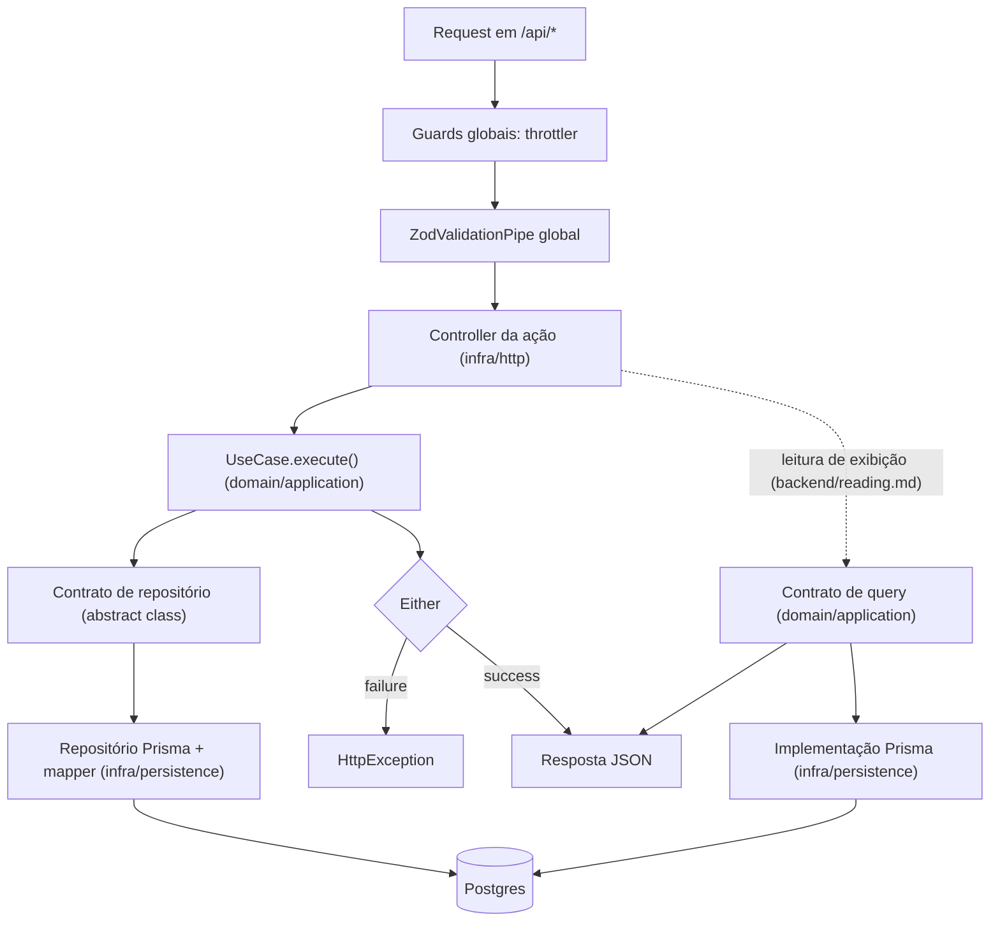

# Arquitetura do projeto

source: .metri@vX.Y

## Stack

## Caminho linear

(Camadas na ordem em que uma requisição passa, com o ponto de entrada de cada uma.)



- As rotas ficam sob `/api` (`general/http-surface.md`, "Superfície HTTP"). Guards e pipe globais, e o módulo dos endpoints de infra externa, entram no grafo de módulos pela regra de `infrastructure/runtime.md`.
- `ZodValidationPipe` global valida body, query e path param na fronteira (`backend/http-api.md`).
- Controller é por ação (`backend/http-api.md`) e traduz `Either.failure` em `HttpException` pela tabela de `backend/errors.md`.
- Use case fala com o banco só pelo contrato; repositório concreto e mapper vivem em `infra/persistence`.
- Endpoint de leitura de exibição substitui use case e repositório de agregado por um contrato de query da aplicação, implementado em infra e injetado no controller (`backend/reading.md`); guards, pipe e formato de erro são os mesmos.

## Caminhos do projeto

(Globs que dependem de decisão de projeto, como o pacote do contrato de API; o `rules-for` os soma ao `applies_to` da regra.)

- <glob> → <id>

Exemplo, o pacote do contrato de API:

- packages/<pacote-do-contrato>/src/** → backend/http-api
- packages/<pacote-do-contrato>/src/** → frontend/data-fetching
- packages/<pacote-do-contrato>/src/** → frontend/forms

## Exceções e defaults trocados

- <regra global ou default> → ADR-NNNN

## Ativação da arquitetura

Dono de: a ativação da arquitetura num projeto — as três classes de decisão (GLOBAL, GLOBAL_CONDITIONAL, PROJECT_SPECIFIC), o que a ativação pergunta e o que não pergunta, a ordem de ativação, o registro do que ela resolve, o encaminhamento de uma necessidade sem cobertura como ARCHITECTURE DECISION REQUIRED e a matriz das decisões delegadas ao projeto.

Consultar antes de: ativar a arquitetura num projeto novo; ligar uma capacidade condicional num projeto existente; escolher um valor que a Source deixa ao projeto (provider, identidade do dono, pacote dono, topologia); registrar essa escolha.

Não cobre: a arquitetura técnica de cada capacidade, que é do owner indicado na matriz; a casa de cada tipo de decisão e o critério de ADR (`methodology/authoring.md`, "Decisões específicas de projeto"); a regra de escape (`AGENTS.md`, "How to work here"); a regra de transição (`methodology/authoring.md`, "Regra de transição"); a localização e o formato físico da Project Architecture, que estão na METHODOLOGY, seção 5.2; a descoberta do repositório.

A Source decide como o sistema é construído; o projeto decide o que só ele sabe: se precisa de uma capacidade, qual provider usa, quem é o dono dos dados. Este documento é o contrato entre os dois: o que a ativação pergunta, quando pergunta e onde a resposta fica.

### Regras

#### Três classes de decisão

| Classe | O que é | Na ativação |
| --- | --- | --- |
| GLOBAL | Regra que vale em todo projeto | Aplicada, sem pergunta |
| GLOBAL_CONDITIONAL | Capacidade que o projeto pode não ter; quando tem, a forma já está decidida pelo owner | Uma pergunta: o projeto precisa dela? |
| PROJECT_SPECIFIC | Valor concreto que só o projeto conhece: provider, entidade do dono, pacote, topologia | Resolvido antes do primeiro ponto que depende dele |

**Obrigatório.** A ativação não pergunta o que a Source já decidiu.

**Obrigatório.** Decisão GLOBAL é aplicada como está.

Quando a capacidade é GLOBAL_CONDITIONAL: **Obrigatório.** A pergunta é só se o projeto precisa dela; sem necessidade, ela não é ativada e nada dela é perguntado.

Quando uma capacidade GLOBAL_CONDITIONAL é ativada: **Obrigatório.** Ela segue o owner global, pela regra de transição de `methodology/authoring.md`, e a ativação resolve só os valores PROJECT_SPECIFIC dela.

Quando um valor é PROJECT_SPECIFIC: **Obrigatório.** Ele é resolvido antes do primeiro ponto do projeto que depende dele.

**Proibido.** Preencher valor PROJECT_SPECIFIC com escolha que a Source não declarou como default.

#### A ativação não é questionário

**Obrigatório.** Cada pergunta depende do gatilho da delegação correspondente: sem gatilho no projeto, a pergunta não existe.

**Proibido.** Questionário fixo que percorre a matriz inteira.

> **Por quê.** Pergunta sem gatilho força uma escolha que o projeto não tem como fazer bem, e a escolha feita sem necessidade vira dependência que ninguém pediu.

#### Ordem

**Obrigatório.** A ativação segue esta ordem:

1. identificar as capacidades do projeto;
2. aplicar o GLOBAL;
3. avaliar os gatilhos GLOBAL_CONDITIONAL;
4. resolver os PROJECT_SPECIFIC aplicáveis;
5. registrar na Project Architecture e, quando cabe, em ADR;
6. validar a arquitetura ativada pela verificação de cada owner ativado.

Quando o gatilho de uma delegação aparece depois da ativação inicial, como o primeiro job ou o primeiro asset: **Obrigatório.** A delegação é resolvida naquele momento, pelos passos 3 a 6.

#### Registro

**Obrigatório.** A Project Architecture registra quais capacidades GLOBAL_CONDITIONAL foram ativadas e o valor escolhido para cada delegação resolvida.

Quando a delegação resolvida cumpre a condição de "ADR quando", na matriz ou no arquivo da capacidade do catálogo, que aplica a ela o critério de `methodology/authoring.md`: **Obrigatório.** Ela ganha ADR, que guarda o porquê, e a Project Architecture continua guardando o estado vigente.

#### Necessidade sem cobertura

Quando uma necessidade do projeto não tem regra global, não está declarada como PROJECT_SPECIFIC, contradiz regra existente, exige exceção nova ou exige mecanismo estrutural não coberto: **Obrigatório.** A ativação para e aplica a regra de escape do `AGENTS.md`, com o caso nomeado ARCHITECTURE DECISION REQUIRED:

```text
parar → ARCHITECTURE DECISION REQUIRED → decidir → atualizar a Source (regra global) ou registrar ADR (exceção ou decisão estrutural do projeto) → atualizar a Project Architecture → continuar
```

**Proibido.** A ativação improvisar valor, mecanismo ou exceção.

#### Matriz de delegações

**Obrigatório.** Toda decisão que a Source delega ao projeto tem uma linha na matriz abaixo, que é forma canônica, com nove campos: assunto, classe da capacidade, gatilho, owner global, o que o projeto decide, restrições que a Source já fixou, default (só quando a Source o declara), registro e condição de ADR.

Quando a decisão é de uma capacidade do catálogo: **Obrigatório.** Ela mora no arquivo da capacidade, não na matriz: `catalog/design-system`, `catalog/async-jobs`, `catalog/mail`, `catalog/storage`, `catalog/cache` e `catalog/observability` (`catalog/INDEX.md`).

Quando um owner passa a delegar uma decisão nova ao projeto: **Obrigatório.** A linha dela entra na matriz, ou no arquivo da capacidade do catálogo, na mesma edição.

| Assunto | Classe | Gatilho | Owner global | O projeto decide | Restrições da Source | Default | Registro | ADR quando |
| --- | --- | --- | --- | --- | --- | --- | --- | --- |
| Autenticação | PROJECT_SPECIFIC | O produto tem identidade autenticada | `backend/boundaries.md`, `backend/application.md`, `backend/access-scope.md` | Mecanismo e provider; modelo concreto de sessão ou token | Resolvida na fronteira de request (`infrastructure/runtime.md`); same-origin (`general/http-surface.md`); tabela escrita pelo provider segue a propriedade do agregado de `domain/model.md` | — | Project Architecture | O mecanismo molda a estrutura, como sessão × token ou provider com schema próprio |
| Autorização | PROJECT_SPECIFIC | Ações ou recursos com políticas de acesso diferentes | `backend/access-scope.md`, `backend/errors.md`, `backend/boundaries.md` | O modelo concreto de permissão; os papéis e as políticas reais | Recusa na forma de `backend/errors.md`, "Erros sensíveis"; nenhum modelo nem biblioteca de permissão global | — | Project Architecture | O modelo de permissão é estrutural |
| Identidade do dono | PROJECT_SPECIFIC | Isolamento por organização, cliente ou outro dono | `backend/access-scope.md` | A entidade que representa o dono; o identificador; a origem dele na identidade ou na request | Origem validada na fronteira; escopo em todo `where`; prova A/B | — | Project Architecture | A escolha define a fronteira de isolamento dos dados |
| Bounded contexts | GLOBAL_CONDITIONAL | Um dos sinais de `domain/bounded-contexts.md` | `domain/bounded-contexts.md` | Os contextos, os nomes, as fronteiras, os módulos de cada um e os contratos entre eles | Sem entidade nem contrato de repositório entre contextos; interação por contrato explícito | Um contexto | Project Architecture | A divisão é decisão estrutural |
| Domain Service / Policy | GLOBAL_CONDITIONAL | Regra de domínio sem dono natural em value object, entidade ou agregado | `domain/domain-services.md` | A regra concreta; o conceito e o módulo a que ela pertence; a forma mínima | Sem IO nem framework; fatos carregados pelo caso de uso | Regra no modelo | O código da regra | — |
| Módulos e agregados | PROJECT_SPECIFIC | O primeiro módulo; antes do primeiro contrato de cada agregado | `backend/modules.md`, `domain/model.md` | A divisão de módulos; a propriedade e a forma de cada agregado | Módulo por conceito de negócio; as formas de `domain/model.md` | Agregado do app | Project Architecture | A tabela é escrita por sistema externo, com o acordo da integração |
| Apps e pacotes | PROJECT_SPECIFIC | Ativação inicial; capacidade nova | `general/code-placement.md` | Os apps e pacotes reais; o pacote dono de cada capacidade | Colocação por ownership (`general/code-placement.md`, "Código pode nascer no pacote dono quando nada nele é do app"); nenhum pacote catch-all | O artefato fica no app enquanto o ownership compartilhado não é inequívoco | Project Architecture | App ou pacote novo muda a estrutura do monorepo |
| Pacote do contrato de API | PROJECT_SPECIFIC | Frontend e backend consomem o mesmo contrato | `backend/http-api.md`, `general/code-placement.md` | O pacote dono de cada contrato | Uma representação canônica; nunca `@metri/contracts`; o schema de form fica no frontend | — | Project Architecture | O contrato cria pacote novo |
| Destino do log | GLOBAL | O runtime roda num ambiente com coletor de log | `infrastructure/logging.md` | O destino das linhas (coletor, agregador); a confiança no `x-request-id` de um proxy | `nestjs-pino`, nível por ambiente, redação e contexto de `infrastructure/logging.md` | JSON no stdout | Project Architecture | O `x-request-id` de um proxy passa a ser aceito |
| Topologia de deploy | PROJECT_SPECIFIC | Antes da primeira entrega executável | `infrastructure/runtime.md` | A hospedagem; o runtime; o processo de worker; a topologia; o deploy por ambiente | Same-origin sob `/api` (`general/http-surface.md`, "Superfície HTTP"); env por `EnvService`; shutdown gracioso quando o runtime depende dele | — | Project Architecture | A topologia é estrutural |

### Aplicação

- Um projeto que envia e-mail de confirmação, guarda foto de produto e não tem leitura cara ativa e-mail e storage e resolve vendor, provider e buckets; cache e observabilidade não geram pergunta, e bounded context fica no default de um contexto.
- O primeiro job aparece meses depois da ativação inicial: a delegação de fila é resolvida ali, pelos passos 3 a 6 de "Ordem".
- A exigência de rodar workers em app próprio cai em necessidade sem cobertura, porque o desenho está em aberto em `backend/async-jobs.md`: a ativação para em ARCHITECTURE DECISION REQUIRED.
- A localização e o formato da Project Architecture seguem `methodology/authoring.md`, "Decisões específicas de projeto".

### Verificação

- A ativação perguntou só o que tem gatilho no projeto, sem pergunta sobre decisão GLOBAL?
- Capacidade GLOBAL_CONDITIONAL ativada segue o owner, com só os valores PROJECT_SPECIFIC resolvidos?
- Todo valor PROJECT_SPECIFIC foi resolvido antes do primeiro ponto que depende dele, sem default que a Source não declarou?
- A Project Architecture guarda as capacidades ativadas e os valores escolhidos?
- Delegação que cumpre a condição de "ADR quando" tem ADR?
- Necessidade sem cobertura parou como ARCHITECTURE DECISION REQUIRED, sem valor, mecanismo ou exceção improvisados?
- Toda decisão que a Source delega ao projeto tem linha na matriz, com os nove campos, ou está no arquivo da capacidade do catálogo?

### Referências

- `methodology/authoring.md`: casas de decisão, critério de ADR e regra de transição.
- `AGENTS.md`: regra de escape.
- `general/code-placement.md`, `general/http-surface.md`: apps, pacotes, colocação e superfície HTTP.
- `backend/modules.md`, `domain/model.md`: módulos e forma dos agregados.
- `domain/domain-services.md`, `domain/bounded-contexts.md`: capacidades condicionais de domínio.
- `backend/access-scope.md`, `backend/errors.md`, `backend/boundaries.md`, `backend/application.md`: identidade, autorização e autenticação.
- `backend/http-api.md`: o contrato de API compartilhado.
- `backend/operation-routing.md`, `backend/async-jobs.md`: fila e jobs.
- `infrastructure/runtime.md`, `infrastructure/logging.md`: runtime, deploy e log.
- `infrastructure/mail.md`, `infrastructure/storage.md`, `infrastructure/cache.md`, `infrastructure/observability.md`: capacidades condicionais de infraestrutura.
- `catalog/INDEX.md`: as capacidades do catálogo, com a pergunta de ativação e o que fica para o projeto.

## Verificação

`<comando verify>`

## Áreas ativas

(Lista gerada pelo `rules-index` abaixo do marcador: área → `INDEX.md` da área.)

<!-- rules-index -->
