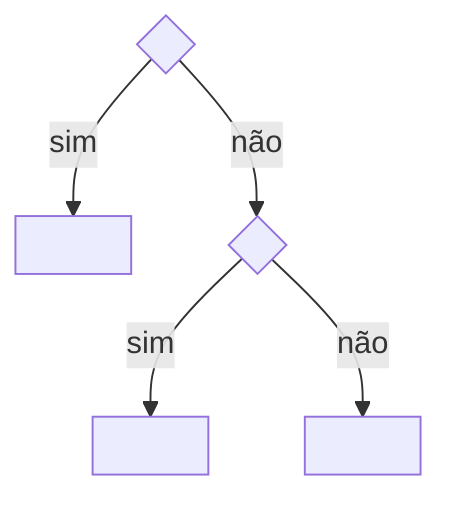

# <Tema>

<Uma frase de propósito.>

## <Seção temática>

**Obrigatório.** <Norma.>

> **Por quê.** <Motivo, quando não for óbvio.>

- **Exceção.** <Condição>: <efeito> (ADR-NNNN).

## Árvore de decisão

## Verificação

- <Pergunta de sim ou não que confere a norma>? (check: <id>)

<!-- Exemplo de regra de projeto: .metri/methodology/templates/examples/design-system.md -->
