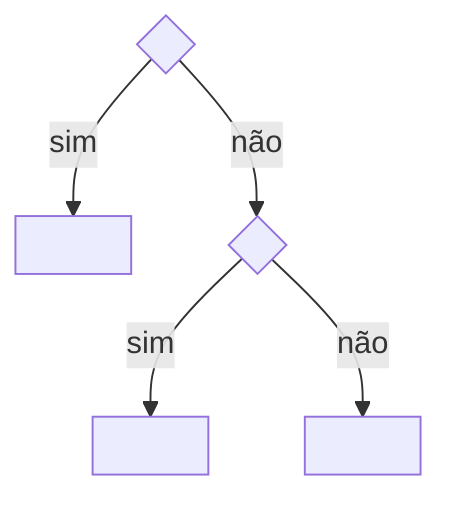

# Formato de regra

O formato de uma regra, global (`node_modules/metri/architecture/`) ou do projeto (`.metri/rules/`), e o contrato de autoria da Architecture Source. Regra é escrita em português; chaves e ids, em inglês.

## Formato

- Toda regra começa com frontmatter, com as chaves de `node_modules/metri/VOCABULARY.md`. É a única parte de formato fixo e a única que os scripts leem.
- O corpo segue, nesta ordem, o que o tema tiver: o propósito (o que se implementa), onde cada arquivo mora, a árvore de decisão, as seções temáticas com as normas, o exemplo de referência, o que entra sob demanda e a verificação. Seção sem conteúdo não nasce.
- Não há limite de linhas. O contexto é controlado pelo `rules-for` (o agente lê só as regras do ticket) e pela extração de exemplos.

````markdown
---
id: <área>/<tema>
description: <o que a regra decide>
use_when: [<situação em que o agente lê a regra>]
applies_to: [<globs>]                  # opcional
keywords: [<SOT keywords>]             # opcional
read_first: [<ids>]                    # opcional
not_covered: ["<tema> → <id>"]         # opcional
enforced_by: [<ids dos checks>]        # opcional
examples: [<arquivos>]                 # opcional
adr: [<ids>]                           # opcional, só na regra do projeto
status: active
---
# <Tema>

<Uma frase de propósito: o que se implementa.>

## Onde mora

| Artefato | Caminho |
| --- | --- |

## Árvore de decisão



## <Seção temática>

**Obrigatório.** <Norma.>

> **Por quê.** <Motivo, quando não for óbvio.>

- **Exceção.** <Condição>: <efeito> (ADR-NNNN).

## Exemplo de referência

Exemplo completo: <tema>.examples.md#<âncora> ou `starter/<caminho>`.

## Sob demanda

- **<Necessidade>.** Quando <gatilho concreto>: <tema>.examples.md#<âncora>.

## Verificação

- <Pergunta de sim ou não que confere a norma>? (check: <id>)
````

Chave marcada `# opcional` só é escrita quando tem valor (`node_modules/metri/VOCABULARY.md`). Exemplo do formato: `node_modules/metri/architecture/frontend/components.md`.

`(check: <id>)` é opcional: só entra quando um check automatiza o item, e o id dele está em `enforced_by`. Item sem ele é candidato a check.

## Escrita da regra

- `description` é o "Dono de" da regra; `use_when`, o gatilho do próprio arquivo ("Consultar antes de"), uma entrada por situação, e nunca uma lista de pré-requisitos, que é `read_first`; `not_covered`, o "Não cobre".
- Exemplo de implementação completa (classe, caso de uso, componente inteiro) vai para `<tema>.examples.md`, com um ponteiro no texto; trecho curto que ilustra uma regra fica onde está.
- Conteúdo cujo dono é outro arquivo fica no dono; aqui vira ponteiro.
- A regra de escape vive no `AGENTS.md`, "How to work here", e não é copiada.
- Citação cujo arquivo e seção não dizem o que foi citado: a frase vai para o arquivo dono, com um texto que já existe em outro arquivo; sem esse texto, vira dúvida.
- O texto segue a skill `writing-for-agents`.

## Autoria da Architecture Source

Dono de: como a Architecture Source é escrita e mantida — ownership de decisão, anatomia de documento, modalidades normativas, exceções, rationale, exemplos, formas canônicas e implementações de referência, status de ferramenta, verificação, o que fica sob demanda, o que a Source delega ao projeto, forma escrita sem instância, emendar ou criar, organização física da Source e casa das decisões específicas de projeto.

Consultar antes de: criar, editar, mover ou reorganizar qualquer documento de `architecture/`; registrar ou fechar uma decisão; decidir onde uma decisão específica de projeto é registrada.

Não cobre: decisão técnica de arquitetura, que tem dono no documento da área (índice do `architecture/INDEX.md`); autoridade da Source, precedência e navegação (`architecture/INDEX.md`); a ativação num projeto e a matriz das decisões delegadas a ele (`node_modules/metri/skills/look-across/ACTIVATION.md`); a regra de escape (`AGENTS.md`, "How to work here").

Este documento é o contrato de escrita da Source: onde cada decisão mora, que forma um documento tem e como uma regra se distingue de explicação, exemplo e verificação. Não decide nada sobre o sistema; decide como o que foi decidido fica escrito.

### Regras

#### Alcance

**Obrigatório.** Documento novo, e texto novo ou editado em documento existente, segue este contrato.

**Permitido.** Trecho que ninguém editou continua na forma em que está, valendo como está escrito.

> **Por quê.** A forma entra pelo trecho que está sendo mudado, sem reescrever a Source inteira de uma vez.

#### Ownership de decisão

Um documento se relaciona com uma decisão arquitetural de uma destas formas:

| Relação | O documento |
| --- | --- |
| DEFINED | É o owner: a decisão normativa pertence a ele |
| APPLIED | Aplica localmente uma decisão definida por outro owner |
| REFERENCED | Só aponta para o owner |
| VERIFIED | Verifica uma regra, sem criar regra nova |
| EXAMPLE | Ilustra uma regra existente |

**Obrigatório.** Toda decisão arquitetural tem exatamente um owner, o documento que a define (DEFINED).

Onde a decisão entra no arquivo do owner: `node_modules/metri/VOCABULARY.md` (frontmatter) e "Formato", acima (corpo).

**Obrigatório.** Documento que não é owner de uma decisão se relaciona com ela só como APPLIED, REFERENCED, VERIFIED ou EXAMPLE.

**Proibido.** Documento que não é owner redefinir a modalidade ou a regra de uma decisão.

**Obrigatório.** Aplicação local de regra de outro documento cita o owner da regra aplicada.

#### Anatomia do documento

O formato do arquivo de regra está em "Formato", acima: frontmatter em `node_modules/metri/VOCABULARY.md`, corpo na mesma seção.

**Permitido.** Heading de subseção afirmar o princípio ("Retornando erro: sempre `Either`, nunca `throw`") em vez de rótulo neutro.

#### Modalidades

| Marcador | Modalidade |
| --- | --- |
| `**Obrigatório.**` | REQUIRED |
| `**Proibido.**` | PROHIBITED |
| `**Padrão.**` | DEFAULT |
| `**Permitido.**` | PERMITTED |

**Obrigatório.** Toda norma nova é marcada pela modalidade, com um dos marcadores da tabela, dentro de `## Regras` ou da seção temática em que está.

**Obrigatório.** Uma regra tem uma modalidade e um assunto.

Quando a regra é condicionada: **Obrigatório.** A condição vem antes da modalidade, na forma `Quando X: **Obrigatório.** Y.`

**Proibido.** Regra escondida em rationale ou exemplo.

Em texto novo ou editado: **Proibido.** Inferir obrigação de trecho sem modalidade.

#### Exceções

Forma canônica:

```text
- **Exceção.** <condição>: <efeito>.
```

**Obrigatório.** Exceção fica vinculada à regra que excepciona, logo abaixo dela, na forma acima.

**Proibido.** Exceção sem a regra original: ela não cria regra sozinha.

**Proibido.** Inferir exceção de exemplo.

#### Rationale

Forma canônica:

```text
> **Por quê.** <explicação>
```

**Obrigatório.** Rationale na forma acima, curto.

**Proibido.** Rationale prescrever ou introduzir exceção.

#### Exemplos, formas canônicas e implementações de referência

| Categoria | O que é |
| --- | --- |
| Exemplo | Didático. A forma literal não é normativa além da regra que ilustra |
| Forma canônica | A forma textual ou estrutural em si faz parte do contrato: formato de erro, formato de chave, naming, path, comando com resultado esperado |
| Implementação de referência | Implementação concreta de uma arquitetura neutra, como o Cloudflare R2 de `infrastructure/storage.md` |

**Obrigatório.** Exemplo ilustra uma regra existente.

**Proibido.** Exemplo como fonte única de norma.

**Obrigatório.** Forma canônica e implementação de referência são declaradas como tais no texto que as apresenta.

**Proibido.** Promover exemplo a forma canônica ou a implementação de referência por inferência.

**Proibido.** Implementação de referência tornar a ferramenta requisito arquitetural.

**Padrão.** Exemplo de código usa o domínio didático de pedidos (`order`, `invoice`, `customer`).

> **Por quê.** Módulo real raramente contém todos os casos que um padrão precisa mostrar, e exemplo espelhando código real convida a tratar o arquivo atual como canônico.

**Proibido.** Nome real em exemplo.

- **Exceção.** Ferramenta escolhida do monorepo, ou ferramenta que o documento classifica na seção "Ferramentas": entra pelo nome real.

#### Domínio didático

Nomes que os exemplos da Source usam.

| Termo | Identificadores |
| --- | --- |
| Pedido (agregado de referência) | `Order`, `OrderItem`, `OrderStatus`, `OrderConfirmedEvent` |
| Valor monetário | `Money` |
| Cliente (o dono no escopo de acesso) | `Customer`, `CustomerTier` |
| Fatura | `Invoice`, `InvoiceLine`, `InvoiceDocument` |
| Notificação | `OrderNotifier`, `NotificationChannel`, `SendOrderConfirmationUseCase` |
| Produto | `Product`, `ProductPhoto`, `ProductTagIds` |
| Frete | `ShippingCostCalculator`, `DeliveryMethod` |
| Desconto | `calculateLoyaltyDiscount` |
| Cancelamento | `OrderCancellationSettlementService` |
| Reembolso | `RefundableOrderSpecification` |
| Relatório de pedidos | `OrderReportStorage`, `GenerateOrderReportUseCase` |
| Carrinho | `CartItem`, `useCartStore` |
| Pagamento | `PaymentReceivedEvent` |

#### Ferramentas

| Status | Significado |
| --- | --- |
| DECIDIDA | Escolhida pela Source, em `node_modules/metri/architecture/defaults/stack.md` |
| REFERÊNCIA | Implementação de referência de uma forma neutra; não é requisito |

Quando uma ferramenta é relevante para uma decisão do próprio documento: **Obrigatório.** O status dela, um dos da tabela, aparece em `## Ferramentas`.

Ferramenta que só aparece em exemplo, ou cuja decisão tem outro owner, não ganha linha só por ser citada: a seção é opcional e não nasce por simetria.

**Proibido.** Atribuir a uma ferramenta status que nenhuma decisão da Source sustenta.

#### Verificação de regra

**Obrigatório.** Verificação comprova regra existente, do próprio documento ou do owner que ele aplica.

**Proibido.** Norma nova em `## Verificação`.

**Permitido.** Checklist, inspeção, teste, compilador ou comando como forma de verificação.

Quando a verificação é comando: **Obrigatório.** O resultado esperado é declarado junto; comando sem resultado esperado não é verificação completa.

Quando a regra é checável mecanicamente: **Padrão.** Verificação por um check executável, com `(check: <id>)` no item e o id em `enforced_by`, como em `backend/boundaries.md`.

Quando a regra não é checável mecanicamente: **Padrão.** Verificação por checklist de perguntas de sim/não.

#### Delegado ao projeto

Quando a Source não decide um ponto e o agente agiria diferente por causa disso: **Obrigatório.** Uma linha na seção "Delegado ao projeto" da regra dona, `- **<título>.** O projeto decide <o quê>.`.

**Proibido.** Escrever na regra um ponto que não muda o que o agente faz.

**Proibido.** Código introduzir mecanismo próprio para contornar um ponto delegado: a necessidade vira ARCHITECTURE DECISION REQUIRED (`node_modules/metri/skills/look-across/ACTIVATION.md`, "Need without coverage").

#### Sob demanda

A base é o que todo projeto usa desde o primeiro dia, mais o que o método consome. Configuração que só um projeto com necessidade concreta usa (autenticação, rate limit, logger estruturado) fica fora da base: das normas e do `starter/`.

Quando, sem a receita, o agente erraria algo que importa (segurança, dado perdido ou corrompido, corrida) e o jeito certo não está na documentação oficial da ferramenta: **Obrigatório.** Uma linha em `## Sob demanda` da regra dona, com o gatilho concreto e a âncora da receita no `<tema>.examples.md`.

Quando a necessidade só pede escolher a biblioteca: **Obrigatório.** Uma linha em `node_modules/metri/architecture/defaults/stack.md`, "Quando precisar", sem receita.

Quando a receita é um documento inteiro: **Obrigatório.** Ele é capacidade condicional, com `activation`.

**Padrão.** O exemplo de referência é o que o `starter/` replica, e o `starter/` traz só o que um exemplo da base mostra.

> **Por quê.** Configuração particular na base vira cópia em todo projeto novo, sem a necessidade que a justificaria.

#### Forma escrita sem instância

Quando existe forma arquitetural escrita para uma capacidade sem instância no código: **Obrigatório.** A primeira implementação segue essa forma.

**Proibido.** Tratar implementação de referência como decisão: a forma está decidida, a ferramenta não.

> **Por quê.** O documento é a decisão da forma, mesmo quando a ferramenta é referência; o que o projeto decide fica nomeado em "Delegado ao projeto".

#### Emendar ou criar

Antes de escrever: **Obrigatório.** Achar o trecho que já é dono do assunto.

Quando o assunto já pertence a um documento: **Obrigatório.** Editar o owner existente.

Quando não existe responsabilidade arquitetural independente: **Proibido.** Criar documento ou seção nova.

Quando o caso novo é refinamento, limite ou exceção de uma regra já escrita: **Obrigatório.** Emendar a regra no lugar.

Quando o assunto não tem dono no documento e traz decisão própria, com contexto e consequência que não cabem numa frase: **Obrigatório.** Abrir seção que se sustenta sozinha.

**Padrão.** Na dúvida entre emendar e abrir seção, emendar.

> **Por quê.** Camada empilhada a cada evolução faz o documento crescer sem fim e reparte a mesma regra em trechos que passam a divergir; espremer assunto novo dentro de parágrafo alheio esconde a regra de quem procura por ela.

Quando a emenda contradiz o texto em volta: **Obrigatório.** Corrigir o texto em volta junto, no mesmo lugar.

**Proibido.** Regra repartida em dois trechos do mesmo documento.

**Permitido.** Regras parecidas em documentos diferentes, quando são decisões distintas, cada uma com seu owner.

**Proibido.** Changelog, histórico ou documento paralelo de decisão dentro da Source: o histórico pertence ao Git.

#### Organização física

As pastas de área do source estão em `node_modules/metri/architecture/INDEX.md`, "Índice".

**Obrigatório.** A localização do documento reflete o ownership: o documento mora na pasta da área dona do assunto.

**Proibido.** Pasta `system/` ou `cross-cutting/`.

**Obrigatório.** Um documento cobre um assunto só: um padrão de construção (`domain/strategy.md`), uma capacidade de infra (`infrastructure/mail.md`), uma área do sistema (`backend/errors.md`).

Quando um assunto acumula partes independentes: **Obrigatório.** Cada parte vira documento próprio.

O índice de cada área é gerado do frontmatter (`pnpm rules-index`).

#### Decisões específicas de projeto

| Casa | Guarda |
| --- | --- |
| Architecture Source (`architecture/`, em `node_modules/metri/` no projeto) | Decisão global e reutilizável |
| ADR (`docs/adr/`) | Decisão específica do projeto pelo critério do ADR-FORMAT, incluindo a exceção deliberada a uma regra da Source |
| Project Architecture (`.metri/ARCHITECTURE.md` e, quando houver caso real, regra em `.metri/rules/<área>/`) | Estado e configuração vigentes do projeto: módulos existentes, owner/tenant escolhido, apps e packages além do padrão de `general/code-placement.md`, ativações, decisões operacionais vigentes; o `.metri/ARCHITECTURE.md` aponta para o ADR de cada uma |
| `AGENTS.md`, `CLAUDE.md` e instruções locais | Ponteiros para a Source, o ADR e o `.metri/ARCHITECTURE.md`, e orientação operacional local: armadilha viva, contrato entre partes que envelhecem separadas |

**Obrigatório.** Decisão global e reutilizável fica na Architecture Source.

Quando a decisão específica do projeto passa no critério de `node_modules/metri/skills/domain-language/ADR-FORMAT.md`, "When to offer an ADR": **Obrigatório.** Registrá-la como ADR em `docs/adr/`.

Quando um projeto precisa divergir deliberadamente de uma regra da Source: **Obrigatório.** A exceção é explícita e registrada em ADR, com a regra da Source que ela excepciona, o escopo em que vale e o rationale.

Quando uma decisão de projeto, exceção incluída, muda o estado vigente do projeto: **Obrigatório.** A Project Architecture registra o estado resultante.

**Obrigatório.** Estado e configuração vigentes do projeto ficam na Project Architecture.

**Proibido.** O `.metri/ARCHITECTURE.md` copiar o porquê de um ADR: ele registra o estado e aponta para o ADR.

**Obrigatório.** A regra de projeto que aplica um ADR guarda o como e aponta o ADR (`adr`); a decisão e o motivo ficam só no ADR.

A localização e o formato físico da Project Architecture estão em `pnpm docs-lint --help` (árvores fechadas de `docs/` e `.metri/`) e em `node_modules/metri/skills/look-across/ACTIVATION.md`.

**Proibido.** Documento da Source registrar o resultado de decisão por app, como a divisão de módulos e a forma de cada agregado: ele ensina o procedimento de decidir, e o resultado fica nas casas de projeto.

**Proibido.** `AGENTS.md`, `CLAUDE.md` ou instrução local criar exceção arquitetural, redefinir regra da Source ou substituir o ADR, a Project Architecture ou o `.metri/ARCHITECTURE.md`.

**Permitido.** `AGENTS.md`, `CLAUDE.md` e instruções locais apontarem para a Architecture Source, o ADR e o `.metri/ARCHITECTURE.md` e darem orientação operacional local.

Quando um assunto ganha documento na Source: **Obrigatório.** Ele sai das instruções de projeto na mesma sessão em que o documento é escrito ou revisado.

Quando uma instrução local contradiz a Source sem ADR explícito que a sustente: **Obrigatório.** Tratar a contradição como inconsistência a corrigir, nunca como exceção válida.

### Verificação

- Cada decisão nova tem exatamente um owner que a define?
- Os demais documentos só aplicam, referenciam, verificam ou exemplificam a decisão, sem redefinir modalidade nem regra, citando o owner quando aplicam?
- Toda norma nova tem um marcador de modalidade, uma modalidade e um assunto, com a condição antes da modalidade?
- Toda exceção está logo abaixo da regra que excepciona, na forma `**Exceção.**`?
- Todo rationale está em `> **Por quê.**`, curto, sem prescrever nem excepcionar?
- Forma canônica e implementação de referência estão declaradas como tais, e nenhum exemplo é fonte única de norma?
- Ferramenta relevante para uma decisão do documento tem status, sustentado por decisão da Source, sem ferramenta de exemplo parecendo obrigatória?
- A verificação só comprova regra existente, e todo comando declara o resultado esperado?
- Configuração particular ficou fora da base: receita em `## Sob demanda` só quando o erro importa e a documentação da ferramenta não ensina; biblioteca em "Quando precisar"?
- Caso novo editou o owner existente, e a seção nova sobreviveria sem o parágrafo acima dela? Se não sobreviveria, era emenda.
- Nenhum changelog nem documento paralelo de decisão dentro da Source?
- O documento está na pasta da área dona e cobre um assunto só?
- Decisão específica de projeto registrada fora da Source, na casa certa, e toda exceção a uma regra da Source em ADR que nomeia a regra, o escopo e o rationale?
- Nenhuma instrução local cria exceção, redefine regra da Source ou faz o papel de ADR, Project Architecture ou `.metri/ARCHITECTURE.md`?

### Referências

- `architecture/INDEX.md`: autoridade e precedência da Source, navegação, decisões transversais e índice.
- `backend/boundaries.md`: verificação por check executável.
- `infrastructure/storage.md`: implementação de referência declarada.
- `docs/adr/`: casa dos ADRs do projeto.
- `node_modules/metri/skills/look-across/ACTIVATION.md`: ativação num projeto e decisões delegadas a ele.
