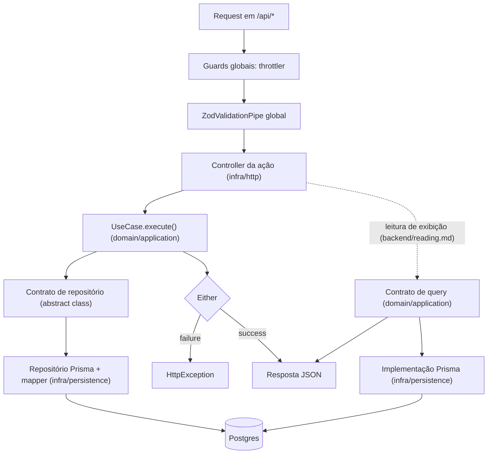

# Arquitetura do projeto

source: .metri@vX.Y

## Stack

(Só o que difere de `.metri/architecture/defaults/stack.md`; o ADR do desvio entra em "Exceções e defaults trocados".)

- <item da stack padrão> → <escolha do projeto>

## Caminho linear

(Camadas na ordem em que uma requisição passa, com o ponto de entrada de cada uma.)

- As rotas ficam sob `/api` (`general/http-surface.md`, "Superfície HTTP"). Guards e pipe globais, e o módulo dos endpoints de infra externa, entram no grafo de módulos pela regra de `infrastructure/runtime.md`.
- `ZodValidationPipe` global valida body, query e path param na fronteira (`backend/http-api.md`).
- Controller é por ação (`backend/http-api.md`) e traduz `Either.failure` em `HttpException` pela tabela de `backend/errors.md`.
- Use case fala com o banco só pelo contrato; repositório concreto e mapper vivem em `infra/persistence`.
- Endpoint de leitura de exibição substitui use case e repositório de agregado por um contrato de query da aplicação, implementado em infra e injetado no controller (`backend/reading.md`); guards, pipe e formato de erro são os mesmos.

## Capacidades ativas

(Uma linha por capacidade de `.metri/catalog/INDEX.md` ativada, com a resposta a "O que fica para o projeto".)

- catalog/<capacidade>: <resposta> (ADR-NNNN, quando cabe)

## Delegações

(Uma linha por delegação resolvida da matriz de `.metri/methodology/METHODOLOGY.md`, 6.14.)

- <assunto>: <valor escolhido> (ADR-NNNN, quando cabe)

## Caminhos do projeto

(Globs que dependem de decisão de projeto, como o pacote do contrato de API; o `rules-for` os soma ao `applies_to` da regra.)

- <glob> → <id>

Exemplo, o pacote do contrato de API:

- packages/<pacote-do-contrato>/src/** → backend/http-api
- packages/<pacote-do-contrato>/src/** → frontend/data-fetching
- packages/<pacote-do-contrato>/src/** → frontend/forms

## Exceções e defaults trocados

- <regra global ou default> → ADR-NNNN

## Áreas ativas

(Lista gerada pelo `rules-index` abaixo do marcador: área → `INDEX.md` da área.)

<!-- rules-index -->
