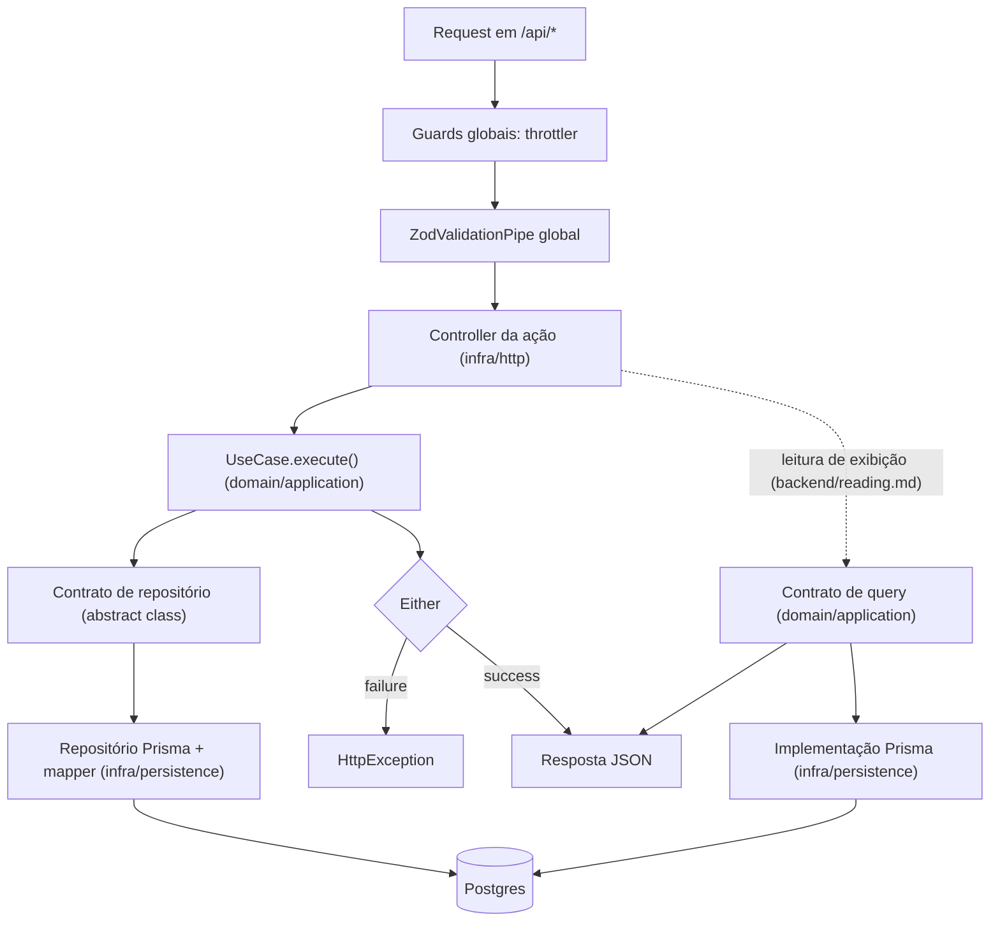

# Arquitetura do projeto

source: .metri@vX.Y

## Stack

- <item da stack padrão> → <escolha do projeto>

## Caminho linear

- As rotas ficam sob `/api` (`.metri/architecture/general/http-surface.md`, "Superfície HTTP"). Guards e pipe globais, e o módulo dos endpoints de infra externa, entram no grafo de módulos pela regra de `.metri/architecture/infrastructure/runtime.md`.
- `ZodValidationPipe` global valida body, query e path param na fronteira (`.metri/architecture/backend/http-api.md`).
- Controller é por ação (`.metri/architecture/backend/http-api.md`) e traduz `Either.failure` em `HttpException` pela tabela de `.metri/architecture/backend/errors.md`.
- Use case fala com o banco só pelo contrato; repositório concreto e mapper vivem em `infra/persistence`.
- Endpoint de leitura de exibição substitui use case e repositório de agregado por um contrato de query da aplicação, implementado em infra e injetado no controller (`.metri/architecture/backend/reading.md`); guards, pipe e formato de erro são os mesmos.

## Capacidades ativas

- <id>: <valores escolhidos> (ADR-NNNN, quando cabe)

## Delegações

- <assunto>: <valor escolhido> (ADR-NNNN, quando cabe)

## Caminhos do projeto

- <glob> → <id>

## Exceções e defaults trocados

- <regra global ou default> → ADR-NNNN

## Áreas ativas

<!-- rules-index -->
