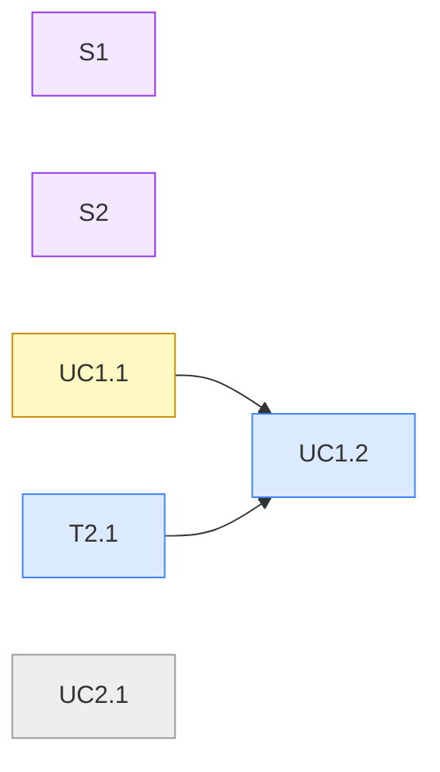

# MATRIX

<!-- matrix-view -->
### Features × Slices

| Feature \ Slice | S1 | S2 |
| --- | --- | --- |
| F1 | UC1.1 ~ | UC1.2 o |
| F2 | — | — |
| T (sem UC) | — | T2.1 o |

### Dependências (blocked_by)

<!-- /matrix-view -->

## Features

### F1 · Pedidos no painel

horizon: now · slices: [S1, S2]
outcome: O operador acompanha os pedidos da organização.
ucs: [UC1.1, UC1.2]

### F2 · Relatórios

horizon: planned
ucs: [UC2.1]

## Slices

### S1 · Lista de pedidos

horizon: now · entry: apps/app-web/src/pages/orders/orders-page.tsx

### S2 · Avisos de pedido

horizon: now · blocked_by: [S1]
contract:
  responsibility: Avisa o cliente quando o pedido muda de estado.
  interface: `OrderConfirmationSender.send(order)`.
  invariants: Um aviso por mudança de estado.
  consumers: [F1]
  planned: Aviso de pedido enviado.

## Fog

- Como relatórios agregam pedidos por período.

## Gaps

- GAP-1 · filtro por status → UC1.1

## Pattern proposals

- PP-1 · de UC1.1 · a lista precisa de ordenação por coluna; frontend/components não cobre → próximo look across
